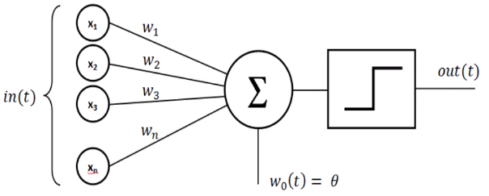
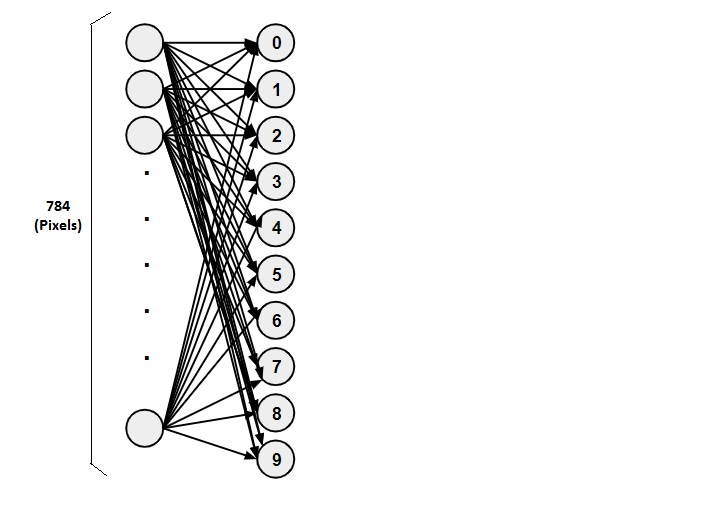
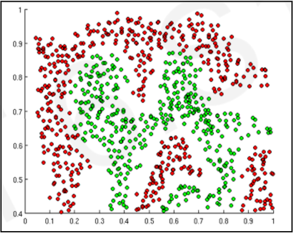
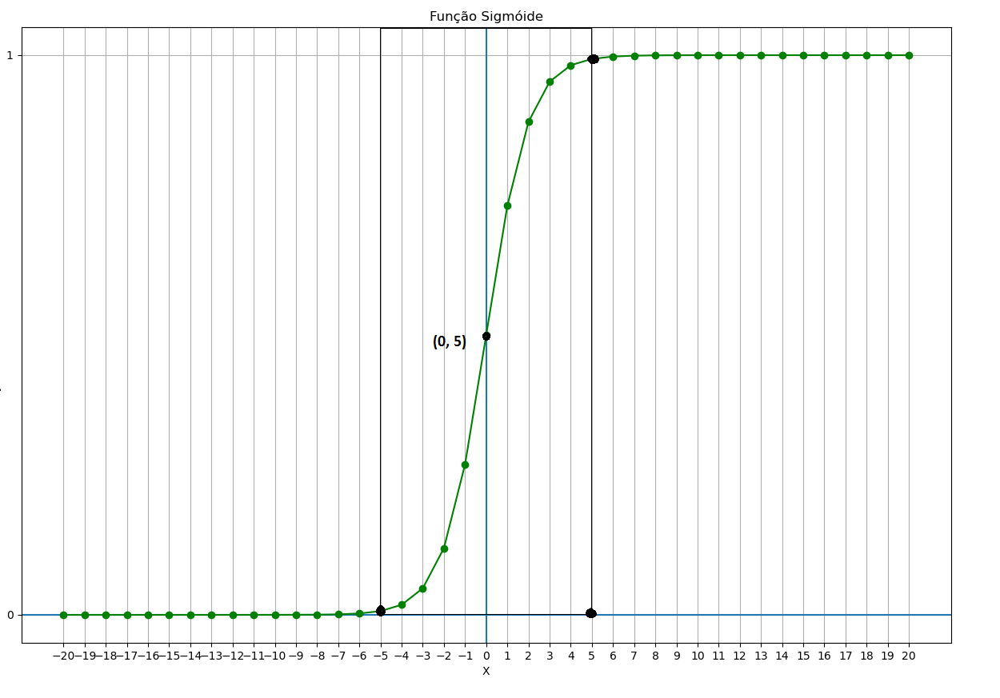
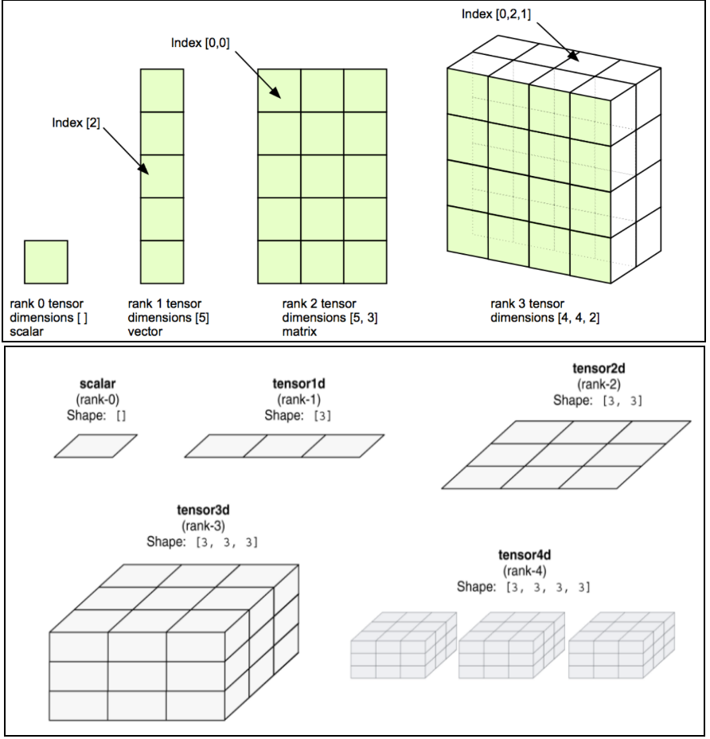
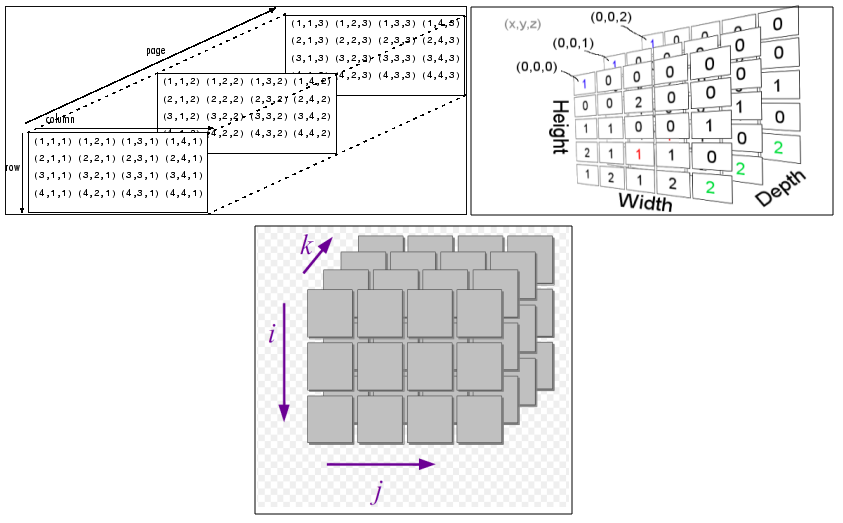
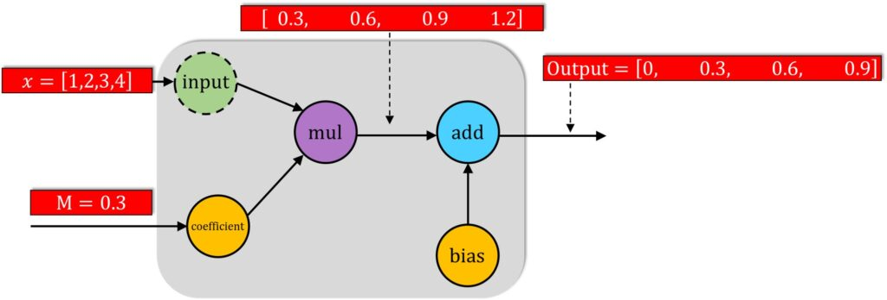
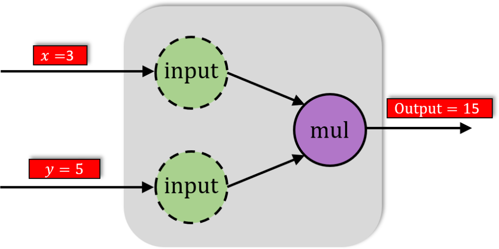

# Artificial Neural Networks & Deep Learning

## Contents

 - [**Fundamentals of Artificial Neural Networks (+Introduction):**](#intro-to-nn)
   - [The First Artificial Neuron (Perceptron)](#perceptron)
   - [How do Artificial Neural Networks learn? (Hypothetical example)](#how-do-learn)
   - [Dense Neural Networks](#intro-to-dnn)
   - [**Activation Functions:**](#activation-functions)
     - [Sigmoid Function](#sigmoid-function)
     - [ReLU (Rectified Linear Unit)](#relu)
 - **Fundamentals of Deep Learning:**
   - **Convolutional Neural Networks (CNN):**
   - **Recurrent Neural Netowkrs (RNN):**
     - LSM
     - LSTM
     - GRU
   - **Autoencoders:**
     - seq2seq
   - **Generative Adversarial Networks (GAN):**
 - **Useful Libraries:**
   - **TensorFlow:**
     - [Why is TensorFlow called "TensorFlow"? (+TensorFlow Components)](#why-called-tf)
     - **TensorFlow Functions and Methods:**
       - [Constants](#tf-const)
       - [Variables](#tf-vars)
     - **TensorBoard:**
       - [Launching TensorBoard](#launching-tf-board)
 - [**Settings**](#settings)
 - [**References**](#ref)


<!--- ( Fundamentals of Neural Networks ) --->

---

<div id="intro-to-nn"></div>

## Fundamentals of Artificial Neural Networks (+Introduction):

> To begin with **Artificial Neural Networks**, it's essential to understand the inspiration behind them. In fact, ANNs are based on the same logic as human neurons.

Take a look at this image to get a better visual understanding:


As we know, the human brain has **billions** of *neurons* and *synapses (which connect neurons)*. Knowing this, we can try to create **Artificial Neurons** following this logic, but using mathematical models.

---

<div id="perceptron"></div>

## The First Artificial Neuron (Perceptron)

The first **Artificial Neuron** created was the **[Perceptron](https://en.wikipedia.org/wiki/Perceptron)** in 1958 by [Frank Rosenblatt](https://en.wikipedia.org/wiki/Frank_Rosenblatt):



 - The **[Perceptron](https://en.wikipedia.org/wiki/Perceptron)** had the main idea of receiving different inputs (or signals) and outputting the signal (result) **1** or **0**.
 - This signal (result) basically indicates whether the neuron will be *active* or *not* to proceed to another neuron.
 - Over time, scientists discovered that there were other possibilities for neurons; Not only *active* or *not*, but we won't delve into details for now.

**NOTE:**  
The idea of the **[Perceptron](https://en.wikipedia.org/wiki/Perceptron)** was a single *neuron* that received **x<sub>i</sub>** inputs; Multiplied these inputs by their respective weights; Then passed through a *Non-Linear Activation Function* and received an *output*.

---

<div id="how-do-learn"></div>

## How do Artificial Neural Networks learn? (Hypothetical example)

To understand how **Artificial Neural Networks** learn, let's consider the following problem:

> **How to create an *Artificial Neural Network* to identify numbers in an image?**

For example, we want to identify the number **4**... But how to identify numbers in an image? Well, images on a computer are composed of various pixels.

Look at the abstraction (it's just an example) below:


In the image above:

- **The white pixels:** Represent the number 4;
- **And the black pixels:** The rest of the image.

**NOTE:**  
So, to train our *neural network* is very simple. Just pass several images of numbers to our neural network and it will identify common patterns for each number. For example, we pass several hand-written numbers **4** by various different people and our neural network will identify common patterns in the numbers **4**.

Now take a look at this very simple abstraction of an **Artificial Neural Network** below:


In the **Artificial Neural Network** (abstraction) above, we have:

- **1st -** The **input neurons *(784 pixels)***; These neurons emit outputs between **0** and **1**;
- **2nd -** The **weights** of each input neuron;
- **3rd -** The **neurons** that will represent the numbers: **0**, **1**, **2**, **3**, **4**, **5**, **6**, **7**, **8**, **9**; These also emit outputs between **0** and **1**.

**NOTE:**  
In this example, we made the connection only from all inputs to the first neuron *(representing the number zero)*, but in a **Dense Neural Network**, the neurons from the layer above connect to all their *predecessors*.

---

<div id="intro-to-dnn"></div>

## Dense Neural Networks

> **What is a Dense Neural Network?**

 - The name suggests that the **"layers"** are fully connected (dense) by neurons in a network layer.
 - Each *neuron* in a **"layer"** receives input from all neurons present in the previous layer - hence they are densely connected.

**NOTE:**  
In other words, *the dense layer is a fully connected layer*, meaning all neurons in one layer are connected to those in the next layer.


> **Why use a Dense Neural Network?**

 - A densely (desamente) connected layer provides learning features of all combinations of the features from the previous layer.
 - While a convolutional layer relies (depende) on consistent features with a small repetitive field.

Returning to our example of identifying numbers with an **Artificial Neural Network**.

**Densely our Artificial Neural Network would look like this:**  
  


<!--- ( Fundamentals of Neural Networks/Activation Functions ) --->

---

<div id="activation-functions"></div>

## Activation Functions

When we're using an **Artificial Neural Network** to learn something, it's common to apply a **"Non-Linear Activation Function"**.

> **But what does this kind of function do?**

The purpose of **Activation Functions** is to introduce **"nonlinearities"** into an *Artificial Neural Network* (within the context of Neural Networks, of course).

Let's look at the example below to make it clearer:



**NOTE:**  
Now suppose I ask you to separate these red points from the green ones using a Linear Function, could you do that? **NO!**

You might achieve something similar to this, but it wouldn't solve the problem:


 - In other words, no matter how many *Linear Functions* you use, it will always generate a line.
 - On the other hand, with **Non-Linear Functions**, you can solve the problem of separating the red points from the green ones.

Something like this:


That's:

 - *Activation Functions* are a crucial component of *Artificial Neural Networks* **used to introduce nonlinearity into the outputs of network layers**:
   - They are applied to the linear combination of inputs to a layer to produce the output of that layer.
 - Without *Activation Functions*, *Artificial Neural Networks* would be limited to performing linear calculations, which would make them incapable of handling (lidar) most real-world problems.

---

<div id='sigmoid-function'></div>

## Sigmoid Function

> The **Sigmoid Function** was born out of the need to binarize data. *How do you binarize data?*

Okay, suppose we have a bank and we want to binarize in order to differentiate between customers who are in **"debt"** and those who are **"not in debt"** to our bank.

Let's suppose the binarization looked like this:

 - **0**, For customers who are ***in debt*** to the Bank;
 - **1**, For customers who are ***okay*** with the bank.

Now let's take a look at the aspects of this **"Sigmoid Function"**:


Now, let's test the **Sigmoid Function** for some **x<sub>i</sub>** input values to understand how it works:

[sigmoide.py](src/sigmoide.py)
```python
from matplotlib import pyplot as plt
from math import e

import pandas as pd


def f(x):
    return (1) / (1 + (e**-x))


if __name__ == "__main__":

    df = pd.DataFrame({"x": range(-20, 20 + 1)})
    df["y"] = [f(n) for n in df.x]

    plt.figure(figsize=(15, 10))
    plt.title("Sigmoid Function")
    plt.xlabel("X")
    plt.ylabel("y = (1)/(1 + (e^-x))")
    plt.xticks(range(-20, 20 + 1, 1))
    plt.yticks(range(-20, 20 + 1, 1))
    plt.axhline()
    plt.axvline()
    plt.grid()
    plt.plot(df.x, df.y, color="green", marker="o")
    plt.savefig("../images/sigmoide-plot-01.png", format="png")
    plt.show()
```

  

Now it looks beautiful!! In addition to all the outputs for **40** inputs of **x**, from -*20* to *20*; We also have a prettier, more detailed plot with more inputs.

 - **But what did you notice about this function?**  
   - **1st -** If you pay attention to this function for negative values, it converges very quickly to zero (0);
   - **2nd -** The same happens for positive values, it converges very quickly to 1.

So we arrived where we wanted to binarize our clients with:

> - **0**, For customers who are ***in debt*** to the Bank;
> - **1**, For customers who are ***okay*** with the bank.

**NOTE:**  
Another interesting thing to note is that if you pay attention to our graph, this conversion to **0** or **1** always happens after **-5** or **5**:

  

**NOTE:**  
This interval between the point **"-5"** and **"5"** is what we know as the **"TRANSITION POINT"**.

Now, let's see some **Sigmoid Function** tips:

 - **Advantage:**
   - **Easy to understand and implement:**
     - The *sigmoid function* is a relatively simple mathematical function, making it easy to understand and implement in code.
     - This can be beneficial for beginners learning about neural networks.
   - **Output Range:**
     - The *sigmoid function* outputs values in the **range (0, 1)**, which is useful for tasks where you need to `predict probabilities` or `binary classification`.
     - The output can be interpreted as the probability of a particular class being present.
   - **Smoothness (Suavidade):**
     - The *sigmoid function* is smooth (suave) and continuously differentiable, which makes it suitable for gradient-based optimization methods like `Gradient Descent`.
     - **NOTE:** This smoothness aids (auxilia) in stable `convergence` during training.
 - **Disadvantage:**
   - **Vanishing Gradient Problem:**
     - The *sigmoid function* saturates when the input is very large or very small, leading to `vanishing gradients` during backpropagation.
     - This makes training deep networks with many layers using the sigmoid function difficult because the gradients become extremely small, causing slow convergence or convergence to poor local minima.
   - **Output Bias:**
     - The output of the *sigmoid function* is not centered around zero.
     - This can lead to issues like `vanishing gradients` or `slow convergence`, especially in deep networks where *weight* updates are relatively small.
 - **When to USE the sigmoid function:**
   - **As the output layer activation function in binary classification problems:**
     - Since the sigmoid function outputs a value between 0 and 1, it can be interpreted as a probability. This makes it suitable for tasks like predicting whether an email is spam or not spam, or whether an image contains a cat or not.
   - **As an activation function in hidden layers when dealing with data between 0 and 1:**
     - If your data is naturally scaled between 0 and 1, the sigmoid function can work well in hidden layers. However, it's important to be aware of the `vanishing gradient` problem, especially in deep networks.
 - **When NOT TO USE the sigmoid function:**
   - **In deep neural networks:**
     - Due to the `vanishing gradient` problem, sigmoid functions are generally not recommended as activation functions in deep neural networks.
     - Avoid using the *sigmoid function* as an activation function in hidden layers of deep neural networks, especially when dealing with deep architectures or problems with a `large number of classes`.
     - **NOTE:** Other activation functions, such as `ReLU (Rectified Linear Unit)` or `tanh (hyperbolic tangent)`, are better suited for these cases.
   - **In regression problems:**
     - Sigmoid functions are not ideal for regression problems where the output can take any real value.
     - **NOTE:** In these cases, *linear activation functions* are typically preferred.

---

<div id="relu"></div>

## ReLU (Rectified Linear Unit)

The **ReLU (Rectified Linear Unit) Activation Function** have as output a value between **"0"** and the **"maximum input value"**.

For example, see the image below to understand more easily:

  

See that:

 - **The ReLu receives as input "x".**
 - **Return:**
   - **"0" if "x" is less than "0":**
     - This is because.. What's the maximum value between "-x" and "0"? It's "0".
     - Then, we return "0" if "x" is less than "0".
   - **"maximum input value" if "x" is greater than "0":**
     - Here the output will be the input itself (própria entrada).

Now, let's see some **ReLU Function** tips:

 - **Advantage:**
   - **Solves Vanishing Gradient problem:**
     - Unlike *sigmoid* and *tanh functions*, *ReLU* has a constant gradient of 1 for positive inputs. This helps avoid the `Vanishing Gradient` problem, which can hinder training in deep neural networks.
   - **Computationally efficient:**
     - ReLU involves a simple comparison operation (max(0, x)), making it significantly faster to compute compared to *sigmoid* and *tanh functions*, which require more complex calculations.
 - **Disadvantage:**
   - **Dying ReLU Problem:**
     - A common issue with ReLU is the **"dying ReLU"** problem, where some neurons effectively become inactive during training because they always output zero.
     - This typically happens when the input to a neuron is consistently negative, causing the neuron to never activate (the gradient becomes zero).
     - **NOTE:** Once a neuron is "dead," it will never recover since the gradient for negative inputs remains zero.


<!--- (  Useful Libraries/TensorFlow ) --->

---

<div id="why-called-tf"></div>

## Why is TensorFlow called "TensorFlow"? (+TensorFlow Components)

> *TensorFlow* is called **'TensorFlow'** because it *handles (lida)* the flow (node/mathematical operation) of **"Tensors"**, which are data structures that you can think of as multi-dimensional arrays.

### But what is a "Tensor"?

> A **"Tensor"** is an **"n-dimensional "vector" or "matrix"** that can contain all data types.

 - All *"tensor"* values carry the same type of data with a known (conhecida), or partially known (conhecida), form.
 - The dimensionality of the matrix is defined by the *"shape"* of the input data.

Let's, see some **"Tensors"** examples:

  

Now imagine, we have a **4×4 matrix** with values from **1** to **16**:

  

In **"TensorFlow"**, we can represent the *"tensor"* above as:

```bash
[[1, 2, 3, 4], [5, 6, 7, 8], [9, 10, 11, 12], [13, 14, 15, 16]]

# or

[
  [1, 2, 3, 4],
  [5, 6, 7, 8],
  [9, 10, 11, 12],
  [13, 14, 15, 16]
]
```

Now, let's see a **3-dimensional (shape 3x3x3)** *"tensor"*:

  

In **"TensorFlow"**, we can represent the *"tensor"* above as:

```python
[
  [[01, 02, 03], [04, 05, 06], [07, 08, 09]],
  [[10, 11, 12], [13, 14, 15], [16, 17, 18]],
  [[19, 20, 21], [22, 23, 24], [25, 26, 27]]
]

# or

[
  [
    [01, 02, 03],
    [04, 05, 06],
    [07, 08, 09]
  ],
  [
    [10, 11, 12],
    [13, 14, 15],
    [16, 17, 18]
  ],
  [
    [19, 20, 21],
    [22, 23, 24],
    [25, 26, 27]
  ]
]
```

> **NOTE:**  
> We can think of each block as a *sheet of paper (page)*, one after the other. In other words, each *sheet of paper (page)* is a depth (profundidade).

See other examples of **"tensors"** and their dimensions below:

  

A **"Tensor"** have properties:

 - **Rank:**
   - Rank is used to identify the number of dimensions of a tensor.
   - It is known (conhecido) as the order of a tensor.
 - **Shape:**
   - It is the number of rows and columns the tensor has.
 - **Type:**
   - It is the data type assigned to the tensors.

Ok, now we know what a **“Tensor”** is. Let's go back to TensorFlow components.

 - A tensor may be derived from the *"input data"* or the *"outcome of a process"*.
 - All functions or methods are carried out (realizados) in a *"graph"* defined by using the TensorFlow library.

### But what is a Graph? (In TensorFlow context)

> A **"graph"** is a sequence of functions that are *carried out consecutively (executadas consecutivamente)*.

 - Each operation represented in a *"graph"* is known (conhecida) as an **"op node (vertex)"**, and these nodes are related to each other.
 - The **"edges"** connected to the nodes in the graph describe the operations to be performed.

> Briefly, a **graph** help us to collect and describe the sequence of computations that you want your model to perform. 

Let's, see some **"Graphs"** examples:

  
  
  

---

<div id="tf-vars"></div>

## Variables

 - In **TensorFlow**, *"variables"* are *"tensor"* objects that hold values that can be modified during the execution of the program.
 - A variable can be created with **"tf.Variable()"** function.
 - When you want to *train* a model, you have to use variables to *"hold"* and *"update parameters"*.
 - A variable in TensorFlow is the recommended way to represent a shared, persistent state, that your program manipulates.

Let’s see an example for a basic *linear model*:

$y= wx + b$



[tf_var-v1.py](src/tf_var-v1.py)
```python
import numpy as np
import tensorflow as tf
import matplotlib.pyplot as plt

w = tf.Variable([0.3], tf.float32)
b = tf.Variable([-0.3], tf.float32)
x = np.arange(1, 5)

y = w * x + b

print(y)

plt.plot(x, y)
plt.savefig("../images/tf-var-01.png", format="png")
plt.show()
```

**OUTPUT:**
```bash
tf.Tensor([0.    0.3    0.6    0.90000004], shape=(4,), dtype=float32)
```

  

---

<div id="tf-const"></div>

## Constants

 - As constants in any source code, are the actual values that are fixed, the TensorFlow constants are the same.
 - The values assigned to a TensorFlow constant cannot be changed in the future.

> **NOTE:**  
> We use TensorFlow constants, where we need non-changing value, such as datasets in our Machine Learning.

For example, see the *"Tensors"* below, created with the **"tensorflow.constant()"** function:

[tf_const-v1.py](src/tf_const-v1.py)
```python
import tensorflow as tf

a = tf.constant(3.0)
b = tf.constant(5.0)

c = a * b

print(c)
```

**OUTPUT:**
```bash
tf.Tensor(15.0, shape=(), dtype=float32)
```

  

---

<div id="launching-tf-board"></div>

## Launching TensorBoard

To launch **"TensorBoard"**, we should open our terminal or command prompt and run:

```bash
tensorboard --logdir=<directory_name>
```


<!--- ( Settings ) --->

---

<div id="settings"></div>

## Settings

**CREATE VIRTUAL ENVIRONMENT:**  
```bash
python -m venv ai-environment
```

**ACTIVATE THE VIRTUAL ENVIRONMENT (LINUX):**  
```bash
source ai-environment/bin/activate
```

**ACTIVATE THE VIRTUAL ENVIRONMENT (WINDOWS):**  
```bash
source ai-environment/Scripts/activate
```

**UPDATE PIP:**
```bash
python -m pip install --upgrade pip
```

**INSTALL PYTHON DEPENDENCIES:**  
```bash
pip install -U -v --require-virtualenv -r requirements.txt
```

**Now, Be Happy!!!** 😬


<!--- ( References ) --->

---

<div id="ref"></div>

## References

 - **Fundamentals of Artificial Neural Networks (+Introduction):**
   - **Activation Functions:**
     - [Aprenda a função Sigmóide (machine learning)](https://www.youtube.com/watch?v=DlBhJdHQElI&t=22s)
 - **Fundamentals of Deep Learning:**
   - **Convolutional Neural Networks (CNN):**
   - **Recurrent Neural Netowkrs (RNN):**
     - LSM
     - LSTM
     - GRU
   - **Autoencoders:**
     - seq2seq
   - **Generative Adversarial Networks (GAN):**
 - **Useful Libraries:**
   - **TensorFlow:**
     - [What is Tensorflow?](https://intellipaat.com/blog/what-is-tensorflow/)
     - [TF 2.0 An Introduction to TensorFlow 2.0](https://datahacker.rs/tensorflow-constants-and-variables/)
     - [Tensorboard Tutorial](https://zito-relova.medium.com/tensorboard-tutorial-5d482d270f08)
 - **General:**
   - [Cursos de Machine Learning com Python - Didática Tech](https://didatica.tech/combo-modulos-i-ii-iii-e-iv/)

---

**R**odrigo **L**eite da **S**ilva - **drigols**
