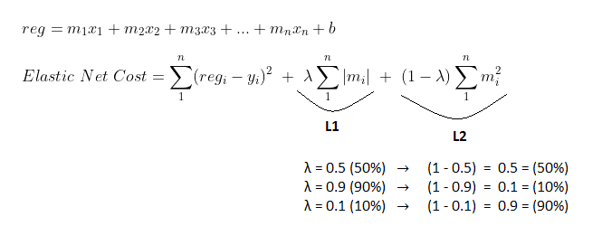

# Elastic Net

## Conteúdo

 - [01 - Introdução ao Algoritmo Elastic Net](#01)
 - [02 - Elastic Net na Prática](#02)

<div id='01'></div>

## 01 - Introdução ao Algoritmo Elastic Net

Ok, até então nós já estudamos os Algoritmos de [Regressão Linear](../linear-regression-and-gd) e [Ridge Regression (+Regularização L1 & L2)](../ridge-regression) e entendemos toda a lógica e prioridades de cada Algoritmo. Mas o que tem de especial o **Algoritmo Elas Net**?

> O Algoritmo **Elastic Net** utiliza a mesma lógica da *Regressão Linear* +  *Ridge Regression* (+Regularização L1 e L2) no mesmo Algoritmo.

Não entendeu? Vamos ver na fórmula como fica:

  

Vejam que agora nós estamos utilizando todos os conceitos juntos: **Regressão Linear** + **Ridge Regression (+Regularização L1 + L2)**

**NOTE:**  
Mas agora nós temos uma regrinha que vamos aplicar a nossa **constante λ (lambda do grego)**:

  

Isso significa que:

 - A nossa constante *λ (lambda do grego)* vai ser **maior** ou **igual a 0**;
 - E a nossa constante *λ (lambda do grego)* vai ser **menor** ou **igual a 1**.

Mas por que isso agora? Bem se você prestar atenção vai ver que essa constante multiplica as nossas regularizações **L1** e **L2**:

  

**NOTE:**  
Se você prestar bem atenção vai ver que no meu **L2** nós vamos ter **(1 - λ)**. O que isso significa?

> Sigiffica que nós estamos *dividindo* a nossa constante **λ** em **porcentagem (%)** entre **L1** e **L2**.

Vamos ver a imagem abaixo para ficar mais claro:

  

**NOTE:**  
Isso é importante para você dar uma *prioridade* entre a *Regularização* **L1** e **L2**.

<div id='02'></div>

## 02 - Elastic Net na Prática

Da mesma maneira que nós tinhamos classes no *Scikit-Learn* para trabalhar com outros modelos de regressões, também temos a classe [ElasticNet](https://scikit-learn.org/stable/modules/generated/sklearn.linear_model.ElasticNet.html). Vamos ver como fazer isso na prática:

[elastic-net.py](src/elastic-net.py)
```python
from sklearn.model_selection import train_test_split
from sklearn.linear_model import LinearRegression
from sklearn.linear_model import ElasticNet
from sklearn.linear_model import Ridge
from sklearn.linear_model import Lasso
from matplotlib import pyplot as plt
import pandas as pd

# Settings
pd.set_option('display.max_columns', 21)
df = pd.read_csv('../datasets/kc_house_data.csv')
df = df.drop(['id', 'date', 'zipcode', 'lat', 'long'], axis=1)
y = df['price']
x = df.drop(['price'], axis=1)
x_train, x_test, y_train, y_test = train_test_split(x, y, test_size=0.3, random_state=14)

# Linear Regression
linearRegressionModel = LinearRegression()
linearRegressionModel.fit(x_train, y_train)
r2 = linearRegressionModel.score(x_test, y_test)
print('Coeficiente de Determinação R^2 para o Algoritmos de Regressão Linear: {0}'.format(r2))

# Lasso Regression - L1
lassoModel = Lasso(alpha=10, max_iter=1000, tol=0.1)
lassoModel.fit(x_train, y_train)
lassoR2 = lassoModel.score(x_test, y_test)
print('Coeficiente de Determinação R^2 para o Algoritmos Ridge Regression - L1/Lasso: {0}'.format(lassoR2))

# Ridge Regression - L2
ridgeModel = Ridge(alpha=10)
ridgeModel.fit(x_train, y_train)
ridgeR2 = ridgeModel.score(x_test, y_test)
print('Coeficiente de Determinação R^2 para o Algoritmos Ridge Regression - L2: {0}'.format(ridgeR2))

# Elastic Net
elasticNetModel = ElasticNet(alpha=1, l1_ratio=0.5, tol=0.3)
elasticNetModel.fit(x_train, y_train)
elasticNetR2 = elasticNetModel.score(x_test, y_test)
print('Coeficiente de Determinação R^2 para o Algoritmos Elastic Net: {0}'.format(elasticNetR2))
```

**OUTPUT:**  
```python
Coeficiente de Determinação R^2 para o Algoritmos de Regressão Linear: 0.653809419628071
Coeficiente de Determinação R^2 para o Algoritmos Ridge Regression - L1/Lasso: 0.6538322613120116
Coeficiente de Determinação R^2 para o Algoritmos Ridge Regression - L2: 0.6545037069731695
Coeficiente de Determinação R^2 para o Algoritmos Elastic Net: 0.6233739640209431
```

---

[Didática Tech - Módulo I](https://didatica.tech/)  

---

**Rodrigo Leite -** *Software Engineer*
