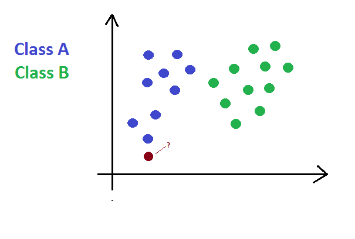
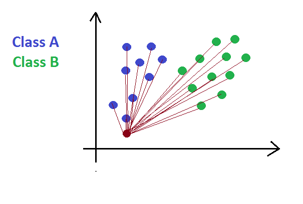
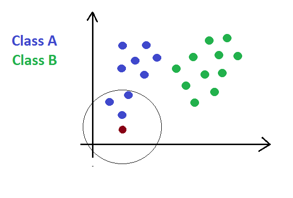
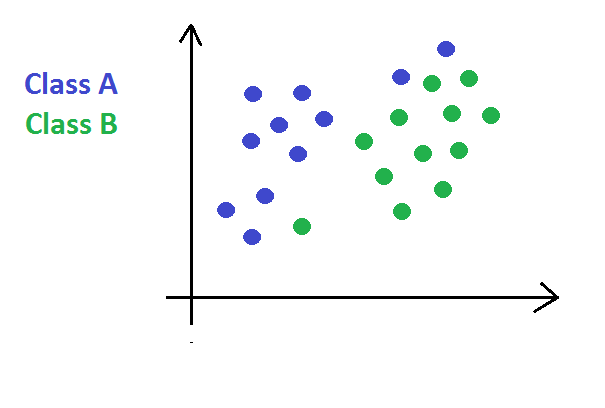
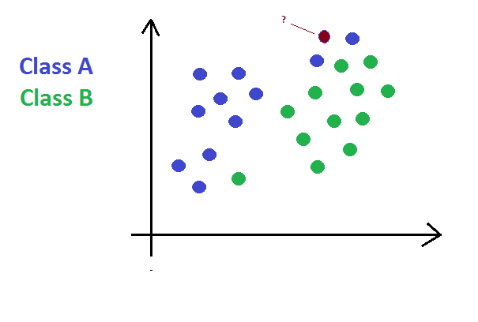
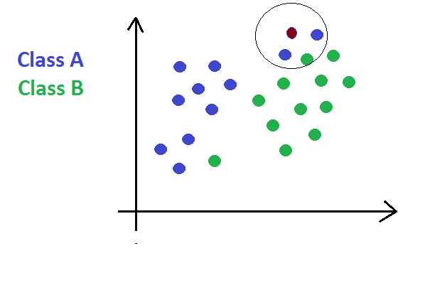

# Introdução ao Algoritmo KNN (K-Nearest Neighbors)

## Conteúdo

 - [01 - O Problema inicial (analogia)](#01)
 - [02 - Como o Algoritmo KNN funciona](#02)
 - [03 - O problema do ruído (dados distorcidos) e pequenos valores de "K" no Algoritmo KNN](#03)

---

## 01 - O Problema inicial (analogia)

Para entender o algoritmo **KNN (K-vizinhos mais próximos)** vamos começar com o seguinte problema. Suponha que nós recebemos um conjunto de dados que nós deu o seguinte gráfico:

  

Vejam que os nossos dados já estão classificados entre classes **A** e **B**. Agora suponha que nós entramos com um novo dado (amostra), algo parecido com isso:

  

**NOTE:**  
Como nós vamos saber em qual classe esse novo dado pertence?

---

## 02 - Como o Algoritmo KNN funciona

Bem, para resolver o nosso problema acima com o algoritmo **KNN**, simplesmente, nós vamos:

 - Calcular a distância de todos os pontos do nosso gráfico em relação ao nosso novo dado *(ou dado observado)*;
 - Armazenar/salvar todas essas distâncias;
 - Ver entre os **K's** vizinhos mais próximos qual classe é predominante:
   - Lembrando que esse **K** representa o número **"n"** de vizinhos mais próximos que nós vamos observar.

Não entendeu? Veja o exemplo abaixo:

Suponha que o nosso **K** é **3**, ou seja, **K = 3**:

**Primeiro, nós vamos calcular a distância de todos os dados em relação ao nosso novo dado *(ou dado observado)*:**

  

**Agora nós vamos armazenar/salvar todas essas distâncias *(para saber de fato quais são as maiores e menores)* pegar os K = 3, ou seja, quais os *3 K's* mais próximo do meu novo dado *(ou dado observado)*:**

  

**NOTE:**  
Bem, se você olhar bem vai ver que a *classe (ou K's)* predominante é a *classe A*, ou seja, o nosso novo dado *(ou dado observado)* seria classificado na *classe A (para esse exemplo)* seguindo a lógico do Algoritmo **KNN**.

**NOTE:**  
Vale salientar que o nosso **K** representa o número de *dados (K's)* mais próximos *(entre todos os dados)* que nós vamos observar para classificar o novo dado *(ou dado observado)*. Por exemplo, se o nosso **K** fosse igual **5** nós iriamos observar os **5** dados *(K's)* mais próximos para classificar o novo dado.

---

## 03 - O problema do ruído (dados distorcidos) e pequenos valores de "K" no Algoritmo KNN

**Agora suponha que nós recebemos um novo conjunto de dados já classificados, porém, esse veio com os dados um pouco distorcidos. Algo parecido com isso:**

  

**Agora vamos adicionar um novo dado (uma nova amostra) a esse conjunto de dados:**

  

**Ok, de qual classe pertence esse novo dado (amostra)? Suponha, que nós escolhemos um **K = 3** para o nosso algoritmo KNN, vai ficar assim:**

  

**NOTE:**  
Bem, a *classe* predominante é a **classe A** para esse nosso exemplo com **K = 3**. O problema é que os dados estão um pouco distorcidos. Se você olhar bem vai ver que não faz sentido esse novo dado ser da **classe A**, pois, só tem 2 dados desta classe entre vários outros da **classe B**.

> **Esse é um dos problemas de escolhermos um pequeno valor de *"K"* para o nosso Algoritmo *KNN*.**

---

**REFERÊNCIA:**  
[Didática Tech - Inteligência Artificial & Data Science](https://didatica.tech) 
