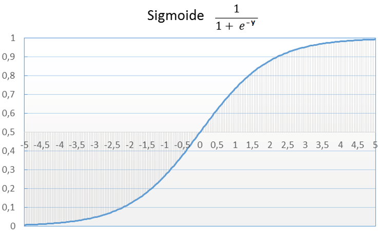

# Introduction to Logistic Regression

## Contents

 - [01 - Introduction to Classification & Logistic Regression](#01)

## 01 - Introduction to Classification & Logistic Regression

Well, unlike *Linear Regression* problems, where we are interested in investigating relationships between quantitative (numerical) variables. Classification problem tries to predict discrete class labels.

As well?

> Well, briefly (and not formally) we are trying to classify whether or not a label/class is what we are comparing.

Classification problems are those where one seeks to find a class, within the limited existing possibilities. This class can be:

 - If a student has **passed** or **failed**;
 - Whether a person **has an illness** or **not**...

**NOTE:**  
In these cases, the forecast will be one or the other. Classes can also have more than two options, such as separating people into three groups, **A**, **B** and **C**; Or **1**, **2** and **3**; Or even predicting the make of a particular car.

But does mathematics change a lot in relation to *Linear Regression* problems? Not necessarily, but we have some peculiarities. Let's start by reviewing the line equation for one or more variables:

  

Well, but now we have a little problem... This is because the **y** result of the **Equation of the Line** gives us a line as an **output** and we are interested in classifying it in certain existing classes. For example: **YES** or **NO**; **0** or **1**.

An interesting approach to solve our problem would be to use the **Sigmoid Function**:

  

Graphically it looks like this:

  

Now I am going to assume that you already know the **Sigmoid Function** that briefly:

 - Binarizes outputs between: **0** or **1**;
 - And has a **period of transition**.

Great, I know that with the S**igmoid Function** I can binarize my output, but how do I apply this to my Classification problem?

Simple:

---

**REFERENCES:**  
[Didática Tech - Inteligência Artificial & Data Science](https://didatica.tech/)  
[Problemas de Classificação e Regressão](https://didatica.tech/problemas-de-classificacao-e-regressao/)  

---

**Rodrigo Leite -** *Software Engineer*
