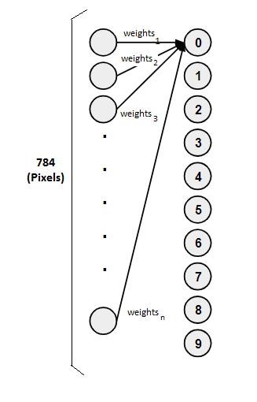
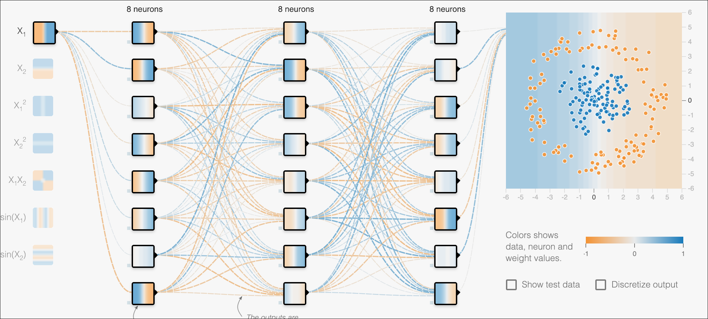
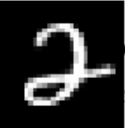
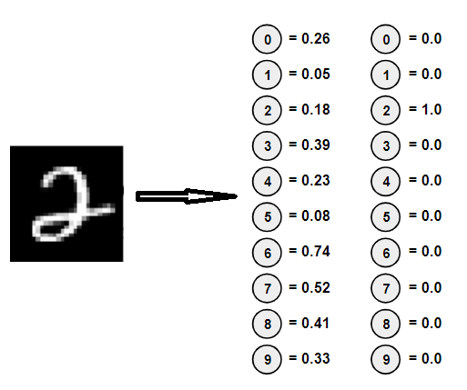

# History & Introduction to Artificial Neural Networks

## Contents

 - [01 - Artificial Neural Networks History](#01)
 - [02 - The first Artificial Neuron (Perceptron)](#02)
 - [03 - An abstract example of Artificial Neural Network](#03)
   - [03.1 - Dense Neural Networks](#03-1)

## 01 - Artificial Neural Networks History

Okay, to start with **Artificial Neural Networks**, nothing better than thinking about how this idea is based. In fact, neural networks are based on the same logic as human neurons.

See this image below to get a more visual idea:

  

As we know in a human brain there are **billions** of **neurons** and **synapses** *(which connect neurons)*. Knowing this we can try to create Artificial Neurons following this logic, however, using *mathematical models*.

---

## 02 - The first Artificial Neuron (Perceptron)

The first **Artificial Neuron** created was [Perceptron](https://en.wikipedia.org/wiki/Perceptron) in 1958 by [Frank Rosenblatt](https://en.wikipedia.org/wiki/Frank_Rosenblatt):

  

**NOTE:**  
The [Perceptron](https://en.wikipedia.org/wiki/Perceptron) had the main idea of receiving different input (or signals) and releases the output signal (result) **1** or **0**. This signal (result) basically tells whether the neuron is going to be active or not active to proceed to another neuron. Over time, scientists discovered that there were other possibilities for neurons; Not only *active* or *not active*, but we will not go into details for now.

[Perceptron](https://en.wikipedia.org/wiki/Perceptron) idea was a single neuron that received **xi** inputs; He multiplied these entries with their respective weights; Then it passed an Activation Function (Non-Linear) and received an output.

---

## 03 - An abstract example of Artificial Neural Network

Now to continue our studies on Neural Networks, let's think about the following problem:

> **How to create a neural network to identify numbers in an image?**

For example, we want to identify the number **4**... But how do we identify numbers in an image? Well, images on a computer are made up of several pixels.

See the abstraction *(just an example)* below:

  

In the image above:

 - **White pixels:** Represent the number **4**;
 - **And the black pixels:** The rest of the image.

**NOTE:**  
So, to train our neural network is very simple. Just pass several images of numbers to our neural network and it will identify common patterns for each number. For example, we pass several handwritten numbers **4** by several different people and our neural network will identify common patterns in numbers **4**.

Now see this very simple Neural Network abstraction below:

  

In the Neural Network (abstraction) above we have the following:

 - **1st -** The **input neurons (784 pixels)**; These neurons emit outputs between **0** and **1**;
 - **2nd -** The ***weights*** for each input neuron;
 - **3rd -** The **neurons** that will represent the numbers: **0**, **1**, **2**, **3**, **4**, **5**, **6**, **7**, **8**, **9**; These also output between **0** and **1**.

**NOTE:**  
In this example we only connected all inputs with the first neuron (representing the number zero), but in a **dense neural network** the neurons in the layer above connect with all their *predecessors*.

## 03.1 - Dense Neural Networks

**What is a dense neural network?**  
The name suggests that the layers are fully connected **(dense)** by neurons in a network layer. Each neuron in a layer receives input from all neurons present in the previous layer - so they are densely connected.

In other words, the dense layer is a fully connected layer, which means that all neurons in one layer are connected to those in the next layer.

  

**Why use a dense neural network?**  
A densely connected layer provides learning resources for all combinations of the resources of the previous layer, while a convolutional layer depends on resources consistent with a small repetitive field.

Going back to our example of identifying numbers with a Neural Network. Densely our Neural Network would look like this:

  

Now let's try to transform this *neural network* (abstraction) into mathematics:

  

In the above equation:

 - **Nn -** It is the neurons that will represent the numbers: **0** to **9**;
 - **xi -** Are the entries (784 pixels);
 - **wi -** Weights;
 - **b -** A constant (bias).

Another mathematical abstraction is as follows:

  

**NOTE:**  
Pay attention that in the example above we have only 1 neuron that will receive **xi** inputs. But in our example we are going to have 10 receptor neurons *(0 to 9)*. If you pay attention to this equation calmly, it is easy to imagine that it is similar to the **Best Line Equation** for several input variables of **xn**.  

**NOTE:**  
Knowing that all neurons will emit outputs between **0** and **1** *(e.g. 0.5, 0.8, 0.1, 0.9)* how can we binarize these outputs to be **0** or **1**?

Simple, just use the Sigmoide function:

  

Applying in practice looks like this:

  

  

For example, after multiplying all the input pixels **xi** with the weights **wi** and adding everything to the neuron that will represent the number zero (**N0**), the closer to **1** the more chance of being the number zero.

## Why the closer to 1 the more chance of being the zeo number?

To better understand this, suppose someone happened to pass the number **2** to our Neural Network to identify which number is in the image:

  

And as an output we had the following result for all neurons (which represent the numbers):

  

**Hey, why did the neuron representing number 2 only give 0.18 (18% probability of being number 2)?**  
Well, initially it is common in a *Neural Network* that weights **wi** start with random values ​​and we will calibrate until we find the best weights **wi** for the input.

See this other abstraction below:

  

**NOTE:**  
See that in the first column was when the weights **wi** of the *Neural Network* were started and in the second we want to get there.

Now what we are going to do is measure the error of our Neura Network. This can be done easily by subtracting the values ​​of current neurons with those we want to obtain.

**Did not understand? See below:**  

  

**NOTE:**  
Two very important observations must be made above:

 - **1st -** The **cost2** has index 2 because we inidicando the number 2 as input and only that;
 - **2nd -** The **size of our current wrong was 2.05**; And the closer to zero, the better our Neural Network is calibrated (the weights).

Hey, but why the closer to zero, the better our Neural Network is calibrated (the weights)?

**Then, see the scenario below:**  

  

  

**NOTE:**  
See that we now have the best possible scenario:

> **Our error size was zero. That's, 100% probability.**

  

**NOTE:**  
Well, this approach is just an *abstraction* as it would be for number 2, but remember that we need to train our *Neural Network* for several other numbers as well.

---

**REFERENCES:**  
[Introdução a Redes Neurais e Deep Learning](https://www.youtube.com/watch?v=Z2SGE3_2Grg&feature=emb_title)  
[The Mathematics of Neural Networks](https://medium.com/coinmonks/the-mathematics-of-neural-network-60a112dd3e05)  

---

**Rodrigo Leite -** *Software Engineer*
