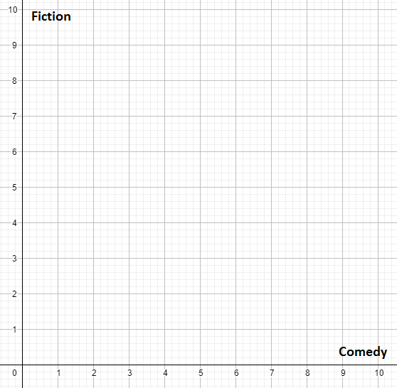
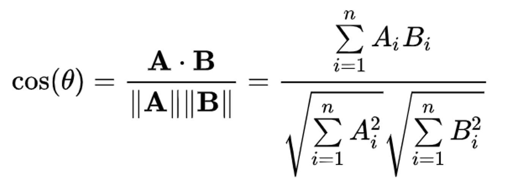
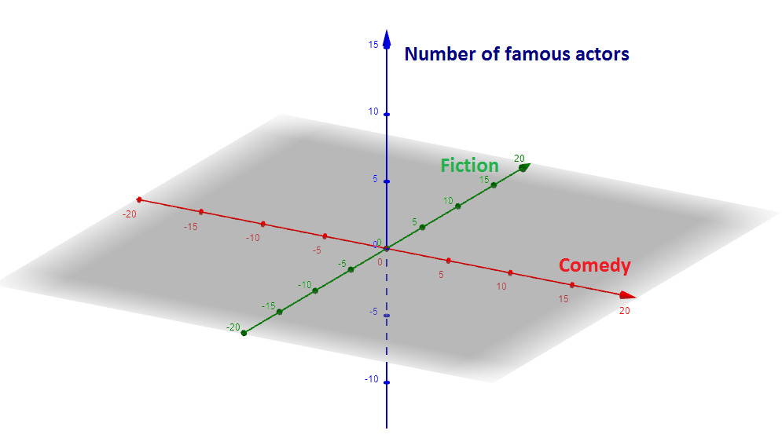

# Método Cosine Distance/ Similarity (Teoria)

## Conteúdo

 - [01 - Introdução ao calculo de similaridade (Cosine Distance/ Similarity)](#intro)
 - [02 - Calculando similaridade em gráficos tridimensionais (3D)](#3d)

---

## 01 - Introdução ao calculo de similaridade (Cosine Distance/ Similarity)

Imagine que nós temos o seguinte gráfico vetorial:

  

 - No **eixo-x** nós temos:
   - Filmes de comédia (comedy).
 - No **eixo-y** nós temos:
   - Filmes de ficção (Fiction).

O que nós vamos fazer aqui é o seguinte, medir a **similaridade (Similarity)** entre esses 2 tipos de filmes. Imagine que entraram 2 filmes com as seguintes classificações:

  

Olhando para o gráfico vetorial acima nós temos:

 - O **vetor A (1, 9)** representando um filme;
 - O **vetor B (6, 5)** representando outro filme.

**NOTE:**  
Agora vem a pergunta-chave:

> Como eu posso medir quão similar (similarity) são esses 2 filmes (A e B)? Ou seja, quão próximos eles estão um do outro em termo de característica.

Uma abordagem para resolver esse problema é utilizando a fórmula **"Cosine Distance"**:

  
  

**NOTE:**  
Essa fórmula nada mas é do que o cálculo do angulo entre esses 2 vetores **A** e **B**:

  

---

## 02 - Calculando similaridade em gráficos tridimensionais (3D)

Ótimo, em um gráfico vetorial **bidimensional** isso parece ser simples, mas em um cenário **tridimensional**? Por exemplo, veja o gráfico vetorial abaixo:

  

---

**REFERÊNCIA:**  
[Didática Tech](https://didatica.tech/)

---

**Rodrigo Leite -** *drigols*
