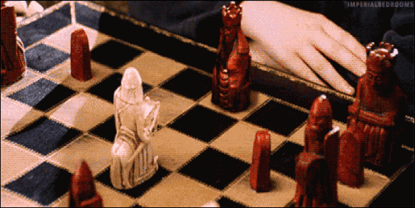

# Actions, States and Rewards

## Contents

 - [01 - States](#states)
 - [02 - Actions](#actions)
 - [03 - Rewards](#rewards)

---

## 01 - States

Well, to start understanding what **Actions**, **States** and **Rewards** are, let's think about a *chess game*:

  

> Let's imagine that the states are the positions where the pieces are at the moment.

**NOTE:**  
If two people (or even one playing itself) are playing at a certain point in the game the pieces will be positioned in very specific regions of the two opponents and this is what we can call or define as a state. That is, the position in which the pieces are in this specific scenario.

  

**NOTE:**  
Well, now you'll agree with me that if I move a single piece if I want we'll have another state. That is, another specific scenario.

---

## 02 - Actions

Okay, but what is an **Action** then? In a *chess game* an action can be an agent making a move (moving a piece):

  

**NOTE:**  
Well, now think with me... What happens to my every **action** in a *chess game*?

> **A new *state* is created.**

This is easy to understand, because for each action we will have a new specific scenario.

> **That is, a new *state*.**

---

## 03 - Rewards

So, following our train of thought in a game of chess the **rewards** are going to be the **feedbacks** we get after every action.

See the scenario below:

  

In this scenario the **rewards** was **positive** or **negative**?

**It depends:**
 - **If you were a white piece that moved and was captured** - The reward was negative (-1);
 - **Now if you were the red piece moving to capture the opponent** - The reward was positive (+1).

**NOTE:**  
Another note here is that an agent can do an action that will return zero. That is, no pieces were lost from either side.

---

**REFERENCES:**  
[Didática Tech - Inteligência Artificial & Data Science](https://didatica.tech/)  
[An Introduction to Deep Reinforcement Learning](https://thomassimonini.medium.com/an-introduction-to-deep-reinforcement-learning-17a565999c0c)  
