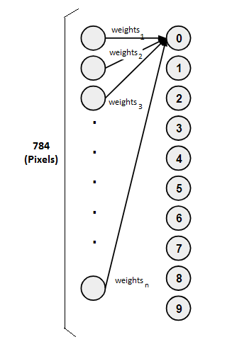
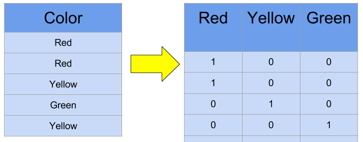

# A.I From Scratch

## Contents

 - **Artificial Neural Networks and Deep Learning:**
   - **Fundamentals of Artificial Neural Networks and Deep Learning:**
     - [Artificial Neural Networks Inspiration](#ann-inspiration)
     - [The First Artificial Neuron (Perceptron)](#perceptron)
     - [Artificial Neural Networks Components](#ann-components)
     - [How do Artificial Neural Networks learn? (Hypothetical example)](#how-do-learn)
     - [Dense Artificial Neural Networks](#intro-to-dnn)
 - **Implementations:**
   - **Utils:**
     - [](#)
 - [**Settings**](#settings)
 - [**REFERENCES**](#ref)
<!--- 
[WHITESPACE RULES]
- Same topic = "10" Whitespace character.
- Different topic = "50" Whitespace character.
--->


<!--- ( Fundamentals of ANN and DP ) --->

---

<div id="ann-inspiration"></div>

## Artificial Neural Networks Inspiration

> To begin with **Artificial Neural Networks**, it's essential to understand the inspiration behind them.

In fact, *Artificial Neural Networks* are based on the same logic as human neurons.

**Take a look at this image to get a better visual understanding:**  


As we know, the human brain has **billions** of *neurons* and *synapses (which connect neurons)*. Knowing this, we can try to create **Artificial Neurons** following this logic, but using mathematical models.


---

<div id="perceptron"></div>

## The First Artificial Neuron (Perceptron)

The first **Artificial Neuron** created was the **[Perceptron](https://en.wikipedia.org/wiki/Perceptron)** in 1958 by [Frank Rosenblatt](https://en.wikipedia.org/wiki/Frank_Rosenblatt):


 - The **[Perceptron](https://en.wikipedia.org/wiki/Perceptron)** had the main idea of receiving different inputs (or signals) and outputting the signal (result) **1** or **0**.
 - This signal (result) basically indicates whether the neuron will be *active* or *not* to proceed to another neuron.
 - Over time, scientists discovered that there were other possibilities for neurons; Not only *active* or *not*, but we won't delve into details for now.

**NOTE:**  
The **[Perceptron](https://en.wikipedia.org/wiki/Perceptron)** idea was:

 - A single *"neuron"* that receives **x<sub>i</sub>** inputs;
 - Multiplies these inputs by their respective *"weights"*;
 - Pass the multiplication to *"Non-Linear Activation Function"*
 - It takes multiplication and passes it through a *"Nonlinear Activation Function"*.
 - Finnaly, receive an *"output"*.


---

<div id="ann-components"></div>

## Artificial Neural Networks Components

To understand the basics of ANNs, let's take a look at the following components:


Looking at the image above, we can see our ANNs have the following components:

 - **Inputs:**
   - The *"inputs"* are the **x<sub>i</sub>** values.
 - **Weights:**
   - The *"weights"* are the **w<sub>i</sub>** values.
   - Like a graph, the *"weights"* are related to the *"inputs"*.
 - **Sum:**
   - The *"sum"* is the **x<sub>i</sub>** multiplied by the **w<sub>i</sub>**.
 - **Activation Function:**
   - The "activation function (f<sub>i</sub>)" applies *nonlinearity* to the *"sum"*.
 - **Output:**
   - The *"output"* is the predicted **ŷ** value.

Mathematically the formula is:

  

Where:

 - **ŷ:**
   - The predicted value.
   - Passed by the *"Activation Function"*.
 - **g():**
   - The *Activation Function*.
 - **w<sub>0</sub>:**
   - The *Bias*.
 - **X<sup>T</sup>:**
   - The *vector of inputs*.
   - E.g: *x<sub>1</sub>, x<sub>2</sub>, ..., x<sub>i</sub>*.
   - The exponential *"T"* means *transpose the matrix*.
 - **W:**
   - The *vector of weights*.
   - E.g: *w<sub>1</sub>, w<sub>2</sub>, ..., w<sub>i</sub>*.


---

<div id=""></div>

## Artificial Neural Networks Components

To understand the basics of ANNs, let's take a look at the following components:


Looking at the image above, we can see our ANNs have the following components:

 - **Inputs:**
   - The *"inputs"* are the **x<sub>i</sub>** values.
 - **Weights:**
   - The *"weights"* are the **w<sub>i</sub>** values.
   - Like a graph, the *"weights"* are related to the *"inputs"*.
 - **Sum:**
   - The *"sum"* is the **x<sub>i</sub>** multiplied by the **w<sub>i</sub>**.
 - **Activation Function:**
   - The "activation function (f<sub>i</sub>)" applies *nonlinearity* to the *"sum"*.
 - **Output:**
   - The *"output"* is the predicted **ŷ** value.

Mathematically the formula is:

  

Where:

 - **ŷ:**
   - The predicted value.
   - Passed by the *"Activation Function"*.
 - **g():**
   - The *Activation Function*.
 - **w<sub>0</sub>:**
   - The *Bias*.
 - **X<sup>T</sup>:**
   - The *vector of inputs*.
   - E.g: *x<sub>1</sub>, x<sub>2</sub>, ..., x<sub>i</sub>*.
   - The exponential *"T"* means *transpose the matrix*.
 - **W:**
   - The *vector of weights*.
   - E.g: *w<sub>1</sub>, w<sub>2</sub>, ..., w<sub>i</sub>*.


---

<div id="how-do-learn"></div>

## How do Artificial Neural Networks learn? (Hypothetical example)

To understand how **Artificial Neural Networks** learn, let's consider the following problem:

> **How to create an *Artificial Neural Network* to identify numbers in an image?**

For example, we want to identify the number **4**... But how to identify numbers in an image? Well, images on a computer are composed of various pixels.

Look at the abstraction (it's just an example) below:


In the image above:

- **The white pixels:** Represent the number 4;
- **And the black pixels:** The rest of the image.

> **NOTE:**  
So, to train our *neural network* is very simple. Just pass several images of numbers to our neural network and it will identify common patterns for each number.

For example, we pass several hand-written numbers **4** by various different people and our neural network will identify common patterns in the numbers **4**.

Now take a look at this very simple abstraction of an **Artificial Neural Network** below:



In the **Artificial Neural Network** (abstraction) above, we have:

- **1st -** The **input neurons *(784 pixels)***.
- **2nd -** The **weights** of each *input neuron*.
- **3rd -** The **neurons** that will represent the numbers: **0**, **1**, **2**, **3**, **4**, **5**, **6**, **7**, **8**, **9**.

> **NOTE:**  
> In the example above, we made the connection only from all inputs to the first neuron *(representing the number zero)*, but in a **Dense Neural Network**, the neurons from the layer above connect to all their *predecessors*.


---

<div id="intro-to-dnn"></div>

## Dense Artificial Neural Networks

Briefly:

> An **Artificial Neural Network** is *"dense"* when the neurons on the current layer are connected to all neurons in the previous layer *(From the *input neurons* onwards/em diante)*.

For example:

  

See that:

 - From the **input neurons** onwards (em diante), each *neuron* in the current **layer** *"receives output from all neurons in the previous layer"* - Hence they are densely connected.
 - In other words, the dense layer is fully connected, meaning all neurons in one layer are connected to those in the next layer.

> **Why use a Dense Neural Network?**

**NOTE:**  
A densely (densamente) connected layer provides learning features of all combinations of the features from the previous layer.

Returning to our example of identifying numbers with an **Artificial Neural Network** would look like this:

  


<!--- ( Implementations ) --->

---

<div id="keras-to-categorical"></div>

## to_categorical()

To understand the need for **One-Hot Encoding** let's start with the following question:

 - **Independent variables:**
   - To train an *Artificial Neural Network*, we need to pass *inputs (x independent variables)* to our model and have the model learn from these *inputs (x independent variables)*.
 - **Dependent variables:**
   - In the training process, the model also needs to know the *output (y dependent variables)* to compare the inputs with the *output (y dependent variables)*.

For example, [The Iris Dataset](https://scikit-learn.org/stable/auto_examples/datasets/plot_iris_dataset.html) has **150 samples** and 3 **categories (setosa, versicolor, virginica)**:

  

Now, let's check the **Independent** and **Dependent variables**:

[iris_problem.py](src/keras/iris_problem.py)
```python
from sklearn.datasets import load_iris
import pandas as pd

iris = load_iris()
x = pd.DataFrame(iris.data, columns=[iris.feature_names])
y = pd.Series(iris.target)

print("Independent Variables:\n", x.head())
print("\nDependent Variables:\n", y.head())
print("\nClasses/Categories number:\n", y.value_counts())
```

**OUTPUT:**
```bash
Independent Variables:
   sepal length (cm) sepal width (cm) petal length (cm) petal width (cm)
0               5.1              3.5               1.4              0.2
1               4.9              3.0               1.4              0.2
2               4.7              3.2               1.3              0.2
3               4.6              3.1               1.5              0.2
4               5.0              3.6               1.4              0.2

Dependent Variables:
 0    0
1    0
2    0
3    0
4    0
dtype: int64

Classes/Categories number:
 0    50
1    50
2    50
Name: count, dtype: int64
```

How we know we have three types of **classes (categories)**.

> **Then why do I need *"One-Hot Encoding"*?**

The One-Hot Encoding separates the Classes/Categories into columns and set:

 - 1 if the category is the same as the column name.
 - 0 if the category is different from the column name.

For example, see the image below to understand more easily:

  

Now, let's apply this concepts using the **keras "to_categorical"** function:

[keras_iris_problem.py](src/keras/keras_iris_problem.py)
```python
import keras

y = keras.utils.to_categorical(y)
print("\nDependent Variables One Hot Encoded:\n", y)
```

**OUTPUT:**
```bash
Dependent Variables One Hot Encoded:
 [[1. 0. 0.]
 [1. 0. 0.]
 [1. 0. 0.]
 [1. 0. 0.]
 [1. 0. 0.]
 [1. 0. 0.]
 [1. 0. 0.]
 [1. 0. 0.]
 [1. 0. 0.]
 [1. 0. 0.]
 [1. 0. 0.]
 [1. 0. 0.]
 [1. 0. 0.]
 [1. 0. 0.]
 [1. 0. 0.]
 [1. 0. 0.]
 [1. 0. 0.]
 [1. 0. 0.]
 [1. 0. 0.]
 [1. 0. 0.]
 [1. 0. 0.]
 [1. 0. 0.]
 [1. 0. 0.]
 [1. 0. 0.]
 [1. 0. 0.]
 [1. 0. 0.]
 [1. 0. 0.]
 [1. 0. 0.]
 [1. 0. 0.]
 [1. 0. 0.]
 [1. 0. 0.]
 [1. 0. 0.]
 [1. 0. 0.]
 [1. 0. 0.]
 [1. 0. 0.]
 [1. 0. 0.]
 [1. 0. 0.]
 [1. 0. 0.]
 [1. 0. 0.]
 [1. 0. 0.]
 [1. 0. 0.]
 [1. 0. 0.]
 [1. 0. 0.]
 [1. 0. 0.]
 [1. 0. 0.]
 [1. 0. 0.]
 [1. 0. 0.]
 [1. 0. 0.]
 [1. 0. 0.]
 [1. 0. 0.]
 [0. 1. 0.]
 [0. 1. 0.]
 [0. 1. 0.]
 [0. 1. 0.]
 [0. 1. 0.]
 [0. 1. 0.]
 [0. 1. 0.]
 [0. 1. 0.]
 [0. 1. 0.]
 [0. 1. 0.]
 [0. 1. 0.]
 [0. 1. 0.]
 [0. 1. 0.]
 [0. 1. 0.]
 [0. 1. 0.]
 [0. 1. 0.]
 [0. 1. 0.]
 [0. 1. 0.]
 [0. 1. 0.]
 [0. 1. 0.]
 [0. 1. 0.]
 [0. 1. 0.]
 [0. 1. 0.]
 [0. 1. 0.]
 [0. 1. 0.]
 [0. 1. 0.]
 [0. 1. 0.]
 [0. 1. 0.]
 [0. 1. 0.]
 [0. 1. 0.]
 [0. 1. 0.]
 [0. 1. 0.]
 [0. 1. 0.]
 [0. 1. 0.]
 [0. 1. 0.]
 [0. 1. 0.]
 [0. 1. 0.]
 [0. 1. 0.]
 [0. 1. 0.]
 [0. 1. 0.]
 [0. 1. 0.]
 [0. 1. 0.]
 [0. 1. 0.]
 [0. 1. 0.]
 [0. 1. 0.]
 [0. 1. 0.]
 [0. 1. 0.]
 [0. 1. 0.]
 [0. 1. 0.]
 [0. 1. 0.]
 [0. 0. 1.]
 [0. 0. 1.]
 [0. 0. 1.]
 [0. 0. 1.]
 [0. 0. 1.]
 [0. 0. 1.]
 [0. 0. 1.]
 [0. 0. 1.]
 [0. 0. 1.]
 [0. 0. 1.]
 [0. 0. 1.]
 [0. 0. 1.]
 [0. 0. 1.]
 [0. 0. 1.]
 [0. 0. 1.]
 [0. 0. 1.]
 [0. 0. 1.]
 [0. 0. 1.]
 [0. 0. 1.]
 [0. 0. 1.]
 [0. 0. 1.]
 [0. 0. 1.]
 [0. 0. 1.]
 [0. 0. 1.]
 [0. 0. 1.]
 [0. 0. 1.]
 [0. 0. 1.]
 [0. 0. 1.]
 [0. 0. 1.]
 [0. 0. 1.]
 [0. 0. 1.]
 [0. 0. 1.]
 [0. 0. 1.]
 [0. 0. 1.]
 [0. 0. 1.]
 [0. 0. 1.]
 [0. 0. 1.]
 [0. 0. 1.]
 [0. 0. 1.]
 [0. 0. 1.]
 [0. 0. 1.]
 [0. 0. 1.]
 [0. 0. 1.]
 [0. 0. 1.]
 [0. 0. 1.]
 [0. 0. 1.]
 [0. 0. 1.]
 [0. 0. 1.]
 [0. 0. 1.]
 [0. 0. 1.]]
```

### MNIST Dataset

Another example is when training a Neural Network for the [MNIST Dataset](https://keras.io/api/datasets/mnist/).

[keras_mnist_problem.py](src/keras/keras_mnist_problem.py)
```python
import os
os.environ["TF_CPP_MIN_LOG_LEVEL"] = "3"

from keras.datasets import mnist
from keras.utils import to_categorical

(x_train, y_train), (x_test, y_test) = mnist.load_data()

print("Independent Variables:\n", x_train)
print("\nDependent Variables:\n", y_train)
```

**OUTPUT:**
```bash
Independent Variables:
 [[[0 0 0 ... 0 0 0]
  [0 0 0 ... 0 0 0]
  [0 0 0 ... 0 0 0]
  ...
  [0 0 0 ... 0 0 0]
  [0 0 0 ... 0 0 0]
  [0 0 0 ... 0 0 0]]

 [[0 0 0 ... 0 0 0]
  [0 0 0 ... 0 0 0]
  [0 0 0 ... 0 0 0]
  ...
  [0 0 0 ... 0 0 0]
  [0 0 0 ... 0 0 0]
  [0 0 0 ... 0 0 0]]

 [[0 0 0 ... 0 0 0]
  [0 0 0 ... 0 0 0]
  [0 0 0 ... 0 0 0]
  ...
  [0 0 0 ... 0 0 0]
  [0 0 0 ... 0 0 0]
  [0 0 0 ... 0 0 0]]

 ...

 [[0 0 0 ... 0 0 0]
  [0 0 0 ... 0 0 0]
  [0 0 0 ... 0 0 0]
  ...
  [0 0 0 ... 0 0 0]
  [0 0 0 ... 0 0 0]
  [0 0 0 ... 0 0 0]]

 [[0 0 0 ... 0 0 0]
  [0 0 0 ... 0 0 0]
  [0 0 0 ... 0 0 0]
  ...
  [0 0 0 ... 0 0 0]
  [0 0 0 ... 0 0 0]
  [0 0 0 ... 0 0 0]]

 [[0 0 0 ... 0 0 0]
  [0 0 0 ... 0 0 0]
  [0 0 0 ... 0 0 0]
  ...
  [0 0 0 ... 0 0 0]
  [0 0 0 ... 0 0 0]
  [0 0 0 ... 0 0 0]]]

Dependent Variables:
 [5 0 4 ... 5 6 8]
```

See that:

 - **The Independent variables:**
   - Matrices of pixels (images).
   - For example: (60000, 28, 28) = 60000 images (matrices) 28x28 pixels.
 - **The Dependent variables:**
   - The labels of the images.
   - 10 Classes/Categories: 0 to 9.

Now, let's apply the **One-Hot Encoding** to the *Dependent Variables (y target)*:

[keras_mnist_problem.py](src/keras/keras_mnist_problem.py)
```python
y_train = to_categorical(y_train)
y_test = to_categorical(y_test)

print("------------------------------")
print("|0, 1, 2, 3, 4, 5, 6, 7, 8, 9|")
print("------------------------------")
for i in range(50):
    print(y_train[i])
```

**OUTPUT:**
```bash
------------------------------
|0, 1, 2, 3, 4, 5, 6, 7, 8, 9|
------------------------------
[0. 0. 0. 0. 0. 1. 0. 0. 0. 0.]
[1. 0. 0. 0. 0. 0. 0. 0. 0. 0.]
[0. 0. 0. 0. 1. 0. 0. 0. 0. 0.]
[0. 1. 0. 0. 0. 0. 0. 0. 0. 0.]
[0. 0. 0. 0. 0. 0. 0. 0. 0. 1.]
[0. 0. 1. 0. 0. 0. 0. 0. 0. 0.]
[0. 1. 0. 0. 0. 0. 0. 0. 0. 0.]
[0. 0. 0. 1. 0. 0. 0. 0. 0. 0.]
[0. 1. 0. 0. 0. 0. 0. 0. 0. 0.]
[0. 0. 0. 0. 1. 0. 0. 0. 0. 0.]
[0. 0. 0. 1. 0. 0. 0. 0. 0. 0.]
[0. 0. 0. 0. 0. 1. 0. 0. 0. 0.]
[0. 0. 0. 1. 0. 0. 0. 0. 0. 0.]
[0. 0. 0. 0. 0. 0. 1. 0. 0. 0.]
[0. 1. 0. 0. 0. 0. 0. 0. 0. 0.]
[0. 0. 0. 0. 0. 0. 0. 1. 0. 0.]
[0. 0. 1. 0. 0. 0. 0. 0. 0. 0.]
[0. 0. 0. 0. 0. 0. 0. 0. 1. 0.]
[0. 0. 0. 0. 0. 0. 1. 0. 0. 0.]
[0. 0. 0. 0. 0. 0. 0. 0. 0. 1.]
[0. 0. 0. 0. 1. 0. 0. 0. 0. 0.]
[1. 0. 0. 0. 0. 0. 0. 0. 0. 0.]
[0. 0. 0. 0. 0. 0. 0. 0. 0. 1.]
[0. 1. 0. 0. 0. 0. 0. 0. 0. 0.]
[0. 1. 0. 0. 0. 0. 0. 0. 0. 0.]
[0. 0. 1. 0. 0. 0. 0. 0. 0. 0.]
[0. 0. 0. 0. 1. 0. 0. 0. 0. 0.]
[0. 0. 0. 1. 0. 0. 0. 0. 0. 0.]
[0. 0. 1. 0. 0. 0. 0. 0. 0. 0.]
[0. 0. 0. 0. 0. 0. 0. 1. 0. 0.]
[0. 0. 0. 1. 0. 0. 0. 0. 0. 0.]
[0. 0. 0. 0. 0. 0. 0. 0. 1. 0.]
[0. 0. 0. 0. 0. 0. 1. 0. 0. 0.]
[0. 0. 0. 0. 0. 0. 0. 0. 0. 1.]
[1. 0. 0. 0. 0. 0. 0. 0. 0. 0.]
[0. 0. 0. 0. 0. 1. 0. 0. 0. 0.]
[0. 0. 0. 0. 0. 0. 1. 0. 0. 0.]
[1. 0. 0. 0. 0. 0. 0. 0. 0. 0.]
[0. 0. 0. 0. 0. 0. 0. 1. 0. 0.]
[0. 0. 0. 0. 0. 0. 1. 0. 0. 0.]
[0. 1. 0. 0. 0. 0. 0. 0. 0. 0.]
[0. 0. 0. 0. 0. 0. 0. 0. 1. 0.]
[0. 0. 0. 0. 0. 0. 0. 1. 0. 0.]
[0. 0. 0. 0. 0. 0. 0. 0. 0. 1.]
[0. 0. 0. 1. 0. 0. 0. 0. 0. 0.]
[0. 0. 0. 0. 0. 0. 0. 0. 0. 1.]
[0. 0. 0. 0. 0. 0. 0. 0. 1. 0.]
[0. 0. 0. 0. 0. 1. 0. 0. 0. 0.]
[0. 0. 0. 0. 0. 0. 0. 0. 0. 1.]
[0. 0. 0. 1. 0. 0. 0. 0. 0. 0.]
```

> **NOTE:**  
> We have a mapping to the Classes/Categories of images again.


<!--- ( Settings ) --->

---

<div id="settings"></div>

## Settings

**CREATE VIRTUAL ENVIRONMENT:**  
```bash
python -m venv ai-environment
```

**ACTIVATE THE VIRTUAL ENVIRONMENT (LINUX):**  
```bash
source ai-environment/bin/activate
```

**ACTIVATE THE VIRTUAL ENVIRONMENT (WINDOWS):**  
```bash
source ai-environment/Scripts/activate
```

**UPDATE PIP:**
```bash
python -m pip install --upgrade pip
```

**INSTALL PYTHON DEPENDENCIES:**  
```bash
pip install -U -v --require-virtualenv -r requirements.txt
```

**Now, Be Happy!!!** 😬


<!--- ( REFERENCES ) --->

---

<div id="ref"></div>

## REFERENCES

 - [](#)

---

**Rodrigo** **L**eite da **S**ilva
