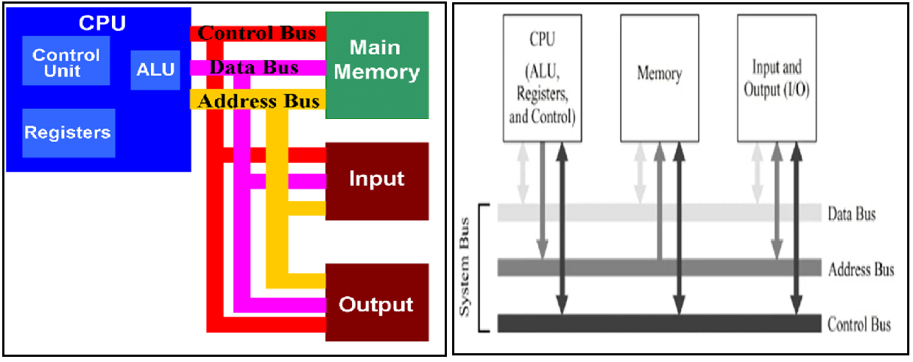

# Computer Organization and Architecture

## Contents

 - **Data Representation in Computer Systems:**
   - **Information Measurements (Units of Information):**
     - [Bits](#intro-to-bits)
 - **Processors:**
   - [**Registers:**](#intro-to-registers)
   - **Processors Architectures (Describes the characteristics of an *"processor line"*):**
     - [x86](#intro-x86)
       - [x86 and Von Neumann Architecture (+Von Neumann bottleneck)](#x86-vna)
     - [AMD64](#intro-amd64)
     - [ARM](#intro-arm)

<!--- 
[WHITESPACE RULES]
- Same topic = "10" Whitespace character.
- Different topic = "50" Whitespace character.
--->

<!--- ( Data Representation in Computer Systems/Information Measurements (Units of Information) ) --->

## Bit (Binary Digit | 0 or 1)

> The most basic unit of information in a digital computer is called a **"bit"**, which is a contraction of **"Binary Digit"**.

In the concrete sense, a **"bit"** is nothing more than a state of **“on”** or **“off” (or “high” and “low”)** within a computer circuit. In 1964, the designers of the IBM System/360 mainframe

  

| Unit of measurement | Abbreviation | Conversion               |
| ------------------- | ------------ | ------------------------ |
| **Bit**             | b            | 1 bit                    |
| **Nibble**          | -            | 4 bits (or half a Byte)  |
| **Byte**            | B            | 8 bits                   |
| **Kilobyte**        | KB           | 1024 bytes               |
| **Megabyte**        | MB           | 1024 kilobytes           |
| **Gigabyte**        | GB           | 1024 megabytes           |
| **Terabyte**        | TB           | 1024 gigabytes           |
| **Petabyte**        | PB           | 1024 terabytes           |

---

## Word

> The **Word (The maximum number of bits a computer can process at one time)** size refers to the maximum number of bits a CPU can process at a time. Most CPUs use a much bigger word size than 8 bits.

 - *32-bit/64-bit* CPUs can handle *32 bits/64 bits* of information at one time.
 - Modern PCs have a *64-bit* processor.
 - A *64-bit CPU* can handle numbers larger than 18 quintillion (as 264 = 18,446,744,073,709,551,615).

<!--- ( Processors/Registers ) --->>

---

## Registers

x

<!--- ( Processors/Processors Architectures ) --->

---

## x86

> The **x86 processor** was born with *"Intel's 8086"* in *1978*.

 - Basic service for a lot of processors.
 - Currently operates in 32 bits.

---

## x86 and Von Neumann Architecture (+Von Neumann bottleneck)

> The *x86 Architecture* follows the **Von Neumann Architecture**.

The Von Neumann Architecture is the following:

  

See that the CPU communicates with the memory by the **System Bus (Control Bus, Data Bus, and Address Bus**:

 - **Buses – Data is transmitted from one part of a computer to another, connecting all major internal components to the CPU and memory:**
   - **Data Bus:**
     - *It carries data among the memory unit (transporta dados entre a unidade de memória)*, the I/O devices, and the processor.
   - **Address Bus:**
     - It carries the address of data (not the actual data) between memory and processor. 
   - **Control Bus:**
     - It carries control commands from the CPU (and status signals from other devices) in order to control and coordinate all the activities within the computer.

**Von Neumann bottleneck:**
However, if you paid attention to Von Neumann's model, you will see that it is only possible to access memory once at a time. In other words, you either read or write. But not both at the same time.

---

## AMD64

> The **AMD64 processor** was born with the *"AMD Opteron"* in *2003*.

  - Currently operates in 64-bit.
  - Backward compatibility with x86 (also called x86-64).

---

## ARM

> The **ARM processor** was born with the *"Acorn ARM1"* in *1985*.

  - Currently operates in 32-bit.
  - Suitable (próprio) for Embedded Systems.

---

**Rodrigo** **L**eite da **S**ilva
