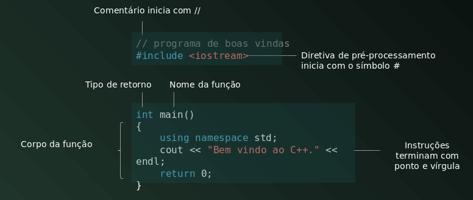

# Tradução Dirigida por Sintaxe (Syntax Directed Translation)

## Contents

 - [Introdução a sintaxe de um programa](#intro-to-sintax)
 - [Relação entre sintax de uma linguagem de programação e gramática](#sintax-grammar)
 - [Tradutor dirigido por sintaxe](#translator)

---

<div id="intro-to-sintax"></div>

## Introdução a sintaxe de um programa

> A **sintaxe de uma linguagem de programação** descreve a <u>forma</u> como os programas são escritos para essa línguagem.

Para entender melhor veja a imagem abaixo:



**NOTE:**  
Olhando para o programa (image) acima nós conseguimos identificar a forma como escreve um programa **C++.** Por exemplo:

 - Um comentário inicia com `//`
 - Diretivas de pré-processamento iniciam com `#
 - Funções tem:
   - Um tipo;
   - Um Nome;
   - Um corpo.
 - instruções terminam com ponto e vírgula `(;)`

**NOTE:**  
Essa é a <u>forma</u> de escrever um programa em **C++** e a sintaxe são essas regrinhas.

---

<div id="sintax-grammar"></div>

## Relação entre sintaxes de uma linguagem de programação e gramática

> As sintaxes das linguagens de programação podem ser representadas por gramáticas. Normalmente escritas na linguagem **Backus-Naur Form (BNF)**.

Por exemplo, veja uma parte da **gramática da linguagem C++** escrita em **Backus-Naur Form (BNF)**:

  

**NOTE:**  
Normalmente, gramáticas são utilizadas para fazer traduções que é uma tecnica muita utilizada em compiladores.

---

<div id="translator"></div>

## Tradutor dirigido por sintaxe

Uma das maneiras de entender melhor como funciona o Front-End de um Compilador seria criar um **tradutor dirigido por sintaxe**.

> esse tradutor deve traduzir expressões aritméticas **infixadas** para a forma **pós-fixada**.

 - **Notação infixada:**
   - Operadores aparecem <u>entre</u> os operandos.
 - **Notaçao pós-fixada:**
   - Operadores aparecem <u>após</u> operandos

Para entender melhor veja a imagem abaixo:

  

 - **No exemplo infixada:**
   - O operador `-` aparece <u>entre</u> os operandos **9** e **5**; E o operador `+` aparece <u>entre</u> o resultado da subtração (que vai gerar um operando) e o operando 2.
 - **No exemplo pós-fixada:**
   - O operador `-` vai aparecer <u>após</u> os operandos **9** e **5**; E o operador `+` vai aparecer <u>após</u> o operandor 2.

> **Mas quando eu vou precisar utilizar o modelo <u>pós-fixada</u>?**

Não sei se vocês já utilizaram a calculadora **HP 48G** (mais utilizada nos cursos de Engenharias para calcular integrais, derivadas) que segue um modelo de pilha (Stack), onde você vai empilhando os operandos e operadores.

Vejam o exemplo abaixo:

  

No exemplo acima a calculadora **HP 48G** adiciona os operandos **1** e **3** a pilha (pode ver no index da calculadora que começa de baixo para cima) e agora é só você adicionar o operador <u>após</u> os operandos oara a calculadora fazer a operação.

**NOTE:**  
Vejam que esse exemplo é o mesmo utilizado na **notaçao pós-fixada**.

x


[](src/)
```python

```

**OUTPUT:**  
```python

```


---

**REFERENCES:**  
[]()  

---

**Rodrigo Leite da Silva -** *drigols*
