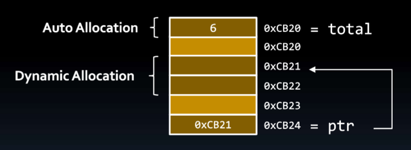
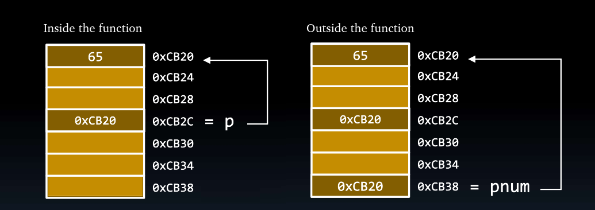
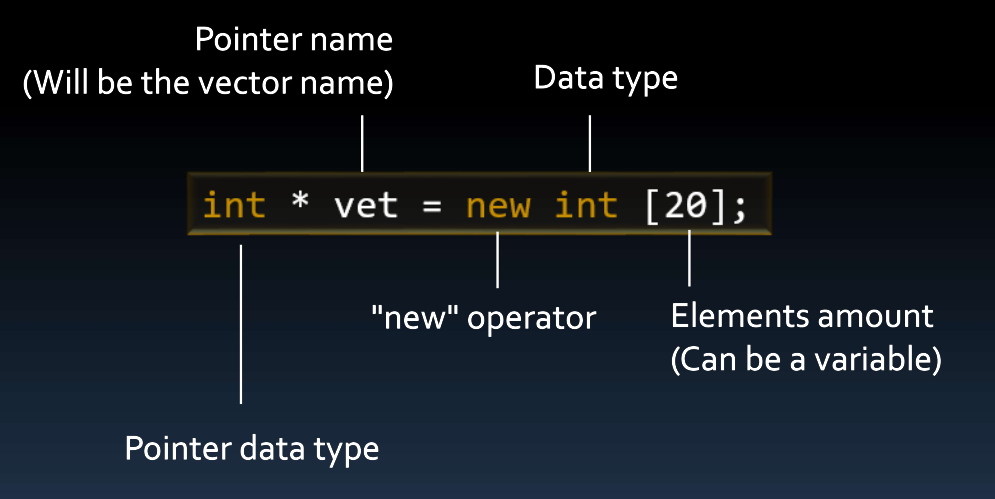
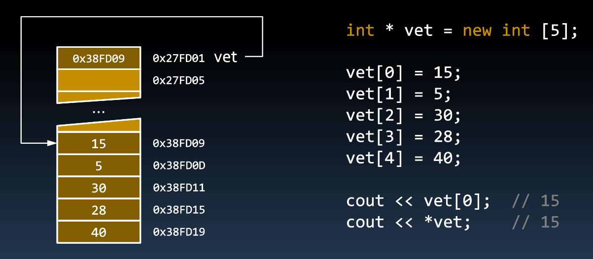

# Dynamic Memory Allocation

## Contents

 - [Memory Allocation: Auto Allocation vs. Dynamic Allocation](#aa-da)
 - [Intro to Dynamic Memory Allocation](#intro-to-dma)
 - [Deleting allocated memory (+delete operator)](#delete-operator)
 - [Memory Leak (+Some solutions)](#memory-leak)
 - [Dynamic Vectors (+Static Vectors vs. Dynamic Vectors)](#dynamic-va)
 - [Assign values to a Dynamic Vector (+The vector name (pointer) points to the first element of a vector)](#assign-values)
 - [Dynamic Records/Structs (+Vector of Records/Structs)](#dynamic-structs)
 - **Tips & Tricks:**
   - [When use Dynamic Memory Allocation?](#when-use-dma)

---

<div id="aa-da"></div>

## Memory Allocation: Auto Allocation vs. Dynamic Allocation

There are two approach to Memory Allocation:

 - **Auto Allocation:**
   - declare variables: *int total = 100;*
 - **Dynamic Allocation:**
   - Allocate memory with the **"new"** operator;
   - Save the memory address in a pointer;
   - Use the pointer to access and modify the data;
   - Free the memory with **"delete"** operator.

  

---

<div id="intro-to-dma"></div>

## Intro to Dynamic Memory Allocation

To allocate memory (dynamically) with the **"new"** operator to an *unlabeled memory* in C++, we use the follow definition:

  

For example, see the code below how allocate memory with the **"new"** operator:

[memory_allocation.cpp](src/memory_allocation.cpp)
```cpp
#include <iostream>

int main()
{
    int *iptr = new int; // Allocate memory for an Integer.
    *iptr = 1001;        // Save a value (using "*" operator | Indirection Operator)
    std::cout << "Integer value: " << *iptr << "\n";
    std::cout << "Location: " << iptr << "\n";
    std::cout << "Size of 'iptr': " << sizeof(iptr) << "\n";
    std::cout << "Size of '*iptr': " << sizeof(*iptr) << "\n";

    double *dprt = new double; // Allocate memory for a double
    *dprt = 500.35;            // Save a value (using "*" operator | Indirection Operator)
    std::cout << "\nFloating-point value: " << *dprt << "\n";
    std::cout << "Location: " << dprt << "\n";
    std::cout << "Size of 'dprt': " << sizeof(dprt) << "\n";
    std::cout << "Size of '*dprt': " << sizeof(*dprt) << "\n";

    return 0;
}
```

**COMPILATION AND RUN:**
```cpp
g++ memory_allocation.cpp -o test.out && ./test.out
```

**OUTPUT:**  
```cpp
Integer value: 1001
Location: 0x6b25a0
Size of 'iptr': 8
Size of '*iptr': 4

Floating-point value: 500.35
Location: 0x6b25c0
Size of 'dprt': 8
Size of '*dprt': 8
```

See the abstraction of the code above:

  

Ok, now let's review the code output:

**OUTPUT:**  
```cpp
Integer value: 1001
Location: 0x6b25a0
Size of 'iptr': 8
Size of '*iptr': 4

Floating-point value: 500.35
Location: 0x6b25c0
Size of 'dprt': 8
Size of '*dprt': 8
```

**What?**  
Why my **pointers have 8 Bytes (both)**?

> **NOTE:**  
> The size of your *pointer (in Bytes)* depends your computer architecture:  
> - 32 bits commonly use 4 Bytes.
> - 64 bits commonly use 8 Bytes.

---

<div id="delete-operator"></div>

## Deleting allocated memory (+delete operator)

> When using **Dynamic Memory Allocation** principles, the programmer always cares about one thing - **Freeing the allocated memory**.

To freeing the allocated memory the programer need to use **"delete"** operator. For example, see the code below how delete allocated memory by the programer:

[main_delete.cpp](src/main_delete.cpp)
```cpp
#include <iostream>

int main()
{
    int *iptr = new int; // Allocate memory for an Integer.
    *iptr = 30;          // Save a value (using "*" operator | Indirection Operator)

    std::cout << "Memory Address save in 'iptr' pointer: " << iptr << "\n";
    std::cout << "Value save in the Memory Address save in 'iptr' pointer: " << *iptr << "\n";
    std::cout << "Memory Address of 'iptr' pointer: " << &iptr << "\n"
              << "\n";

    delete iptr;

    std::cout << "After use 'delete' operator in 'iptr' pointer: "
              << "\n";
    std::cout << "Memory Address save in 'iptr' pointer: " << iptr << "\n";
    std::cout << "Value save in the Memory Address save in 'iptr' pointer: " << *iptr << "\n";
    std::cout << "Memory Address of 'iptr' pointer: " << &iptr << "\n";

    return 0;
}
```

**COMPILATION AND RUN:**
```cpp
g++ main_delete.cpp -o test.out && ./test.out
```

**OUTPUT:**  
```cpp
Memory Address save in 'iptr' pointer: 0xf125a0
Value save in the Memory Address save in 'iptr' pointer: 30
Memory Address of 'iptr' pointer: 0x61fe18

After use 'delete' operator in 'iptr' pointer: 
Memory Address save in 'iptr' pointer: 0xf125a0
Value save in the Memory Address save in 'iptr' pointer: 15804688
Memory Address of 'iptr' pointer: 0x61fe18
```

Seeing for the above program output we can see some observations:

 - **Our 'iptr' pointer still exists (ainda existe) and has the same memory address (0x61fe18):**
   - Yes, our **'iptr'** *pointer* still exists(ainda existe), the memory allocated was freed, however, the pointer still exists (ainda existe).
   - Knowing this, we also can save another memory address in the **'iptr'** *pointer*.
 - **Even after freeing the memory our pointer still points to the same memory space (0xf125a0):**
   - Yes, our pointer still has the same memory address saved.
   - Knowing this, we need to take care to don't use this pointer to work because this pointer points to memory we don't allocate any more.

---

<div id="memory-leak"></div>

## Memory Leak (+Some solutions)

> The **"new"** operator must (deve) always be balanced with the use of the **"delete"** operator. Otherwise (caso contrário), there is a **memory leak**.

For example, imagine we allocate the following memory:

```cpp
int *p = new int;
*p = 30;
```

  

See that:

 - First, we allocated memory:
   - `int *p = new int`
 - Next, we put a value in allocated memory:
   - `*p = 30`

Now, imagine we allocate memory to the same pointer without use **"delete"** *operator*:

```cpp
p = new int;
*p = 50;
```

  

Now, we have a problem:

 - **We don't have any more the old memory address saved in "p":**
   - That's, don't have how to use **"delete"** *operator* in the old allocated memory.
   - We lost the memory address of old allocated memory.

> This is what we know as a ***memory leak***.

For example, see a function that print the ASCII number of a character typed, however, we don't use **"delete"** *operator*:

[print_ascii.h](src/print_ascii.h)
```cpp
#pragma once

void printASCII(char ch);
```

[print_ascii.cpp](src/print_ascii.cpp)
```cpp
#include <iostream>

void printASCII(char ch)
{
    int *p = new int{ch};
    std::cout << "The ASCII number is: " << *p << "\n";
}
```

[drive_print_ascii.cpp](src/drive_print_ascii.cpp)
```cpp
#include <iostream>
#include "print_ascii.h"

int main()
{
    char ch;

    std::cout << "Enter a character: ";
    std::cin >> ch;

    printASCII(ch);

    return 0;
}
```

**COMPILATION AND RUN:**
```cpp
g++ print_ascii.cpp drive_print_ascii.cpp -o test.out && ./test.out
```

**OUTPUT:**  
```cpp
Enter a character: A
The ASCII number is: 65
```

  

**NOTE:**  
See that we have a problem... the pointer **"p"** stop existing when the function ends. That's, we don't have any more access to allocated memory in the function.

 - Imagine that our program call the function printASCII() many times?
 - Many times we allocated memory, however, don't freeing the memory.
 - That's, we have a **memory leak** problem.

> **Ok, but how solve that?**

An approach to solve that is using a function that returns a **pointer (memory address)** to our *allocated memory*:

[get_ascii.h](src/get_ascii.h)
```cpp
#pragma once

int *getASCII(char ch);
```

[get_ascii.cpp](src/get_ascii.cpp)
```cpp
int *getASCII(char ch)
{
    int *p = new int{ch};
    return p;
}
```

[drive_get_ascii.cpp](src/drive_get_ascii.cpp)
```cpp
#include <iostream>
#include "get_ascii.h"

int main()
{
    char ch;

    std::cout << "Enter a character: ";
    std::cin >> ch;

    // Pointer (*pnum) var to save memory address returned by getASCII() function.
    int *pnum = getASCII(ch);

    std::cout << "Value saved in '*pnum' pointer allocated inside getASCII() function: " << *pnum << "\n";
    delete pnum; // delete allocated memory inside getASCII() function.
    std::cout << "Value saved in '*pnum' pointer after delete allocated memory: " << *pnum << "\n";

    return 0;
}
```

**COMPILATION AND RUN:**
```cpp
g++ get_ascii.cpp drive_get_ascii.cpp -o test.out && ./test.out
```

**INTPUT:**  
```
Enter a character: A
```

**OUTPUT:**  
```cpp
Value saved in '*pnum' pointer allocated inside getASCII() function: 65
Value saved in '*pnum' pointer after delete allocated memory: 14821648
```



 - **See that first we allocated memory inside the function getASCII():**
   - `int *p = new int{ch}`
 - **Next, we returns the memory address (pointer) to allocated memory:**
   - `return p`
   - That's, even (mesmo) if the pointer that pointed to the allocated memory ceases (deixar) to exist (when the function ends) we still (ainda) have the memory address of allocated, passed as return.
 - **Finally, we apply "delete" operator to freeing allocated memory:**
   - `delete pnum`

---

<div id="dynamic-va"></div>

## Dynamic Vectors (+Static Vectors vs. Dynamic Vectors)

Now, let's see the difference between **Static Vectors vs. Dynamic Vectors**:

 - **Static Vectors:**
   - It is necessary to define the size of the array in the declaration​ (size needs to be an integer constant).
 - **Dynamic Vectors:**
   - With the **"new"** *operator* it is possible to create a dynamic vector.
   - Its size can be set at any time​ (size can be read from the user)​

For example, see the **Static Vectors** below:

```cpp
int vet[10];
```

  

 - See that we create a **static vector** to store 10 integer values:
   - How the vector is **static** we can't *increase* the size.
   - Another observation is that we need to define the size of the vector in the vector definition:
     - `int vet[10]`.
     - That value need be constant *(e.g. 10)* and don't get by the user *(e.g. cin)*.

> **Ok, but how create a Dynamic Vector?**

See the definition below how define a **Dynamic Vector**:

  

For example, let's see how creates a **Dynamic Vector** with the size passed by user:

[drive_dynamic_vector.cpp](src/drive_dynamic_vector.cpp)
```cpp
#include <iostream>

int main()
{
    int vSize;

    std::cout << "Enter the Vector size: ";
    std::cin >> vSize;

    int *vec = new int[vSize];
    delete vec;

    return 0;
}
```

**COMPILATION AND RUN:**
```cpp
g++ drive_dynamic_vector.cpp -o test.out && ./test.out
```

**INTPUT:**  
```cpp
Enter the Vector size: 10
```

**NOTE:**  
However, the **Dynamic Vector** can't be increased after created. Yes, he is created dynamically, but don't be increase after created.

For example:

```
vSize += 10;
```

> **Don't works!**

---

<div id="assign-values"></div>

## Assign values to a Dynamic Vector (+The vector name (pointer) points to the first element of a vector)

Before learn how assign values to dynamic vectors you need to know that:

> **The vector name (pointer) points to the first element of a vector.**

For example, let's see how assign values in a dynamic vector and show the first element of a vector from a pointer:

[drive_assign.cpp](src/drive_assign.cpp)
```cpp
#include <iostream>

int main()
{
    int vSize = 5;

    int *vec = new int[vSize];
    vec[0] = 15;
    vec[1] = 5;
    vec[2] = 30;
    vec[3] = 28;
    vec[4] = 40;

    std::cout << "The first value get by 'vec[0]': " << vec[0] << "\n";
    std::cout << "The first value get by '*vec': " << *vec << "\n";

    for (int i = 0; i < vSize; i++)
        std::cout << "Value in index " << i << " is " << vec[i] << "\n";

    delete []vec;
    return 0;
}
```

**COMPILATION AND RUN:**
```cpp
g++ drive_assign.cpp -o test.out && ./test.out
```

**OUTPUT:**  
```cpp
The first value get by 'vec[0]': 15
The first value get by '*vec': 15
Value in index 0 is 15
Value in index 1 is 5
Value in index 2 is 30
Value in index 3 is 28
Value in index 4 is 40
```

See that:

 - **The name of a vector (pointer):**
   - Has the memory address to the first element of a vector.
   - That's, we can access that value by `*vec`.
 - **Finally, see we use another approach to freeing the allocated memory:**
   - `delete []vec`

For example, see the image below to understand more easily:

  

---

<div id="dynamic-structs"></div>

## Dynamic Records/Structs (+Vector of Records/Structs)

> Ok, but can I create Dynamic Records (structs)? Yes, of course!

For example, see the code below how create a Dynamic Records (structs):

[player.h](src/player.h)
```cpp
#pragma once

struct player
{
    std::string name;
    float salary;
    unsigned goals;
};
```

[drive_dynamic_struct.cpp](src/drive_dynamic_struct.cpp)
```cpp
#include <iostream>
#include "player.h"

int main()
{
    player *messi = new player{"Messi", 100000.00f, 600};

    std::cout << "Player name: " << messi->name << "\n";
    std::cout << "Player salary: " << messi->salary << "\n";
    std::cout << "Player goals: " << messi->goals << "\n";

    delete messi;
    return 0;
}
```

**COMPILATION AND RUN:**
```cpp
g++ drive_dynamic_struct.cpp -o test.out && ./test.out
```

**OUTPUT:**  
```cpp
Player name: Messi
Player salary: 100000
Player goals: 600
```

> **Nice! But how create a Vector of Records (structs)?**

[player.h](src/player.h)
```cpp
#pragma once

struct player
{
    std::string name;
    float salary;
    unsigned goals;
};
```

[drive_vector_to_struct.cpp](src/drive_vector_to_struct.cpp)
```cpp
#include <iostream>
#include "player.h"

int main()
{
    int playersSize;

    std::cout << "Enter the number of players: ";
    std::cin >> playersSize;

    player *vecToPlayers = new player[playersSize];

    for (int i = 0; i < playersSize; i++)
    {
        std::cout << "\nEnter the name of player " << i << ": ";
        std::cin >> vecToPlayers[i].name;
        std::cout << "Enter the salary of player " << i << ": ";
        std::cin >> vecToPlayers[i].salary;
        std::cout << "Enter the number of goals of player " << i << ": ";
        std::cin >> vecToPlayers[i].goals;
    }

    for (int i = 0; i < playersSize; i++)
    {
        std::cout << "\nThe name of player " << i << ": " << vecToPlayers[i].name << "\n";
        std::cout << "The salary of player " << i << ": " << vecToPlayers[i].salary << "\n";
        std::cout << "The number of goals of player " << i << ": " << vecToPlayers[i].goals << "\n";
    }

    delete []vecToPlayers;
    return 0;
}
```

**COMPILATION AND RUN:**
```cpp
g++ drive_vector_to_struct.cpp -o test.out && ./test.out
```

**INPUT:**  
```cpp
Enter the number of player: 3

Enter the name of player 0: Messi
Enter the salary of player 0: 10000000
Enter the number of goals of player 0: 1000

Enter the name of player 1: Neymar
Enter the salary of player 1: 80000
Enter the number of goals of player 1: 700

Enter the name of player 2: Mbappe
Enter the salary of player 2: 10000
Enter the number of goals of player 2: 300
```

**OUTPUT:**  
```cpp
The name of player 0: Messi
The salary of player 0: 1e+07
The number of goals of player 0: 1000

The name of player 1: Neymar
The salary of player 1: 80000
The number of goals of player 1: 700

The name of player 2: Mbappe
The salary of player 2: 10000
The number of goals of player 2: 300
```

---

<div id="when-use-dma"></div>

## When use Dynamic Memory Allocation?

 - **When you create a variable inside a function (scope), however, want to use outside the function (scope):**
   - If you create the variable (memory space) dynamically it will remain there even if the function (scope) ends.
   - This variable (memory space) will only cease to exist when the program ends or you delete (freed) it with the "delete" operator.

---

**REFERENCES:**  
[Aula 15 - Alocação Dinâmica de Memória | Operadores new e delete | Vetores Dinâmicos | Curso de C++](https://www.youtube.com/watch?v=qYUiBzxdf-U&t)  

---

Ro**drigo** **L**eite da **S**ilva - **drigols**
