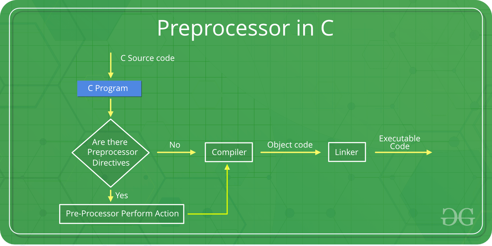

# Preprocessor Directives

## Contents

 - [Intro to Preprocessor](#intro-to-preprocessor)
 - [Preprocessor Directives](#preprocessor-directives)
   - [`#include (File Inclusion)`](#file-inclusion)
   - [`#define (Macros)`](#macros)
 - **Tips & Tricks:**
   - [Predefined C++ Macros](#predefined-macros)

---

<div id="intro-to-preprocessor"></div>

## Intro to Preprocessor

> As the name suggests, **Preprocessors** are *programs* that **process our source code before the compilation**.

For example, see the diagram below:

  

You can see the intermediate steps in the above diagram:

 - The source code written by programmers is first stored in a file, let the name be **“program.cpp“**.
 - This file is then processed by preprocessors and an expanded source code file is generated named **“program.i”**.
 - This expanded file is compiled by the compiler and an object code file is generated named **“program.obj”**.
 - Finally, the *linker* links this object code file to the object code of the library functions to generate the executable file **“program.exe”** or **"program.out"**. 

---

<div id="preprocessor-directives"></div>

## Preprocessor Directives

 - **Preprocessor** *programs* provide *preprocessor directives* that tell the compiler to preprocess the source code before the compiling. All of these preprocessor directives begin with a **‘#’ (hash) symbol**.
 - The **‘#’ symbol** indicates that whatever statement starts with a **‘#’** will go to the preprocessor program to get executed.

Examples of some **preprocessor directives** are:

 - #include
 - #define
 - #ifndef
 - etc...

**NOTE:**  
Remember that the **"#" symbol** only provides a *path* to the preprocessor, and a command such as include is processed by the preprocessor program.

For example, **#include** will include extra code in your program. We can place these preprocessor directives anywhere in our program.

---

<div id="file-inclusion"></div>

## `#include (File Inclusion)`

> This type of **preprocessor directive** tells the compiler to *include* a file in the source code program.

There are two types of files that can be included by the user in the program:

 - **Standard files**
 - **Header files**

See the two examples (abstractions) below:

```cpp
#include <file_name> // Standard example.
#include" file_name" // Header example.
```

 - `#include <file_name>`
   - The `<...>` brackets tell the compiler to look for the file in the **Standard Directory**. 
 - `#include" file_name"`
   - **User-defined files:** When a program becomes very large, it is a good practice to divide it into smaller files and include them whenever needed. These types of files are user-defined files.

---

<div id="macros"></div>

## `#define (Macros)`

> Macros are pieces of code in a program that is given some name. Whenever (sempre) this name is encountered (encontrado) by the compiler, the compiler replaces the name with the actual piece of code.

The **#define directive** is used to define a *macro*. Let us now understand the macro definition with the help of a program:

[pi_macro.cpp](src/pi_macro.cpp)
```cpp
#include <iostream>

#define PI 3.14159

int main()
{
    std::cout << "Value of PI: " << PI << "\n";

    return 0;
}
```

**COMPILATION AND RUN:**
```cpp
g++ pi_macro.cpp -o test.out && ./test.out
```

**OUTPUT:**  
```cpp
Value of PI: 3.14159
```

**NOTE:**
In the above program (code), when the preprocessor program encounters (encontra) the word **PI**, it replaces it with **3.14159**.

 - The word **"PI"** in the macro definition is called a **macro template**.
 - And **3.14159** is **macro expansion**. 

---

<div id="predefined-macros"></div>

## Predefined C++ Macros

C++ provides a number of predefined macros mentioned below:

 - `__cplusplus`
   - It is an integer literal value that **represents the C++ compiler version** and it is defined by the compatible C++ compilers during the compilation of a C++ program:
     - For example, **201703** value represents the **2017 C++ version**.
 - `__LINE__`
   - This contains the current line number of the program when it is being compiled.
 - `__FILE__`
   - This contains the current file name of the program when it is being compiled.
 - `__DATE__`
   - This contains a string of the form **"month/day/year"** that is the date of the translation of the source file into object code.
 - `__TIME__`
   - This contains a string of the form **"hour:minute:second"** that is the time at which the program was compiled.
 - `__STDC__`
   - To validate the compiler version `__STDC__` macro is used. It usually has the value 1, indicating that the compiler complies with **ISO Standard C**. Otherwise, it is undefined.
 - `__STDC_HOSTED__`
   - If the compiler has a hosted implementation that provides the whole needed standard libraries in a C++ program, its value is replaced by 1 during pre-processing. Otherwise, 0 is used.

Let us see an example for all the above macros:

[predefined_macros.cpp](src/predefined_macros.cpp)
```cpp
#include <iostream>

int main()
{
    std::cout << "Value of __cplusplus: " << __cplusplus << "\n";
    std::cout << "Value of __LINE__: " << __LINE__ << "\n";
    std::cout << "Value of __FILE__: " << __FILE__ << "\n";
    std::cout << "Value of __DATE__: " << __DATE__ << "\n";
    std::cout << "Value of __TIME__: " << __TIME__ << "\n";
    std::cout << "Value of __STDC__: " << __STDC__ << "\n";
    std::cout << "Value of __STDC_HOSTED__: " << __STDC_HOSTED__ << "\n";

    return 0;
}
```

**COMPILATION AND RUN:**
```cpp
g++ predefined_macros.cpp -o test.out && ./test.out
```

**OUTPUT:**  
```cpp
Value of __cplusplus: 201402
Value of __LINE__: 6
Value of __FILE__: predefined_macros.cpp
Value of __DATE__: Jan 26 2023
Value of __TIME__: 10:05:14
Value of __STDC__: 1
Value of __STDC_HOSTED__: 1
```

---

**REFERENCES:**  
[Preprocessor Directives in C++](https://www.scaler.com/topics/cpp/cpp-preprocessor-directives/)  
[C/C++ Preprocessors](https://www.geeksforgeeks.org/cc-preprocessors/)  
[C++ Preprocessor](https://www.tutorialspoint.com/cplusplus/cpp_preprocessor)  

---
