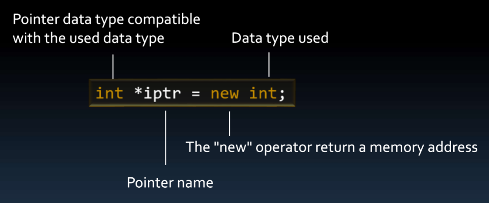

# Dynamic Memory Allocation

## Contents

 - [Memory Allocation: Auto Allocation vs. Dynamic Allocation](#aa-da)
 - [Intro to Dynamic Memory Allocation](#intro-to-dma)
 - [Deleting allocated memory (delete operator)](#delete-operator)

---

<div id="aa-da"></div>

## Memory Allocation: Auto Allocation vs. Dynamic Allocation

There are two approach to Memory Allocation:

 - **Auto Allocation:**
   - declare variables: *int total = 100;*
 - **Dynamic Allocation:**
   - Allocate memory with the **"new"** operator;
   - Save the memory address in a pointer;
   - Use the pointer to access and modify the data;
   - Free the memory with **"delete"** operator.

  

---

<div id="intro-to-dma"></div>

## Intro to Dynamic Memory Allocation

To allocate memory (dynamically) with the **"new"** operator to an *unlabeled memory* in C++, we use the follow definition:

  

For example, see the code below how allocate memory with the **"new"** operator:

[memory_allocation-01.cpp](src/memory_allocation-01.cpp)
```cpp
#include <iostream>
using namespace std;

int main()
{
    int *iptr = new int; // Allocate memory for an Integer.
    *iptr = 1001;        // Save a value (using "*" operator | Indirection Operator)
    cout << "Integer value: " << *iptr << endl;
    cout << "Location: " << iptr << endl;
    cout << "Size of 'iptr': " << sizeof(iptr) << endl;
    cout << "Size of '*iptr': " << sizeof(*iptr) << endl;

    double *dprt = new double;     // Allocate memory for a double
    *dprt = 500.35;                // Save a value (using "*" operator | Indirection Operator)
    cout << "\nFloating-point value: " << *dprt << endl;
    cout << "Location: " << dprt << endl;
    cout << "Size of 'dprt': " << sizeof(dprt) << endl;
    cout << "Size of '*dprt': " << sizeof(*dprt) << endl;

    return 0;
}
```

**COMPILATION AND RUN:**
```cpp
g++ memory_allocation-01.cpp -o testNew

./testNew
```

**OUTPUT:**  
```cpp
Integer value: 1001
Location: 0x6b25a0
Size of 'iptr': 8
Size of '*iptr': 4

Floating-point value: 500.35
Location: 0x6b25c0
Size of 'dprt': 8
Size of '*dprt': 8
```

See the abstraction of the code above:

  

Ok, now let's review the code output:

**OUTPUT:**  
```cpp
Integer value: 1001
Location: 0x6b25a0
Size of 'iptr': 8
Size of '*iptr': 4

Floating-point value: 500.35
Location: 0x6b25c0
Size of 'dprt': 8
Size of '*dprt': 8
```

**What?**  
Why my **pointers have 8 Bytes (both)**?

> **NOTE:**  
> The size of your *pointer (in Bytes)* depends your computer architecture:  
> - 32 bits commonly use 4 Bytes.
> - 64 bits commonly use 8 Bytes.

---

<div id="delete-operator"></div>

## Deleting allocated memory (delete operator)

> When using **Dynamic Memory Allocation** principles, the programmer always cares about one thing - **Freeing the allocated memory**.

To freeing the allocated memory the programer need to use **"delete"** operator. For example, see the code below how delete allocated memory by the programer:

[](src/)
```cpp

```

**COMPILATION AND RUN:**
```cpp

```

**OUTPUT:**  
```cpp

```


[](src/)
```cpp

```

**COMPILATION AND RUN:**
```cpp

```

**OUTPUT:**  
```cpp

```


---

**REFERENCES:**  
[Aula 15 - Alocação Dinâmica de Memória | Operadores new e delete | Vetores Dinâmicos | Curso de C++](https://www.youtube.com/watch?v=qYUiBzxdf-U&t)  

---

Ro**drigo** **L**eite da **S**ilva - **drigols**
