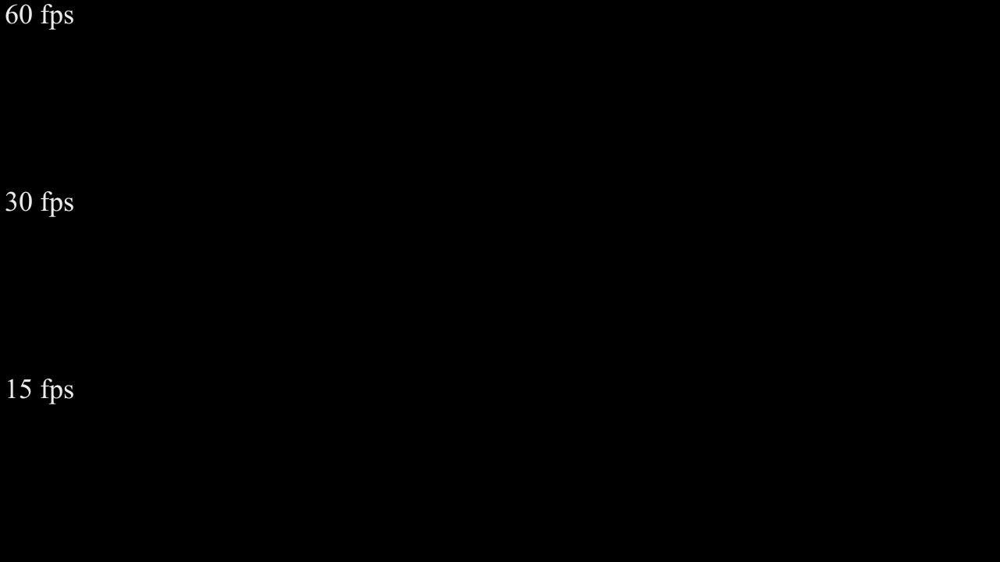
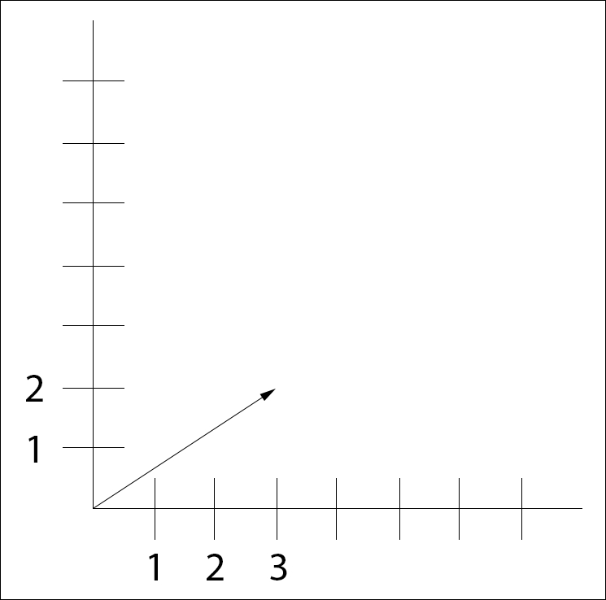
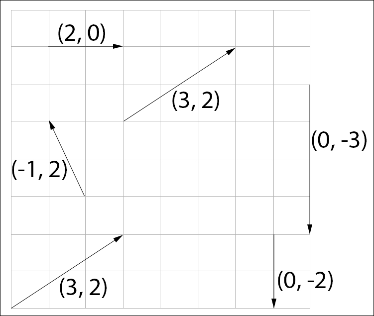
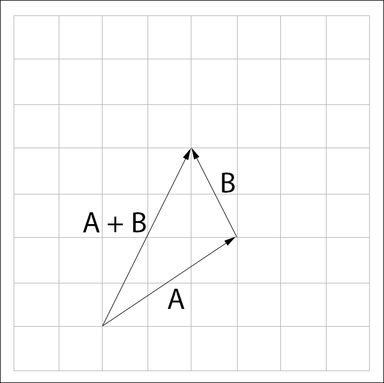
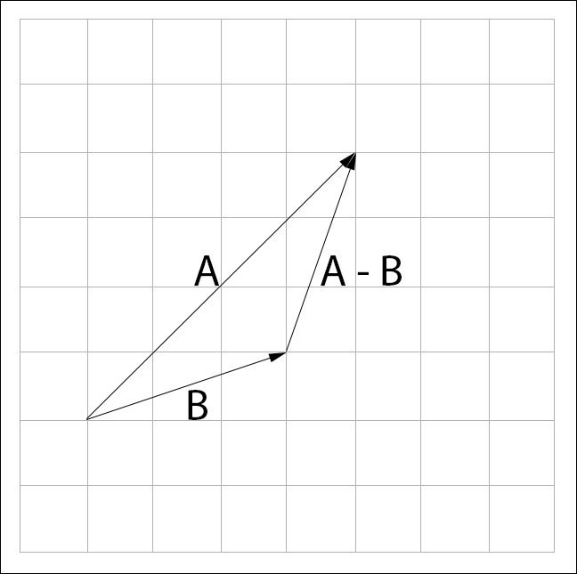
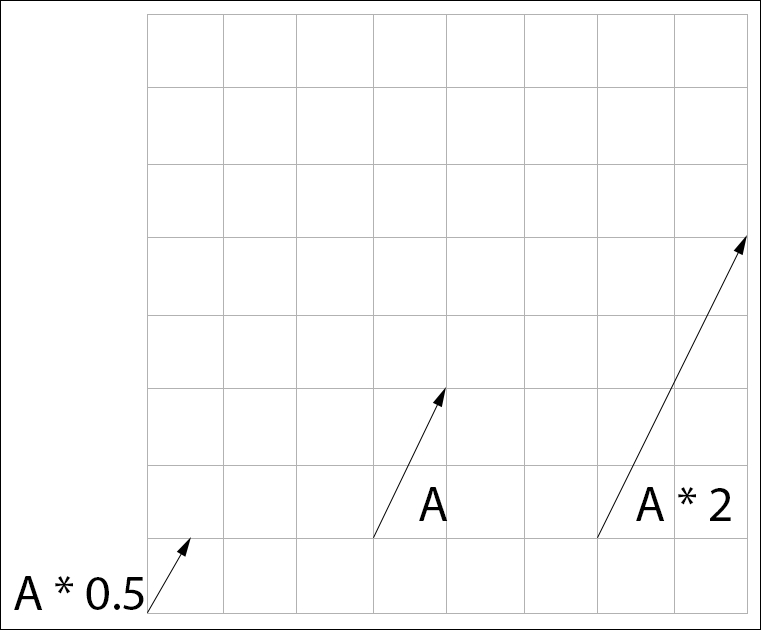
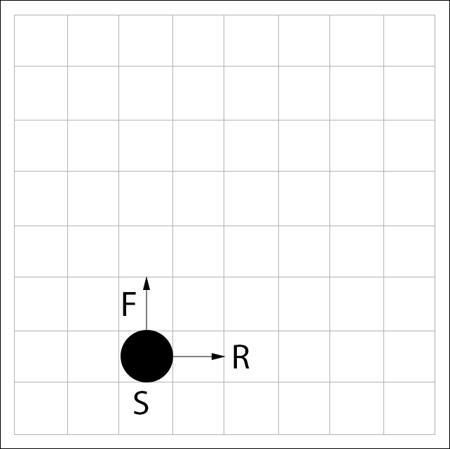
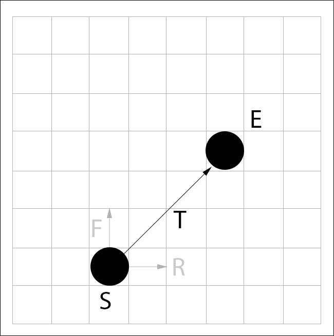
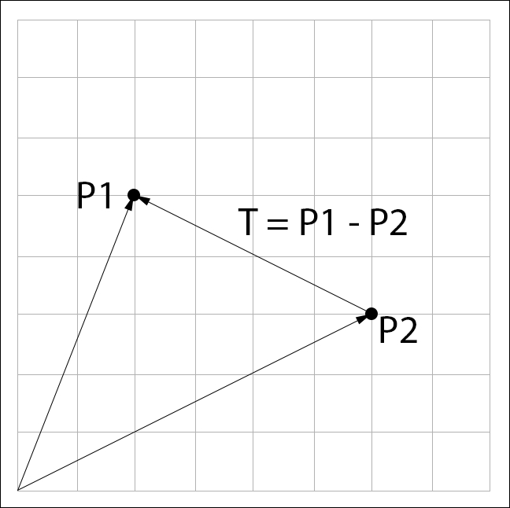

# Game Development

## Contents

 - **Concepts:**
   - **Game Windows:**
     - [Screen (tela) Resolution](#screen-resolution)
     - [Coordinate System (Cartesian plane vs. Screen coordinates)](#screen-coordinates)
     - [Frame Rate (expressed in Frames Per Second or FPS)](#frame-rate)
   - **Game Architectures:**
     - [Game Loop (Architecture)](#game-loop-architecture)
 - **Game Physics:**
   - **Vectors:**
     - [Vector definition](#vector-definition)
       - [2D Vector (Prototypes and Definitions)](#2d-vector)
       - [3D Vector (Prototypes and Definitions)](#3d-vector)
     - **Component-wise operations:**
       - [Addition](#addition)
       - [Subtraction](#subtraction)
       - [Multiplication (Component by component or by scale)](#multiplication-component-wise)
       - [Check if two Vectors are equal (==) or Not equal (!=)](#check-equal-not-equal)
     - [Dot Product (The result of "Dot Product" is a scale / +Use case)](#dot-product)
     - [Magnitude](#magnitude)
     - [Find the distance between two points (Using Magnitude)](#distance-two-points)
 - **Tips & Tricks:**
   - [Hungarian Notation](#hn-w)
 - [**References**](#references)


<!--- ( Concepts/Game Windows ) -->

---

<div id="screen-resolution"></div>

## Screen (tela) Resolution

> The **Window size** is limited by the *screen resolution*.

For example, see the *screen resolution* below:

  

The *screen resolution* above, means:

 - 1920 pixels in the horizontal.
 - 1080 pixels in the vertical.
 - That's, Full HD.

To get those dimensions with *C/C++* we can use the **GetSystemMetrics()** function in the `header <winuser.h>`:

**C++:**
```cpp
#include <windows.h>

int width   = GetSystemMetrics(SM_CXSCREEN);
int height  = GetSystemMetrics(SM_CYSCREEN);
```

---

<div id="screen-coordinates"></div>

## Coordinate System (Cartesian plane vs. Screen coordinates)

Different of the *cartesian plane*, where:

 - The **x-axis** grows to the right.
 - The **y-axis** grows to the left.

The screen coordinates (x and y) have a different approach. See the image below to understand more easily:

  

> **NOTE:**  
> See that the **origin (0, 0)** starts between the top and left.

In *C/C++* the `<windows.h> header` has a struct to represent this:

```cpp
struct RECT
{
    long left;
    long top;
    long right;
    long bottom;
}
```

Those dimensions are called **"Client Area"** and we can modify the default values of this struct easily. For example, see the code below:

```cpp
            (END of the x-axis)
                       |
                       |    ----------- (END of the y-axis)
                       |    |
                       |    |
                       |    |
RECT winRect = {0, 0, 960, 540}
                |  |
                |  |
                |  |
                |  ----------
     (START of the x-axis)  |
                            |
                  (START of the y-axis)
```

Now, our **"Client Area"** will have the same dimensions as the image shown early.

  

---

<div id="frame-rate"></div>

## Frame Rate (expressed in Frames Per Second or FPS)

> **A Game need to draw at least (pelo menos) 30 frames (quadros) on the screen per second -** *Minimum 30 FPS is recommended not a rule.*

For example, imagine we have a loop to draw the frames per second in **60 FPS**, **30 FPS**, and **15 FPS**. The table for these **FPS** is:

| FPS     | A frame (quadro) each |
|---------|-----------------------|
| **60**  | 16.6ms                |
| **30**  | 33.3ms                |
| **15**  | 66.6ms                |

That means:

 - **60 FPS:**
   - Each *16.6ms* the loop draws a new image on the screen.
 - **30 FPS:**
   - Each *33.3ms* the loop draws a new image on the screen.
 - **15 FPS:**
   - Each *66.6ms* the loop draws a new image on the screen.

See the image below to understand more easily:

  

See that:

 - **15 FPS** delay more to draw a frame if compared with **30 FPS**.
 - **30 FPS** delay more to draw a frame if compared with **60 FPS**.

> **NOTE:**  
> That's, the more FPS the better!


<!--- ( Concepts/Game Architectures ) -->

---

<div id="game-loop-architecture"></div>

## Game Loop (Architecture)

> **A Game is a Loop running continuously in a fixed or variable frequency​.**

Now, let's see an Architecture of a Game Loop:


<!--- ( Game Physics ) -->

---

<div id="vector-definition"></div>

## Vector definition

> A vector is an **n-tuple** of real **numbers**.
> - A tuple is a **finite ordered list** of **elements**.
> - In the context of games **n** is usually **2**, **3**, or **4**.

An **n-dimensional vector "V"** is represented as follows:

  

> **NOTE:**  
> Vectors are written as a capital bold letter with or without an **arrow** above it. Both are valid symbols for vector **"V"**. 

 - The subscript numbers **"V<sub>i</sub>"** are called the components of the vector.
 - Components are expressed as a **number** or as a **letter** *corresponding to the axis that component represents*.
 - Subscripts are indexed starting with 0.
 - Axis **x**, **y**, **z**, and **w** correspond to the numbers **0**, **1**, **2**, and **3**, respectively.

Visually, a vector is drawn as a displacement (deslocamento) arrow. For example, the two dimensional vector **V = (3, 2)**:

 - Would be drawn as an arrow pointing:
   - To **3** units on the **X axis**.
   - And **2** units on the **Y axis**.

  

A vector consists of a **direction** and a **magnitude**:

 - **Direction:**
   - The *direction* is where the vector points.
 - **Magnitude:**
   - The *magnitude* is how far along that direction the vector is pointing.

**You can think of a vector as a series of instructions:**  
For example, `take three steps right` and `two steps up`.

Because a vector does not have a set position, where it is drawn does not matter as shown in the following diagram:

  

**NOTE:**  
The preceding figure shows several vectors, with vector **(3, 2)** appearing multiple times. The **origin** of a vector could be anywhere; the coordinate system of the preceding figure was omitted to emphasize this.

<div id="2d-vector"></div>

### 2D Vector (Prototype and Definition)

Now, let's see how *prototype (.h)* and *implement (.cpp)* a **2D Vector**. Let's get started with **2D Vector struct prototype**:

[vectors.h](src/game-physics/vectors.h)
```cpp
#ifndef _H_MATH_VECTORS_
#define _H_MATH_VECTORS_

typedef struct vec2
{
    union
    {
        struct
        {
            float x;
            float y;
        };
        float asArray[2];
    };

    float &operator[](int i)
    {
        return asArray[i];
    }
} vec2;

#endif
```

 - **Inside the vector structure we declare an anonymous union. This anonymous union allows us to access the components of the vector by:**
   - **The name:**
     - e.g. "right.x".
   - **As an index into an array of floats:**
     - e.g. "right.asArray[0]".
 - **Additionally, we overloaded the indexing operator for the structure. This will allow us to index the vectors directly:** `float &operator[](int i) { return asArray[i]; }`
   - e.g. "right[1]".

For example, imagine we need to make a **V = (3, 2)** Vector:

[driver_2d_vector.cpp](src/game-physics/driver_2d_vector.cpp)
```cpp
#include <iostream>
#include "vectors.h"

int main()
{
    vec2 V = {3.0f, 2.0f};

    std::cout << "Component 0 (x): " << V.x << "\n";
    std::cout << "Component 0 (x): " << V.asArray[0] << "\n";
    std::cout << "Component 0 (x): " << V[0] << "\n";

    std::cout << "\nComponent 1 (y): " << V.y << "\n";
    std::cout << "Component 1 (y): " << V.asArray[1] << "\n";
    std::cout << "Component 1 (y): " << V[1];

    return 0;
}
```

**COMPILATION AND RUN:**
```bash
g++ driver_2d_vector.cpp -o test.out && ./test.out
```

**OUTPUT:**  
```bash
Component 0 (x): 3
Component 0 (x): 3
Component 0 (x): 3

Component 1 (y): 2
Component 1 (y): 2
Component 1 (y): 2
```

See that:

 - **We have a *V = (3, 2)* Vector:**
   - vec2 V = {3.0f, 2.0f};
 - **And accessing each component from three different approaches:**
   - **Component name:**
     - V.x
     - V.y
   - **As the index of the array (float):**
     - V.asArray[0] // x component
     - V.asArray[1] // y component
   - **Index overloading "[]":**
     - V[0] // x component
     - V[1] // y component

<div id="3d-vector"></div>

### 3D Vector (Prototype and Definition)

To *prototype (.h)* and *implement (.cpp)* a **3D Vector**, let's use the same approach in a **2D Vector**. For example, see the structure to a **3D Vector** below:

[vectors.h](src/game-physics/vectors.h)
```cpp
#ifndef _H_MATH_VECTORS_
#define _H_MATH_VECTORS_

typedef struct vec3
{
    union
    {
        struct
        {
            float x;
            float y;
            float z;
        };
        float asArray[3];
    };

    // Index overloading.
    float &operator[](int i)
    {
        return asArray[i];
    }
} vec3;

#endif
```

For example, imagine we need to make a **V = (5, 3, 8)** Vector:

[driver_3d_vector.cpp](src/game-physics/driver_3d_vector.cpp)
```cpp
#include <iostream>
#include "vectors.h"

int main()
{
    vec3 V = {5.0f, 3.0f, 8.0f};

    std::cout << "Component 0 (x): " << V.x << "\n";
    std::cout << "Component 0 (x): " << V.asArray[0] << "\n";
    std::cout << "Component 0 (x): " << V[0] << "\n";

    std::cout << "\nComponent 1 (y): " << V.y << "\n";
    std::cout << "Component 1 (y): " << V.asArray[1] << "\n";
    std::cout << "Component 1 (y): " << V[1] << "\n";

    std::cout << "\nComponent 2 (z): " << V.z << "\n";
    std::cout << "Component 2 (z): " << V.asArray[2] << "\n";
    std::cout << "Component 2 (z): " << V[2];

    return 0;
}
```

**COMPILATION AND RUN:**
```bash
g++ driver_3d_vector.cpp -o test.out && ./test.out
```

**OUTPUT:**  
```bash
Component 0 (x): 5
Component 0 (x): 5
Component 0 (x): 5

Component 1 (y): 3
Component 1 (y): 3
Component 1 (y): 3

Component 2 (z): 8
Component 2 (z): 8
Component 2 (z): 8
```

---

<div id="addition"></div>

### Addition

We add vectors by following the series of displacements (deslocamentos) that each vector represents. 

For example, to visualize this:

 - Given Vectors **"A"** and **"B"**;
 - Draw them so (Desenhe-os assim):
   - The head of **"A"** touches the tail of **"B"**.
   - The result of the addition is a new vector spanning from the tail of **"A"** to the head of **"B"**:

See the image below to understand more easily:

  

The formula to represent the **Component-wise addition operation** is:

  

Now, let's see how *prototype (.h)* and *define (.cpp)* **Component-wise addition operation**:

[vectors.h](src/game-physics/vectors.h)
```cpp
// Operator Overloading (prototype) for Add (+) operation.
vec2 operator+(const vec2 &l, const vec2 &r);
vec3 operator+(const vec3 &l, const vec3 &r);
```

Now, let's implement this **Component-wise addition operations**:

[vectors.cpp](src/game-physics/vectors.cpp)
```cpp
#include "vectors.h"
#include <cmath>
#include <cfloat>

// Operator Overloading (implementation) for Add (+) operation.
vec2 operator+(const vec2 &l, const vec2 &r)
{
    return {l.x + r.x, l.y + r.y};
}

// Operator Overloading (implementation) for Add (+) operation.
vec3 operator+(const vec3 &l, const vec3 &r)
{
    return {l.x + r.x, l.y + r.y, l.z + r.z};
}
```

Now, let's check in the practice:

[driver_component_wise_addition_operations.cpp](src/game-physics/driver_component_wise_addition_operations.cpp)
```cpp
#include <iostream>
#include "vectors.h"

int main()
{
    std::cout << "================ ( 2D Vector examples ) ================\n";

    vec2 v1_2d = {5.0f, 4.0f};
    vec2 v2_2d = {10.0f, 8.0f};
    vec2 v3_2d; // "v3" to store operations results.

    std::cout << "v1_2d:\n"
              << "Component 0 (x): " << v1_2d.x << "\n"
              << "Component 1 (y): " << v1_2d.y << "\n\n";

    std::cout << "v2_2d:\n"
              << "Component 0 (x): " << v2_2d.x << "\n"
              << "Component 1 (y): " << v2_2d.y << "\n\n";

    v3_2d = v1_2d + v2_2d;
    std::cout << "v1_2d + v2_2d:\n"
              << "Component 0 (x): " << v3_2d.x << "\n"
              << "Component 1 (y): " << v3_2d.y << "\n\n";

    std::cout << "================ ( 3D Vector examples ) ================\n";

    vec3 v1_3d = {5.0f, 4.0f, 6.0f};
    vec3 v2_3d = {10.0f, 8.0f, 3.0f};
    vec3 v3_3d; // "v3" to store operations results.

    std::cout << "v1_3d:\n"
              << "Component 0 (x): " << v1_3d.x << "\n"
              << "Component 1 (y): " << v1_3d.y << "\n"
              << "Component 2 (z): " << v1_3d.z << "\n\n";

    std::cout << "v2_3d:\n"
              << "Component 0 (x): " << v2_3d.x << "\n"
              << "Component 1 (y): " << v2_3d.y << "\n"
              << "Component 2 (z): " << v2_3d.z << "\n\n";

    v3_3d = v1_3d + v2_3d;
    std::cout << "v1_3d + v2_3d:\n"
              << "Component 0 (x): " << v3_3d.x << "\n"
              << "Component 1 (y): " << v3_3d.y << "\n"
              << "Component 3 (z): " << v3_3d.z << "\n\n";

    return 0;
}
```

**COMPILATION AND RUN:**
```bash
g++ driver_component_wise_addition_operations.cpp vectors.cpp -o test.out && ./test.out
```

**OUTPUT:**  
```bash
================ ( 2D Vector examples ) ================
v1_2d:
Component 0 (x): 5
Component 1 (y): 4

v2_2d:
Component 0 (x): 10
Component 1 (y): 8

v1_2d + v2_2d:
Component 0 (x): 15
Component 1 (y): 12

================ ( 3D Vector examples ) ================
v1_3d:
Component 0 (x): 5
Component 1 (y): 4
Component 2 (z): 6

v2_3d:
Component 0 (x): 10
Component 1 (y): 8
Component 2 (z): 3

v1_3d + v2_3d:
Component 0 (x): 15
Component 1 (y): 12
Component 3 (z): 9
```

<div id="subtraction"></div>

### Subtraction

Subtraction works the same way as addition. We have to follow the negative displacement (deslocamento) of vector **"B"** starting from vector **"A"**.

 - To visually subtract vectors **"A"** and **"B"**.
 - Draw **"A"** and **"B"** with their tails touching (com suas caldas se tocando).
 - The result of the subtraction is a vector spanning from the head of **"B"** to the head of **"A"**.

See the image below to understand more easily:

  

**NOTE:**  
A more intuitive way to visualize subtraction might be to think of it as adding negative **"B"** and **"A"**, like so; **A + (-B)**. If we represent the subtraction like this, visually we can follow the rules of addition:

  

In the above image, the vector **A - B** appears multiple times. This is to emphasize that the position of a vector does not matter. Both of the **A - B** vectors above represent the same displacement (deslocamento)!

The formula to represent the **Component-wise subtraction operation** is:

  

Now, let's see how *prototype (.h)* a **Component-wise subtraction operation**:

[vectors.h](src/game-physics/vectors.h)
```cpp
// Operator Overloading (prototype) for Sub (-) operation.
vec2 operator-(const vec2 &l, const vec2 &r);
vec3 operator-(const vec3 &l, const vec3 &r);
```

Now, let's *implement (define .cpp)* this **Component-wise subtraction operations**:

[vectors.cpp](src/game-physics/vectors.cpp)
```cpp
#include "vectors.h"
#include <cmath>
#include <cfloat>

// Operator Overloading (implementation) for Sub (-) operation.
vec2 operator-(const vec2 &l, const vec2 &r)
{
    return {l.x - r.x, l.y - r.y};
}

// Operator Overloading (implementation) for Sub (-) operation.
vec3 operator-(const vec3 &l, const vec3 &r)
{
    return {l.x - r.x, l.y - r.y, l.z - r.z};
}
```

Finally, let's check in the practice:

[driver_component_wise_subtraction_operations.cpp](src/game-physics/driver_component_wise_subtraction_operations.cpp)
```cpp
#include <iostream>
#include "vectors.h"

int main()
{
    std::cout << "================ ( 2D Vector examples ) ================\n";

    vec2 v1_2d = {5.0f, 4.0f};
    vec2 v2_2d = {10.0f, 8.0f};
    vec2 v3_2d; // "v3" to store operations results.

    std::cout << "v1_2d:\n"
              << "Component 0 (x): " << v1_2d.x << "\n"
              << "Component 1 (y): " << v1_2d.y << "\n\n";

    std::cout << "v2_2d:\n"
              << "Component 0 (x): " << v2_2d.x << "\n"
              << "Component 1 (y): " << v2_2d.y << "\n\n";

    v3_2d = v1_2d - v2_2d;
    std::cout << "v1_2d - v2_2d:\n"
              << "Component 0 (x): " << v3_2d.x << "\n"
              << "Component 1 (y): " << v3_2d.y << "\n\n";

    std::cout << "================ ( 3D Vector examples ) ================\n";

    vec3 v1_3d = {5.0f, 4.0f, 6.0f};
    vec3 v2_3d = {10.0f, 8.0f, 3.0f};
    vec3 v3_3d; // "v3" to store operations results.

    std::cout << "v1_3d:\n"
              << "Component 0 (x): " << v1_3d.x << "\n"
              << "Component 1 (y): " << v1_3d.y << "\n"
              << "Component 2 (z): " << v1_3d.z << "\n\n";

    std::cout << "v2_3d:\n"
              << "Component 0 (x): " << v2_3d.x << "\n"
              << "Component 1 (y): " << v2_3d.y << "\n"
              << "Component 2 (z): " << v2_3d.z << "\n\n";

    v3_3d = v1_3d - v2_3d;
    std::cout << "v1_3d - v2_3d:\n"
              << "Component 0 (x): " << v3_3d.x << "\n"
              << "Component 1 (y): " << v3_3d.y << "\n"
              << "Component 3 (z): " << v3_3d.z << "\n\n";

    return 0;
}
```

**COMPILATION AND RUN:**
```bash
g++ driver_component_wise_subtraction_operations.cpp vectors.cpp -o test.out && ./test.out
```

**OUTPUT:**  
```bash
================ ( 2D Vector examples ) ================
v1_2d:
Component 0 (x): 5
Component 1 (y): 4

v2_2d:
Component 0 (x): 10
Component 1 (y): 8

v1_2d - v2_2d:
Component 0 (x): -5
Component 1 (y): -4

================ ( 3D Vector examples ) ================
v1_3d:
Component 0 (x): 5
Component 1 (y): 4
Component 2 (z): 6

v2_3d:
Component 0 (x): 10
Component 1 (y): 8
Component 2 (z): 3

v1_3d - v2_3d:
Component 0 (x): -5
Component 1 (y): -4
Component 3 (z): 3
```

<div id="multiplication-component-wise"></div>

### Multiplication (Component by component or by scale)

There are many approaches to multiplying Vectors. However, here we focus on **"Component-wise operations"**, that's:

 - Multiply each component of **vector "U"** by the correspondent component of **vector "V"**.
 - Or by **scale (s)**:
   - Multiply a **scale (s)** value (e.g. 10) by each component of a **vector "U"**.

For example, given two n-dimensional vectors **"U"** and **"V"**, multiplication is defined as follows:

  

In addition to multiplying two vectors, you can also multiply a vector by a scalar. In this context, a scalar is any real number. Given vector **"U"** and scalar **s**, scalar multiplication is defined as follows:

  

See the image below to understand more easily how the multiplication of a Vector by a scale works:

  

Now, let's see how *prototype (.h)* a **Component-wise (Component by component or by scale) operation**:

[vectors.h](src/game-physics/vectors.h)
```cpp
// Operator Overloading (prototype) for Scalar Multiplication (*) operation.
vec2 operator*(const vec2 &l, float r);
vec3 operator*(const vec3 &l, float r);

// Operator Overloading (prototype) for Component-wise multiplication (*) operation.
vec2 operator*(const vec2 &l, const vec2 &r);
vec3 operator*(const vec3 &l, const vec3 &r);
```

Now, let's *implement (define .cpp)* this **Component-wise (Component by component or by scale operations**:

[vectors.cpp](src/game-physics/vectors.cpp)
```cpp
#include "vectors.h"
#include <cmath>
#include <cfloat>

// Operator Overloading (implementation) for Scalar Multiplication (*) operation.
vec2 operator*(const vec2 &l, float r)
{
    return {l.x * r, l.y * r};
}

// Operator Overloading (implementation) for Scalar Multiplication (*) operation.
vec3 operator*(const vec3 &l, float r)
{
    return {l.x * r, l.y * r, l.z * r};
}

// Operator Overloading (implementation) for Component-wise multiplication (*) operation.
vec2 operator*(const vec2 &l, const vec2 &r)
{
    return {l.x * r.x, l.y * r.y};
}

// Operator Overloading (implementation) for Component-wise multiplication (*) operation.
vec3 operator*(const vec3 &l, const vec3 &r)
{
    return {l.x * r.x, l.y * r.y, l.z * r.z};
}
```

Finally, let's check in the practice:

[driver_component_wise_multiplication_operations.cpp](src/game-physics/driver_component_wise_multiplication_operations.cpp)
```cpp
#include <iostream>
#include "vectors.h"

int main()
{
    std::cout << "================ ( 2D Vector examples ) ================\n";

    vec2 v1_2d = {5.0f, 4.0f};
    vec2 v2_2d = {10.0f, 8.0f};
    vec2 v3_2d; // "v3" to store operations results.

    std::cout << "v1_2d:\n"
              << "Component 0 (x): " << v1_2d.x << "\n"
              << "Component 1 (y): " << v1_2d.y << "\n\n";

    std::cout << "v2_2d:\n"
              << "Component 0 (x): " << v2_2d.x << "\n"
              << "Component 1 (y): " << v2_2d.y << "\n\n";

    v3_2d = v1_2d * 10;
    std::cout << "v1_2d * 10 (Multiplication as Scaling):\n"
              << "Component 0 (x): " << v3_2d.x << "\n"
              << "Component 1 (y): " << v3_2d.y << "\n\n";

    v3_2d = v1_2d * v2_2d;
    std::cout << "v1_2d * v2_2d (Component-wise multiplication):\n"
              << "Component 0 (x): " << v3_2d.x << "\n"
              << "Component 1 (y): " << v3_2d.y << "\n\n";

    std::cout << "================ ( 3D Vector examples ) ================\n";

    vec3 v1_3d = {5.0f, 4.0f, 6.0f};
    vec3 v2_3d = {10.0f, 8.0f, 3.0f};
    vec3 v3_3d; // "v3" to store operations results.

    std::cout << "v1_3d:\n"
              << "Component 0 (x): " << v1_3d.x << "\n"
              << "Component 1 (y): " << v1_3d.y << "\n"
              << "Component 2 (z): " << v1_3d.z << "\n\n";

    std::cout << "v2_3d:\n"
              << "Component 0 (x): " << v2_3d.x << "\n"
              << "Component 1 (y): " << v2_3d.y << "\n"
              << "Component 2 (z): " << v2_3d.z << "\n\n";

    v3_3d = v1_3d * 10;
    std::cout << "v1_3d * 10 (Multiplication as Scaling):\n"
              << "Component 0 (x): " << v3_3d.x << "\n"
              << "Component 1 (y): " << v3_3d.y << "\n"
              << "Component 2 (z): " << v3_3d.y << "\n\n";

    v3_3d = v1_3d * v2_3d;
    std::cout << "v1_3d * v2_3d (Component-wise multiplication):\n"
              << "Component 0 (x): " << v3_3d.x << "\n"
              << "Component 1 (y): " << v3_3d.y << "\n"
              << "Component 2 (z): " << v3_3d.z << "\n\n";

    return 0;
}
```

**COMPILATION AND RUN:**
```bash
g++ driver_component_wise_multiplication_operations.cpp vectors.cpp -o test.out && ./test.out
```

**OUTPUT:**  
```bash
================ ( 2D Vector examples ) ================
v1_2d:
Component 0 (x): 5
Component 1 (y): 4

v2_2d:
Component 0 (x): 10
Component 1 (y): 8

v1_2d * 10 (Multiplication as Scaling):
Component 0 (x): 50
Component 1 (y): 40

v1_2d * v2_2d (Component-wise multiplication):
Component 0 (x): 50
Component 1 (y): 32

================ ( 3D Vector examples ) ================
v1_3d:
Component 0 (x): 5
Component 1 (y): 4
Component 2 (z): 6

v2_3d:
Component 0 (x): 10
Component 1 (y): 8
Component 2 (z): 3

v1_3d * 10 (Multiplication as Scaling):
Component 0 (x): 50
Component 1 (y): 40
Component 2 (z): 40

v1_3d * v2_3d (Component-wise multiplication):
Component 0 (x): 50
Component 1 (y): 32
Component 2 (z): 18
```

<div id="check-equal-not-equal"></div>

### Check if two Vectors are equal (==) or Not equal (!=)

Now, let's see how *prototype (h.)* and *implement (define .cpp*) functions to check if two Vectors are **equal (==)** or **Not equal (!=)**:

[vectors.h](src/game-physics/vectors.h)
```cpp
// Operator Overloading (prototype) for check equal (==) operation.
bool operator==(const vec2 &l, const vec2 &r);
bool operator==(const vec3 &l, const vec3 &r);

// Operator Overloading (prototype) for check not equal (!=) operation.
bool operator!=(const vec2 &l, const vec2 &r);
bool operator!=(const vec3 &l, const vec3 &r);
```

Now, let's implement *(define .cpp)* a function to check if two Vectors are **equal (==)** or **Not equal (!=)**

[vectors.cpp](src/game-physics/vectors.cpp)
```cpp
#include "vectors.h"
#include <cmath>
#include <cfloat>

// Macro to comparing floating point numbers to vectors.cpp.
#define CMP(x, y) \
    (fabsf(x - y) <= FLT_EPSILON * fmaxf(1.0f, fmaxf(fabsf(x), fabsf(y))))

// Operator Overloading (implementation) for check equal (==) operation.
bool operator==(const vec2 &l, const vec2 &r)
{
    return CMP(l.x, r.x) && CMP(l.y, r.y);
}

// Operator Overloading (implementation) for check equal (==) operation.
bool operator==(const vec3 &l, const vec3 &r)
{
    return CMP(l.x, r.x) && CMP(l.y, r.y) && CMP(l.z, r.z);
}

// Operator Overloading (implementation) for check not equal (!=) operation.
bool operator!=(const vec2 &l, const vec2 &r)
{
    return !(l == r);
}

// Operator Overloading (implementation) for check not equal (!=) operation.
bool operator!=(const vec3 &l, const vec3 &r)
{
    return !(l == r);
}
```

Finally, let's check in the practice:

[driver_component_wise_check_equal_not_equal_operations.cpp](src/game-physics/driver_component_wise_check_equal_not_equal_operations.cpp)
```cpp
#include <iostream>
#include "vectors.h"

int main()
{
    std::cout << "================ ( 2D Vector examples ) ================\n";

    vec2 v1_2d = {5.0f, 4.0f};
    vec2 v2_2d = {10.0f, 8.0f};

    std::cout << "v1_2d:\n"
              << "Component 0 (x): " << v1_2d.x << "\n"
              << "Component 1 (y): " << v1_2d.y << "\n\n";

    std::cout << "v2_2d:\n"
              << "Component 0 (x): " << v2_2d.x << "\n"
              << "Component 1 (y): " << v2_2d.y << "\n\n";

    bool v3_2d_equal = v1_2d == v2_2d;
    std::cout << "v1_2d == v2_2d (0=false, 1=true): " << v3_2d_equal << "\n";

    bool v3_2d_not_equal = v1_2d != v2_2d;
    std::cout << "v1_2d != v2_2d (0=false, 1=true): " << v3_2d_not_equal << "\n\n";

    std::cout << "================ ( 3D Vector examples ) ================\n";

    vec3 v1_3d = {5.0f, 4.0f, 6.0f};
    vec3 v2_3d = {10.0f, 8.0f, 3.0f};

    std::cout << "v1_3d:\n"
              << "Component 0 (x): " << v1_3d.x << "\n"
              << "Component 1 (y): " << v1_3d.y << "\n"
              << "Component 2 (z): " << v1_3d.z << "\n\n";

    std::cout << "v2_3d:\n"
              << "Component 0 (x): " << v2_3d.x << "\n"
              << "Component 1 (y): " << v2_3d.y << "\n"
              << "Component 2 (z): " << v2_3d.z << "\n\n";

    bool v3_3d_equal = v1_3d == v2_3d;
    std::cout << "v1_3d == v2_3d (0=false, 1=true): " << v3_3d_equal << "\n";

    bool v3_3d_not_equal = v1_3d != v2_3d;
    std::cout << "v1_3d != v2_3d (0=false, 1=true): " << v3_3d_not_equal;

    return 0;
}
```

**COMPILATION AND RUN:**
```bash
g++ driver_component_wise_check_equal_not_equal_operations.cpp vectors.cpp -o test.out && ./test.out
```

**OUTPUT:**  
```bash
================ ( 2D Vector examples ) ================
v1_2d:
Component 0 (x): 5
Component 1 (y): 4

v2_2d:
Component 0 (x): 10
Component 1 (y): 8

v1_2d == v2_2d (0=false, 1=true): 0
v1_2d != v2_2d (0=false, 1=true): 1

================ ( 3D Vector examples ) ================
v1_3d:
Component 0 (x): 5
Component 1 (y): 4
Component 2 (z): 6

v2_3d:
Component 0 (x): 10
Component 1 (y): 8
Component 2 (z): 3

v1_3d == v2_3d (0=false, 1=true): 0
v1_3d != v2_3d (0=false, 1=true): 1
```

---

<div id="dot-product"></div>

## Dot Product (The result of "Dot Product" is a scale / +Use case)

> The **"Dot Product"** operation is the *sum (summation)* of the multiplication of the components.

Different of *component-wise operations multiplications*, where only each component is multiplied by the respective component (or scale) in the **Dot Product** approach we:

 - Multiply each component by the respective component.
 - Next, *sum (summation)* all multiplications.

The formula for the **Dot Product** is:

  
  

**NOTE:**  
The resulting scalar represents the directional relation of the vectors. That is, **A * B** represents how much **"A"** is pointing in the direction of **"B"**.

Using the dot product we can tell if two vectors are pointing in the same direction or not following these rules:

 - If the dot product is **positive**, the vectors are pointing in the **same direction**.
 - If the dot product is **negative**, the vectors point in **opposing directions**.
 - If the dot product is 00, the vectors are **perpendicular**.

> **Ok, but when use that?**

 - **EN -** Imagine we have a **spaceship S**, we know its forward vector **"F"** and a vector that points to its right **"R"**:
 - **PT -** Imagine que temos uma **espaçonave S**, sabemos o seu vetor para frente **"F"** e um vetor que aponta para a sua direita **"R"**:

  

 - **EN -** We also have an enemy **ship E**, and a vector that points from our **ship S** to the enemy **ship E**, **vector "T"**:
 - **PT -** Também temos uma nave **inimiga E**, e um vetor que aponta da nossa **nave S** para a nave **inimiga E**, **vetor "T"**:

  

> **How can we tell if the the ship S needs to turn left or right to face the enemy ship E?**

 - We need to take the dot product of **"T"** and **"R"**:
   - If the result of the dot product is **positive**, the **ship needs to turn right**.
   - If the result of the dot product is **negative**, the **ship needs to turn to the left**.
   - If the result of the dot product is **0**, the **ship does not need to turn**.

Now, let's *prototype (.h)* and implement (define .cpp) **Dot Product operations with Vectors**. For example, see the codes below:

[vectors.h](src/game-physics/vectors.h)
```cpp
// Prototype for Dot Product function.
float Dot(const vec2& l, const vec2& r);
float Dot(const vec3& l, const vec3& r);
```

[vectors.cpp](src/game-physics/vectors.cpp)
```cpp
// Dot Product implementation.
float Dot(const vec2 &l, const vec2 &r)
{
    return ((l.x * r.x) + (l.y * r.y));
}

// Dot Product implementation.
float Dot(const vec3 &l, const vec3 &r)
{
    return ((l.x * r.x) + (l.y * r.y) + (l.z * r.z));
}
```

[driver_dot_product.cpp](src/game-physics/driver_dot_product.cpp)
```cpp
#include <iostream>
#include "vectors.h"

int main()
{
    std::cout << "================ ( 2D Vector example ) ================\n";

    vec2 v1_2d = {5.0f, 4.0f};
    vec2 v2_2d = {10.0f, 8.0f};
    float dot_product_2d;

    dot_product_2d = Dot(v1_2d, v1_2d);
    std::cout << "Dot Product: " << dot_product_2d << "\n";

    std::cout << "================ ( 3D Vector example ) ================\n";

    vec3 v1_3d = {5.0f, 4.0f, 6.0f};
    vec3 v2_3d = {10.0f, 8.0f, 3.0f};
    float dot_product_3d;

    dot_product_3d = Dot(v1_3d, v2_3d);
    std::cout << "Dot Product: " << dot_product_3d;

    return 0;
}
```

**COMPILATION AND RUN:**
```bash
g++ driver_dot_product.cpp vectors.cpp -o test.out && ./test.out
```

**OUTPUT:**  
```bash
================ ( 2D Vector example ) ================
Dot Product: 41
================ ( 3D Vector example ) ================
Dot Product: 100
```

---

<div id="magnitude"></div>

## Magnitude

> The **Magnitude (or length)** of a vector is written as the letter of the vector surrounded by two bars, **|| V ||**.

The **Magnitude (or length)** of a vector is:

> The square root of the dot product of the vector with itself:

  

See that:

 - **We are taking square root (pegando a raiz quadrada).**
 - **From Dot Product operation of a Vector "A" with itself (Da operação Dot Product de um vetor "A" consigo mesmo).**

**NOTE:**  
In addition to implementing the magnitude function, we're also going to implement a magnitude squared function. The formula is the same, but it avoids the expensive square root operation:

  

**NOTE:**  
In games we often compare the magnitude of a vector to known numbers; however, doing a comparison between a number and the magnitude **is expensive (é caro) because of the square root operation**.

Now, let's see how *prototype (.h)* and implement (define .cpp) a function to get a **Magnitude of a Vector**. For example, see the codes below:

[vectors.h](src/game-physics/vectors.h)
```cpp
// Prototype for Magnitude functions (with square root).
float Magnitude(const vec2 &v);
float Magnitude(const vec3 &v);

// Prototype for Magnitude functions (without square root).
float MagnitudeSq(const vec2 &v);
float MagnitudeSq(const vec3 &v);
```


[vectors.cpp](src/game-physics/vectors.cpp)
```cpp

// Magnitude function implementation (with square root).
float Magnitude(const vec2 &v)
{
    return sqrtf(Dot(v, v));
}

// Magnitude function implementation (with square root).
float Magnitude(const vec3 &v)
{
    return sqrtf(Dot(v, v));
}

// Magnitude function implementation (without square root).
float MagnitudeSq(const vec2 &v)
{
    return Dot(v, v);
}

// Magnitude function implementation (without square root).
float MagnitudeSq(const vec3 &v)
{
    return Dot(v, v);
}
```

[driver_magnitude.cpp](src/game-physics/driver_magnitude.cpp)
```cpp
#include <iostream>
#include "vectors.h"

int main()
{
    std::cout << "================ ( 2D Vector example ) ================\n";

    vec2 v_2d = {5.0f, 4.0f};
    float mag2d = Magnitude(v_2d);
    std::cout << "Magnitude: " << mag2d << "\n";

    std::cout << "================ ( 3D Vector example ) ================\n";

    vec3 v_3d = {5.0f, 4.0f, 6.0f};
    float mag3d = Magnitude(v_2d);
    std::cout << "Magnitude: " << mag3d;

    return 0;
}
```

**COMPILATION AND RUN:**
```bash
g++ driver_magnitude.cpp vectors.cpp -o test.out && ./test.out
```

**OUTPUT:**  
```bash
================ ( 2D Vector example ) ================
Magnitude: 6.40312
================ ( 3D Vector example ) ================
Magnitude: 6.40312
```

---

<div id="distance-two-points"></div>

## Find the distance between two points (Using Magnitude)

> The **Magnitude (or length)** of a vector **can be used to find the distance between two points**.

Assuming we have points **"P1"** and **"P2"**, we can find a vector **"T"** that connects them by subtracting **"P2"** from **"P1"**. For example, see the image below to understand more easily:

  

> **NOTE:**  
> The distance between the two points is the **length (or Magnitude)** of **"T"**.

To implement the distance between two points in C++ we know that first:

 - We need to subtract a vector **"P1"** from **"P2"**.
 - And **the Magnitude (or length) of this subtraction is the distance between two points**.

Let's, see how implement that in the practice:

[vectors.h](src/game-physics/vectors.h)
```cpp
// Prototypes for Distance functions (without square root).
float Distance(const vec2 &p1, const vec2 &p2);
float Distance(const vec3 &p1, const vec3 &p2);
```

[vectors.cpp](src/game-physics/vectors.cpp)
```cpp
// Distance function implementation (2D).
float Distance(const vec2 &p1, const vec2 &p2)
{
    vec2 t = p1 - p2;
    return Magnitude(t);
}

// Distance function implementation (3D).
float Distance(const vec3 &p1, const vec3 &p2)
{
    vec3 t = p1 - p2;
    return Magnitude(t);
}
```

**NOTE:**  
See that, the distance between two points is **Magnitude (or length)** of **"t"**, and **"t"** is  **"p1 - p2"**.

[driver_distance.cpp](src/game-physics/driver_distance.cpp)
```cpp
#include <iostream>
#include "vectors.h"

int main()
{
    std::cout << "================ ( 2D Vector example ) ================\n";

    vec2 V1_2D = {6.0f, 3.0f};
    vec2 V2_2D = {2.0f, 5.0f};

    float t_distance_2D = Distance(V1_2D, V2_2D);
    std::cout << "Distance: " << t_distance_2D << "\n";

    std::cout << "================ ( 3D Vector example ) ================\n";

    vec3 V1_3D = {15.0f, 3.0f, 7.0f};
    vec3 V2_3D = {3.0f, 10.0f, 5.0f};

    float t_distance_3D = Distance(V1_3D, V2_3D);
    std::cout << "Distance: " << t_distance_3D;

    return 0;
}
```

**COMPILATION AND RUN:**
```bash
g++ driver_distance.cpp vectors.cpp -o test.out && ./test.out
```

**OUTPUT:**  
```bash
================ ( 2D Vector example ) ================
Distance: 4.47214
================ ( 3D Vector example ) ================
Distance: 14.0357
```


<!--- ( Tips & Tricks ) -->

---

<div id="hn-w"></div>

## Hungarian Notation

> Windows uses a naming convention of variables known as **Hungarian Notation**.

For example:

  


<!--- ( References ) -->

---

<div id="references"></div>

## References

 - [Programação de Jogos - Professor Judson Santiago (Youtube playlist)](https://www.youtube.com/playlist?list=PLX6Nyaq0ebfjfo4PlkAcKRxR66qXZk899)
 - [Game Physics Cookbook](https://learning.oreilly.com/library/view/game-physics-cookbook/9781787123663/)
 - [Procedural Content Generation for C++ Game Development](https://learning.oreilly.com/library/view/procedural-content-generation/9781785886713/)

---

Ro**drigo** **L**eite da **S**ilva - **drigols**
