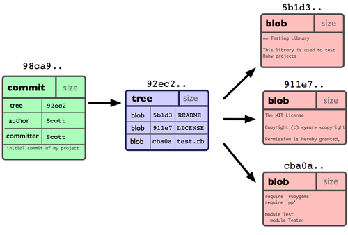
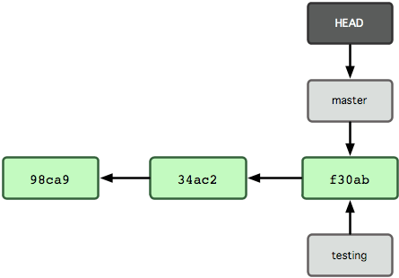
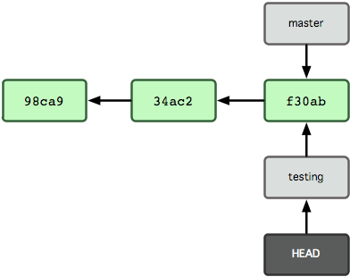
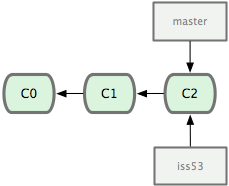
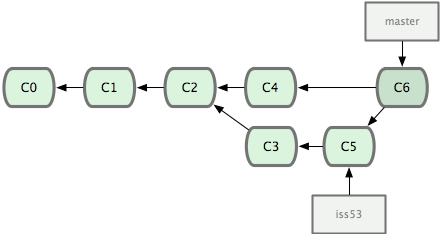
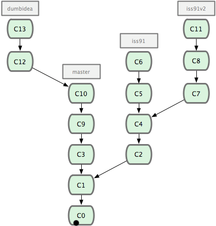
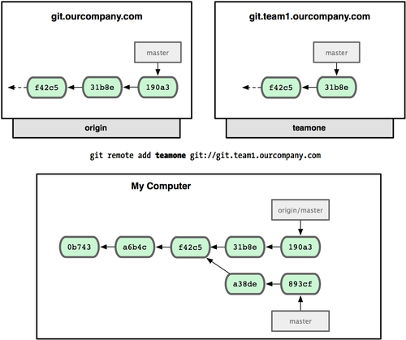
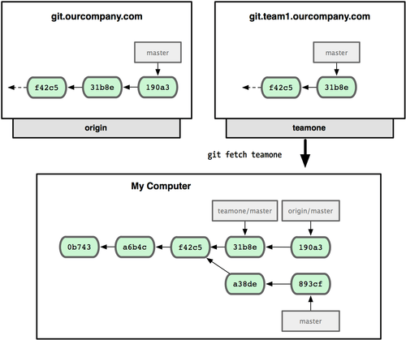
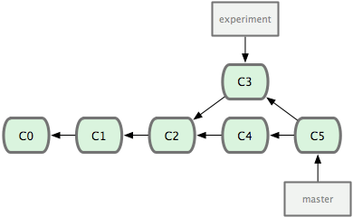

# Branching

## Contents

 - [Branching](#branching)
 - [Merging](#merging)
 - [Branch Management](#management)
 - [Branching Workflows](#workflows) 
 - [Remote Branches + git fetch](#rb)
 - [Rebasing](#rebasing)

---

<div id="branching"></div>

### Branching  

Quando você faz um commit no Git, o Git guarda um objeto commit que contém:  
  
 - Um ponteiro para o snapshot do conteúdo que você colocou na área de seleção;  
 - O autor;  
 - Os metadados da mensagem;  
 - Zero ou mais ponteiros para o commit ou commits que são pais deste commit.  
  
Para visualizar isso, vamos supor que você tenha um diretório contendo três arquivos, e colocou todos eles na área de seleção e fez o commit. Colocar na área de seleção cria o <strong>checksum</strong> de cada arquivo, armazena esta versão do arquivo no repositório Git (o Git se refere a eles como blobs), e acrescenta este checksum à área de seleção:  
  
```  
$ git add README test.rb LICENSE  
$ git commit -m 'commit inicial do meu projeto'  
```  
  
Quando você cria um commit executando <strong>git commit</strong>, o Git calcula o checksum de cada subdiretório e armazena os objetos de árvore no repositório Git. O Git em seguida, <strong>cria um objeto commit</strong> que tem os metadados e <strong>um ponteiro para a árvore do projeto raiz</strong>, então ele pode recriar este snapshot quando necessário.  
  
Seu repositório Git agora contém cinco objetos:  
  
 - 1º Um blob para o conteúdo de cada um dos três arquivos;  
 - 2º Uma árvore que lista o conteúdo do diretório e especifica quais nomes de arquivos são armazenados em quais blobs;  
 - 3º Um commit com o ponteiro para a raiz dessa árvore com todos os metadados do commit.  
  
Conceitualmente, os dados em seu repositório Git se parecem como na figura abaixo:  

  
<strong>Dados de um repositório com um único commit.</strong>  
  
Se você modificar algumas coisas e fizer um commit novamente, o próximo commit armazenará um ponteiro para o commit imediatamente anterior. Depois de mais dois commits, seu histórico poderia ser algo como a figura abaixo:  
  
  
  
__Branching__  
  
Um <strong>branch</strong> no Git é simplesmente um leve ponteiro móvel para um desses commits. O nome do branch padrão no Git é master. Como você inicialmente fez commits, você tem um branch principal (master branch) que aponta para o último commit que você fez. Cada vez que você faz um commit ele avança automaticamente.  
  
  
<strong>Branch apontando para o histórico de commits.</strong>  
  
__NOTE__  
  
Lembram que quando utilizamos o comando <strong>git log</strong> ele retorna a lista de commits da branch vigente? Lembram que ele retorna os commits da ordem mais recente, ou seja, do mais recente até os mais antigos. Então, a imagem acima demonstrar isso na prática onde a <strong>master</strong> está apontando para o último commit(mais recente).  
  
__Nova Branching__  
  
O que acontece se você criar um novo branch? Bem, isso cria um novo ponteiro para que você possa se mover. Vamos dizer que você crie um novo branch chamado <strong>testing</strong>. Você faz isso com o comando <strong>git branch</strong>:  
  
```  
$ git branch testing  
```  
  
Isso cria um novo ponteiro para o mesmo commit em que você está no momento, veja na figura abaixo:  
  
  
  
Como o Git sabe o branch em que você está atualmente? Ou seja, como ele sabe se eu estou na branch <strong>master</strong> ou <strong>testing</strong>? Ele mantém um ponteiro especial chamado <strong>HEAD</strong>.  
  
  
<strong>HEAD apontando para o branch em que você está.</strong>  
  
No Git, este é um ponteiro para o <strong>branch local</strong> em que você está no momento. Neste caso, você ainda está no master. O comando git branch só criou um novo branch — ele não mudou para esse branch.  
  
__Mudando de Branching__  
  
Para mudar para um branch existente, você executa o comando <strong>git checkout</strong>. Vamos mudar para o novo branch <strong>testing</strong>:  
  
```  
$ git checkout testing  
```  
  
Isto move o <strong>HEAD</strong> para apontar para o branch testing, veja a figura abaixo:  
  
  
<strong>O HEAD aponta para outro branch quando você troca de branches.</strong>  
  
Qual é o significado disso? Bem, vamos fazer um outro commit:  
  
```  
$ touch test-02.rb  
$ git commit -a -m 'fiz uma alteração'  
```  
  
A figura abaixo ilustra o nosso resultado:  
  
  
<strong>O branch para o qual HEAD aponta avança com cada commit(Lembra que uma branch no Git é simplesmente um leve ponteiro móvel para um desses commits, então, o que acontece é que a cada commit essa branching vai avançando.).</strong>  
  
Isso é interessante, porque agora o seu branch testing avançou, mas o seu branch master ainda aponta para o commit em que estava quando você executou <strong>git checkout</strong> para trocar de branch. Vamos voltar para o branch master:  
  
```  
$ git checkout master  
```  
  
Veja a figura abaixo o resultado:  
  
  
<strong>O HEAD se move para outro branch com um checkout.</strong>  
  
Esse comando fez duas coisas:  
  
 - Ele alterou o ponteiro HEAD para apontar novamente para o branch master;  
 - E reverteu os arquivos em seu diretório de trabalho para o estado em que estavam no snapshot para o qual o master apontava.  
  
Isto significa também que as mudanças feitas a partir deste ponto em diante, irão divergir de uma versão anterior do projeto. Ele essencialmente "volta" o trabalho que você fez no seu <strong>branch testing</strong>, temporariamente, de modo que você possa ir em uma direção diferente.  
  
Vamos fazer algumas mudanças e fazer o commit novamente:  
  
```  
$ vim test.rb  
$ git commit -a -m 'fiz outra alteração'  
```  
  
Agora o histórico do seu projeto divergiu. Você criou e trocou para um branch, trabalhou nele, e então voltou para o seu branch principal(master) e trabalhou mais. Ambas as mudanças são isoladas em branches distintos: você pode alternar entre os branches e fundi-los (merge) quando estiver pronto. E você fez tudo isso simplesmente com os comandos <strong>branch</strong> e <strong>checkout</strong>.  
  
Veja na figura abaixo como fica essas divergências(fluxos diferentes de trabalho):  
  
  
<strong>O histórico dos branches diverge.</strong>  
  
__NOTE__  
Um branch em Git é na verdade um arquivo simples que contém os 40 caracteres do checksum SHA-1 do commit para o qual ele aponta, os branches são baratos para criar e destruir. Criar um novo branch é tão rápido e simples como escrever 41 bytes em um arquivo (40 caracteres e uma quebra de linha).  

---

<div id="merging"></div>

## Merging

Vamos ver um exemplo simples de uso de <strong>branch</strong> e <strong>merge</strong> com um fluxo de trabalho que você pode usar no mundo real. Você seguirá esses passos:  
  
1. Trabalhar em um web site.  
2. Criar um branch para uma nova história em que está trabalhando.  
3. Trabalhar nesse branch.  
  
Nesse etapa, você receberá um telefonema informando que outro problema crítico existe e precisa de correção. Você fará o seguinte:  
  
1. Voltar ao seu branch de produção.  
2. Criar um branch para adicionar a correção.  
3. Depois de testado, fazer o merge do branch da correção, e enviar para produção.  
4. Retornar à sua história anterior e continuar trabalhando.  
  
__Branch Básico__  
  
Primeiro, digamos que você esteja trabalhando no seu projeto e já tem alguns commits. Veja na figura abaixo:  
  
  
<strong>Um histórico de commits pequeno e simples(Lembre que esses commit apontam em sequência do mais recente para o mais antigo).</strong>  
  
Você decidiu que irá trabalhar na tarefa <strong>(issue) #53</strong> do gerenciador de bugs ou tarefas que sua empresa usa. Para deixar claro, Git não é amarrado a nenhum gerenciador de tarefas em particular; mas já que a tarefa <strong>#53</strong> tem um foco diferente, você criará um branch novo para trabalhar nele.  
  
Para criar um branch e mudar para ele ao mesmo tempo, você pode executar o comando <strong>git checkout</strong> com a opção <strong>-b</strong>:  
  
```  
$ git checkout -b iss53  
Switched to a new branch "iss53"  
```  
  
Isso é um atalho para:  
  
```  
$ git branch iss53  
$ git checkout iss53  
```  
  
Veja a figura abaixo para ficar melhor com uma ilustração do fluxo:  
  
  
  
Você trabalha no seu web site e faz alguns commits:  
  
```  
$ touch index.html  
$ git commit -a -m 'adicionei um novo rodapé [issue 53]'  
```  
  
Ao fazer isso o branch <strong>iss53</strong> avançará, pois você fez o checkout dele (isto é, seu HEAD está apontando para ele), veja na figura abaixo:  
  
  
  
Nesse momento você recebe uma ligação dizendo que existe um problema com o web site e você deve resolvê-lo imediatamente. Com Git, você não precisa fazer o deploy de sua correção junto com as modificações que você fez no <strong>iss53</strong>, e você não precisa se esforçar muito para reverter essas modificações antes que você possa aplicar sua correção em produção. Tudo que você tem a fazer é voltar ao seu <strong>branch master</strong>.  
  
No entanto, antes de fazer isso, note que seu <strong>diretório de trabalho(Working Directory)</strong> ou <strong>área de seleção</strong> tem modificações que não entraram em commits e que estão gerando conflitos com o branch que você está fazendo o checkout, Git não deixará você mudar de branch.  
  
Existem maneiras de contornar esta situação (isto é, incluir e fazer o commit). Por enquanto, você fez o commit de todas as suas modificações, então você pode mudar para o seu branch master:  
  
```  
$ git checkout master  
Switched to branch "master"  
```  
  
Nesse ponto, o diretório do seu projeto está exatamente do jeito que estava antes de você começar a trabalhar na tarefa #53, e você se concentra na correção do erro.  
  
Em seguida, você tem uma correção para fazer. Vamos criar um branch para a correção <strong>(hotfix)</strong> para trabalhar até a conclusão:  
  
```  
$ git checkout -b 'hotfix'
Switched to a new branch "hotfix"
$ touch index.html
$ git commit -a -m 'consertei o endereço de email'
[hotfix]: created 3a0874c: "consertei o endereço de email"
 1 files changed, 0 insertions(+), 1 deletions(-)
```  
  
Veja o resultado na figura abaixo:  
  
  
<strong>branch de correção (hotfix) baseado num ponto de seu branch master.</strong>  
  
Você pode rodar seus testes, tenha certeza que a correção é o que você quer, e faça o merge no seu branch master para fazer o deploy em produção. Você faz isso com o comando <strong>git merge</strong>:  
  
```  
$ git checkout master
$ git merge hotfix
Updating f42c576..3a0874c
Fast forward
 README |    1 -
 1 files changed, 0 insertions(+), 1 deletions(-)  
```  
  
Você irá notar a frase <strong>"Fast forward"</strong> no merge. Em razão do branch que você fez o merge <strong>apontar para o commit que está diretamente acima do commit que você se encontra</strong>, Git avança o ponteiro adiante. Em outras palavras, quando você tenta fazer o merge de um commit com outro que pode ser alcançado seguindo o histórico do primeiro, Git simplifica as coisas movendo o ponteiro adiante porque não existe modificações divergente para fazer o merge — isso é chamado de <strong>"fast forward"</strong>.  
  
Sua modificação está agora no snapshot do commit apontado pelo <strong>branch master</strong>, e você pode fazer o deploy, veja na figura abaixo:  
  
  
  
<strong>Depois do merge seu branch master aponta para o mesmo local que o branch hotfix(Isso porque os commits da branche master e hotfix são adjacentes).</strong>  
  
Depois que a sua correção super importante foi enviada, você está pronto para voltar ao trabalho que estava fazendo antes de ser interrompido. No entanto, primeiro você <strong>apagará o branch hotfix</strong>, pois você não precisa mais dele — o branch master aponta para o mesmo local. Você pode excluí-lo com a opção <strong>-d</strong> em <strong>git branch</strong>:  
  
```  
$ git branch -d hotfix  
Deleted branch hotfix (3a0874c).  
```  
  
Agora você pode voltar para o trabalho incompleto no branch da tafera <strong>#53</strong> e continuar a trabalhar nele:  
  
```  
$ git checkout iss53
Switched to branch "iss53"
$ vim index.html
$ git commit -a -m 'novo rodapé terminado [issue 53]'
[iss53]: created ad82d7a: "novo rodapé terminado [issue 53]"
 1 files changed, 1 insertions(+), 0 deletions(-)
```  
  
Veja a figura abaixo para entender melhor como serie esse fluxo de trabalho:  
  
  
<strong>Seu branch iss53 pode avançar de forma independente.</strong>  
  
Vale a pena lembrar aqui que o trabalho feito no seu branch <strong>hotfix</strong> não existe nos arquivos do seu branch <strong>iss53</strong>. Se você precisa incluí-lo, você pode fazer o merge do seu branch <strong>master</strong> no seu branch <strong>iss53</strong> executando o comando <strong>git merge master</strong>, ou você pode esperar para integrar essas mudanças até você decidir fazer o pull do branch <strong>iss53</strong> no <strong>master</strong> mais tarde.  
  
__Merge Básico__  
  
Suponha que você decidiu que o trabalho na <strong>tarefa #53(branching)</strong> está completo e pronto para ser feito o merge no branch <strong></strong>. Para fazer isso, você fará o merge do seu branch <strong>iss53</strong>, bem como o merge do branch <strong>hotfix</strong> de antes. Tudo que você tem a fazer é executar o checkout do branch para onde deseja fazer o merge e então rodar o comando <strong>git merge</strong>:  
  
```  
$ git checkout master
$ git merge iss53
Merge made by recursive.
 README | 1 +
 1 files changed, 1 insertions(+), 0 deletions(-)  
```  
  
Isso parece um pouco diferente do merge de <strong>hotfix</strong> que você fez antes. Neste caso, o histórico do seu desenvolvimento divergiu em algum ponto anterior. Pelo fato do commit no branch em que você está não ser um ancestral direto do branch que você está fazendo o merge, Git tem um trabalho adicional. Neste caso, Git faz um merge simples de três vias, usando os dois snapshots apontados pelas pontas dos branches e o ancestral comum dos dois. A figura abaixo destaca os três snapshots que Git usa para fazer o merge nesse caso.  
  
  
<strong>Git identifica automaticamente a melhor base ancestral comum para o merge do branch.</strong>  
  
Em vez de simplesmente avançar o ponteiro do branch adiante, Git cria um novo snapshot que resulta do <strong>merge de três vias</strong> e automaticamente cria um <strong>novo commit</strong> que aponta para as vias. Isso é conhecido como um merge de commits e é especial pois tem mais de um pai.  
  
Veja na figura abaixo como isso funciona:  
  
  
<strong>Git cria automaticamente um novo objeto commit que contém as modificações do merge.</strong>  
  
Vale a pena destacar que o Git determina o melhor ancestral comum para usar como base para o merge; isso é diferente no CVS ou Subversion (antes da versão 1.5), onde o desenvolvedor que está fazendo o merge tem que descobrir a melhor base para o merge por si próprio. Isso faz o merge muito mais fácil no Git do que nesses outros sistemas.  
  
Agora que foi feito o merge no seu trabalho, você não precisa mais do branch <strong>iss53</strong>. Você pode apagá-lo e fechar manualmente o chamado no seu gerenciador de chamados:  
  
```  
$ git branch -d iss53  
```  
  
__Conflitos de Merge Básico__  
  
Às vezes, esse processo não funciona sem problemas. Se você alterou a mesma parte do mesmo arquivo de forma diferente nos dois branches que está fazendo o merge, Git não será capaz de executar o merge de forma clara. Se sua correção para o erro <strong>#53</strong> alterou a mesma parte de um arquivo que <strong>hotfix</strong>, você terá um conflito de merge parecido com isso:  
  
```  
$ git merge iss53
Auto-merging index.html
CONFLICT (content): Merge conflict in index.html
Automatic merge failed; fix conflicts and then commit the result.  
```  
  
Git não criou automaticamente um novo commit para o merge. Ele fez uma pausa no processo enquanto você resolve o conflito. Se você quer ver em quais arquivos não foi feito o merge, em qualquer momento depois do conflito, você pode executar <strong>git status</strong>:  
  
```  
[master*]$ git status
index.html: needs merge
# On branch master
# Changes not staged for commit:
#   (use "git add <file>..." to update what will be committed)
#   (use "git checkout -- <file>..." to discard changes in working directory)
#
#    unmerged:   index.html  
```  
  
Qualquer coisa que tem conflito no merge e não foi resolvido é listado como "unmerged". Git adiciona marcadores padrão de resolução de conflitos nos arquivos que têm conflitos, para que você possa abri-los manualmente e resolver esses conflitos. Seu arquivo terá uma seção parecida com isso:  
  
```  
<<<<<<< HEAD:index.html
<div id="footer">contato : email.support@github.com</div>
=======
<div id="footer">
  por favor nos contate em support@github.com
</div>
>>>>>>> iss53:index.html  
```  
  
Isso significa que a versão em <strong>HEAD</strong> (seu branch master, pois era isso que você tinha quando executou o comando merge) é a parte superior desse bloco (tudo acima de =======), enquanto a versão no seu branch <strong>iss53</strong> é toda a parte inferior. Para resolver esse conflito, você tem que optar entre um lado ou outro, ou fazer o merge do conteúdo você mesmo. Por exemplo, você pode resolver esse conflito através da substituição do bloco inteiro por isso:  
  
```  
<div id="footer">
por favor nos contate em email.support@github.com
</div>
```  
  
Esta solução tem um pouco de cada seção, e eu removi completamente as linhas <<<<<<<, =======, e >>>>>>>. Depois que você resolveu cada uma dessas seções em cada arquivo com conflito, rode git add em cada arquivo para marcá-lo como resolvido. Colocar o arquivo na área de seleção o marcar como resolvido no Git. Se você quer usar uma ferramenta gráfica para resolver esses problemas, você pode executar git mergetool, que abre uma ferramenta visual de merge adequada e percorre os conflitos:  
```  
$ git mergetool
merge tool candidates: kdiff3 tkdiff xxdiff meld gvimdiff opendiff emerge vimdiff
Merging the files: index.html

Normal merge conflict for 'index.html':
  {local}: modified
  {remote}: modified
Hit return to start merge resolution tool (opendiff):  
```  

---

<div id="management"></div>

## Branch Management

Agora que você criou, fez merge e apagou alguns branches, vamos ver algumas ferramentas de gerenciamento de branches que serão úteis quando você começar a usá-los o tempo todo.  
  
O comando <strong>git branch</strong> faz mais do que criar e apagar branches. Se você executá-lo sem argumentos, você verá uma lista simples dos seus branches atuais:  
  
```  
$ git branch
  iss53
* master
  testing  
```  
  
Note o caractere <strong>*</strong> que vem antes do branch <strong>master</strong>: ele indica o branch que você está atualmente (fez o checkout). Isso significa que se você fizer um commit nesse momento, o branch <strong>master</strong> irá se mover adiante com seu novo trabalho. Para ver o último commit em cada branch, você pode executar o comando <strong>git branch -v</strong>:  
  
```  
$ git branch -v
  iss53   93b412c consertar problema em javascript
* master  7a98805 Merge branch 'iss53'
  testing 782fd34 adicionar drigols para a lista de autores nos readmes  
```  
  
Outra opção útil para saber em que estado estão seus branches é filtrar na lista somente branches que você já fez ou não o merge no branch que você está atualmente. As opções <strong>--merged</strong> e <strong>--no-merged</strong> estão disponíveis no Git desde a versão 1.5.6 para esse propósito. Para ver quais branches já foram mesclados no branch que você está, você pode executar <strong>git branch --merged</strong>:  
  
```  
$ git branch --merged
  iss53
* master  
```  
  
Por você já ter feito o merge do branch <strong>iss53</strong> antes, você o verá na sua lista. Os branches nesta lista sem o <strong>*</strong> na frente em geral podem ser apagados com <strong>git branch -d</strong>; você já incorporou o trabalho que existia neles em outro branch, sendo assim você não perderá nada.  
  
Para ver todos os branches que contém trabalho que você ainda não fez o merge, você pode executar </strong>git branch --no-merged</strong>:  
  
```  
$ git branch --no-merged
  testing  
```  
  
Isso mostra seu outro branch. Por ele conter trabalho que ainda não foi feito o merge, tentar apagá-lo com <strong>git branch -d</strong> irá falhar:  
  
```  
$ git branch -d testing
error: The branch 'testing' is not an ancestor of your current HEAD.
If you are sure you want to delete it, run `git branch -D testing`.  
```  
  
Se você quer realmente apagar o branch e perder o trabalho que existe nele, você pode forçar com </strong>-D</strong>, como a útil mensagem aponta.  

---

<div id="workflows"></div>

## Branching Workflows

Devido ao Git usar um merge de três vias, fazer o merge de um branch em outro várias vezes em um período longo é geralmente fácil de fazer. Isto significa que você pode ter vários branches que ficam sempre abertos e que são usados em diferentes estágios do seu ciclo de desenvolvimento; você pode regularmente fazer o merge de alguns deles em outros.  
  
Muitos desenvolvedores Git tem um fluxo de trabalho que adotam essa abordagem, como ter somente código completamente estável em seus branches <strong>master</strong> — possivelmente somente código que já foi ou será liberado. Eles têm outro branch paralelo chamado <strong>develop</strong> ou algo parecido em que eles trabalham ou usam para testar estabilidade — ele não é necessariamente sempre estável, mas quando ele chega a tal estágio, pode ser feito o merge com o branch master. Ele é usado para puxar (pull) branches tópicos <strong>(topic, branches de curta duração, como o seu branch iss53 anteriormente)</strong> quando eles estão prontos, para ter certeza que eles passam em todos os testes e não acrescentam erros.  
  
Na realidade, nós estamos falando de <strong>ponteiros avançando na linha de commits</strong> que você está fazendo. Os branches estáveis estão muito atrás na linha histórica de commits, e os branches de ponta (que estão sendo trabalhados) estão a frente no histórico, veja a figura abaixo:  
  
  
<strong>Branches mais estáveis geralmente ficam atrás no histórico de commits.</strong>  
  
Normalmente é mais fácil pensar neles como um contêiner de trabalho, onde conjuntos de commits são promovidos a um contêiner mais estável quando eles são completamente testados, veja a ilustração abaixo:  
  
  
  
A ideia é que seus branches estejam em vários níveis de estabilidade; quando eles atingem um nível mais estável, é feito o merge no branch acima deles. Repetindo, ter muitos branches de longa duração não é necessário, mas geralmente é útil, especialmente quando você está lidando com projetos muito grandes ou complexos.  
  
__Branches Tópicos (topic)__  
  
Branches tópicos, entretanto, são úteis em projetos de qualquer tamanho. Um branch tópico é um branch de curta duração que você cria e usa para uma funcionalidade ou trabalho relacionado. Isso é algo que você provavelmente nunca fez com um controle de versão antes porque é geralmente muito custoso criar e fazer merge de branches. Mas no Git é comum criar, trabalhar, mesclar e apagar branches muitas vezes ao dia.  
  
Você viu isso na seção anterior com os branches <strong>iss53</strong> e <strong>hotfix</strong> que você criou. Você fez commits neles e os apagou depois que fez o merge com seu branch principal. Tecnicamente, isso lhe permite mudar completamente e rapidamente o contexto — em razão de seu trabalho estar separado em contêineres onde todas as modificações naquele branch estarem relacionadas ao tópico, é fácil ver o que aconteceu durante a revisão de código. Você pode manter as mudanças lá por minutos, dias, ou meses, e mesclá-las quando estivem prontas, não importando a ordem que foram criadas ou trabalhadas.  
  
__Exemplo__  
  
Considere um exemplo onde:  
  
1. Você está fazendo um trabalho (no <strong>master</strong>);
2. Cria um branch para um erro <strong>(iss91)</strong>, trabalha nele um pouco;  
3. Cria um segundo branch para testar uma nova maneira de resolver o mesmo problema <strong>(iss91v2)</strong>;  
4. Volta ao seu branch principal(<strong>master</strong>) e trabalha nele por um tempo;  
5. Cria um novo branch para trabalhar em algo que você não tem certeza se é uma boa ideia <strong>(dumbidea)</strong>.  
  
Seu histórico de commits irá se parecer com a figura abaixo:  
  
  
<strong>Seu histórico de commits com multiplos branches tópicos.</strong>  
  
Agora, vamos dizer que você decidiu que sua segunda solução é a melhor para resolver o erro <strong></strong>; e você mostrou seu branch <strong>dumbidea</strong> para seus colegas de trabalho, e ele é genial. Agora você pode jogar fora o branch original <strong>iss91</strong> (perdendo os commits <strong>C5</strong> e <strong>C6</strong>) e fazer o <strong>merge</strong> dos dois restantes. Seu histórico irá se parecer com a figura abaixo:  
  
  
<strong>Seu histórico depois de fazer o merge de dumbidea e iss91v2.</strong>  
  
É importante lembrar que você esta fazendo tudo isso com seus branches localmente. Quando você cria e faz o merge de branches, tudo está sendo feito somente no seu repositório Git — nenhuma comunicação com o servidor esta sendo feita.  

---

<div id="rb"></div>

## Remote Branches + git fetch

Branches remotos são <strong>referências ao estado</strong> de seus branches no seu <strong>repositório remoto</strong>. São branches locais que você não pode mover, <strong>eles se movem automaticamente sempre que você faz alguma comunicação via rede</strong>. Branches remotos agem como marcadores para lembrá-lo onde estavam seus branches no seu repositório remoto na última vez que você se conectou a eles.  
  
Eles seguem o padrão <strong>(remote)/(branch)</strong>. Por exemplo, se você quer ver como o branch <strong>master</strong> estava no seu repositório remoto <strong>origin</strong> na última vez que você se comunicou com ele, você deve ver o branch <strong>origin/master</strong>.  
  
Se você estivesse trabalhando em um problema com alguns colegas e eles colocassem o branch <strong>iss53</strong> no repositório, você poderia ter seu próprio branch <strong>iss53</strong>; mas o branch no servidor iria fazer referência ao commit em <strong>origin/iss53</strong>.  
  
Isso pode parecer um pouco confuso, então vamos ver um exemplo. Digamos que você tem um servidor Git na sua rede em <strong>git.ourcompany.com</strong>:  
  
1. Se você cloná-lo, Git automaticamente dá o nome origin para ele;  
2. Baixa todo o seu conteúdo;  
3. Cria uma referência para onde o branch <strong>master</strong> dele está, e dá o nome <strong>origin/master</strong> para ele localmente, e você não pode movê-lo.  
  
O Git também dá seu próprio branch <strong>master</strong> como ponto de partida no mesmo local onde o branch <strong>master</strong> remoto está, a partir de onde você pode trabalhar, veja figura abaixo:  
  
  
<strong>Um comando clone do Git dá a você seu próprio branch master e origin/master faz referência ao branch master original.</strong>  
  
Se você estiver trabalhando no seu branch master local, e, ao mesmo tempo, alguém envia algo para <strong>git.ourcompany.com</strong> atualizando o branch master, seu histórico avançará de forma diferente. <strong>Além disso, enquanto você não fizer contado com seu servidor original, seu origin/master não se moverá</strong>, veja a figura abaixo:  
  
  
<strong>Veja que a branch master avançou no servidor(alguém enviou algo para servidor remoto), e sua branch origin/master continua de onde você clonou. Isso, porque você não fez contato com o servidor ainda.</strong>  
  
<strong>   </strong>  
  
__git fetch origin__  
  
Para sincronizar suas coisas, você executa o comando <strong>git fetch origin</strong>. Esse comando:  
  
 - Verifica qual servidor "origin" representa (nesse caso, é git.ourcompany.com);  
 - Obtém todos os dados que você ainda não tem;  
 - Atualiza o seu banco de dados local, movendo o seu origin/master para a posição mais recente e atualizada.  
  
Veja a figura abaixo:  
  
  
<strong>O comando git fetch atualiza suas referências remotas.</strong>  
  
__Múltiplos Servidores__  
  
Para demostrar o uso de múltiplos servidores remotos e como os branches remotos desses projetos remotos parecem, vamos assumir que você tem outro servidor Git interno que é usado somente para desenvolvimento por um de seus times. Este servidor está em:  
  
```  
git.team1.ourcompany.com  
```  
  
Você pode adicioná-lo como uma nova referência remota ao projeto que você está atualmente trabalhando executando o comando <strong>git remote add</strong>.  
  
Dê o nome de <strong>teamone</strong>, que será o apelido para aquela URL, veja a figura abaixo:  
  
  
<strong>Adicionando um novo servidor.</strong>  
  
Agora, você pode executar o comando <strong>git fetch teamone</strong> para obter tudo que o servidor <strong>teamone</strong> tem e você ainda não, veja a figura abaixo:  
  
  
  
Por esse servidor ter um subconjunto dos dados que seu servidor <strong>origin</strong> tem, Git não obtém nenhum dado, somente cria um branch chamado <strong>teamone/master</strong> que faz referência ao commit que teamone tem no master dele.  

---

<div id="rebasing"></div>

## Rebasing

No Git, existem duas maneiras principais de integrar mudanças de um branch em outro: o <strong>merge</strong> e o <strong>rebase</strong>. Nessa seção você aprenderá o que é rebase, como fazê-lo, por que é uma ferramenta sensacional, e em quais casos você não deve usá-la.  
  
__O Rebase Básico__  
  
Se você olhar para o exemplo abaixo(figura), você pode ver que você criou uma divergência no seu trabalho e fez commits em dois branches diferentes.  
  
  
  
A maneira mais fácil de integrar os branches, como já falamos, é o comando <strong>merge</strong>. Ele executa um merge de <strong>três vias</strong> entre os dois últimos snapshots (cópias em um determinado ponto no tempo) dos branches </strong>(C3 e C4)</strong> e o mais recente ancestral comum aos dois <strong>(C2)</strong>, criando um novo snapshot (e um commit), como é mostrado na figura abaixo:  
  
  
  
Porém, existe outro modo: você pode pegar o trecho da mudança que foi introduzido em <strong>C3</strong> e reaplicá-lo em cima do <strong>C4</strong>. No Git, isso é chamado de <strong>rebasing</strong>. Com o comando rebase, você pode pegar todas as mudanças que foram commitadas em um branch e replicá-las em outro.  
  
Nesse exemplo, se você executar o seguinte:  
  
```  
$ git checkout experiment
$ git rebase master
First, rewinding head to replay your work on top of it...
Applying: added staged command  
```  
  
Ele vai ao ancestral comum dos dois branches (no que você está e no qual será feito o rebase), pega a diferença (diff) de cada commit do branch que você está, salva elas em um arquivo temporário, restaura o branch atual para o mesmo commit do branch que está sendo feito o rebase e, finalmente, aplica uma mudança de cada vez. A figura abaixo ilustra esse processo:  
  
  
<strong>Fazendo o rebase em C4 de mudanças feitas em C3.</strong>  
  
Nesse ponto, você pode ir ao branch master e fazer um merge fast-forward, como na figura abaixo:  
  
  
  
Agora, o snapshot apontado por <strong>C3'</strong> é exatamente o mesmo apontado por <strong>C5</strong> no exemplo do merge. Não há diferença no produto final dessas integrações, mas o rebase monta um histórico mais limpo. Se você examinar um log de um branch com rebase, ele parece um histórico linear: como se todo o trabalho tivesse sido feito em série, mesmo que originalmente tenha sido feito em paralelo.  
  
Constantemente você fará isso para garantir que seus commits sejam feitos de forma limpa em um branch remoto — talvez em um projeto em que você está tentando contribuir mas não mantém. Nesse caso, você faz seu trabalho em um branch e então faz o rebase em <strong>origin/master</strong> quando está pronto pra enviar suas correções para o projeto principal. Desta maneira, o mantenedor não precisa fazer nenhum trabalho de integração — somente um merge ou uma inserção limpa.  
  
__Os Perigos do Rebase__  
  
Apesar dos benefícios do rebase existem os inconvenientes, que podem ser resumidos em um linha:  
  
<strong>Não faça rebase de commits que você enviou para um repositório público.</strong>  
  
Se você seguir essa regra você ficará bem. Se não seguir, as pessoas te odiarão e você será desprezado por amigos e familiares.  
  
Quando você faz o rebase, você está abandonando commits existentes e criando novos que são similares, mas diferentes. Se fizer o push de commits em algum lugar e outros pegarem e fizerem trabalhos baseado neles e você reescrever esses commits com <strong>git rebase</strong> e fizer o push novamente, seus colaboradores terão que fazer o merge de seus trabalhos novamente e as coisas ficarão bagunçadas quando você tentar trazer o trabalho deles de volta para o seu.  

---

**REFERENCES:**  
https://git-scm.com/book/pt-br/v1/  
https://git-scm.com/book/en/v2/  

---

Ro**drigo** **L**eite da **S**ilva - **drigols**
