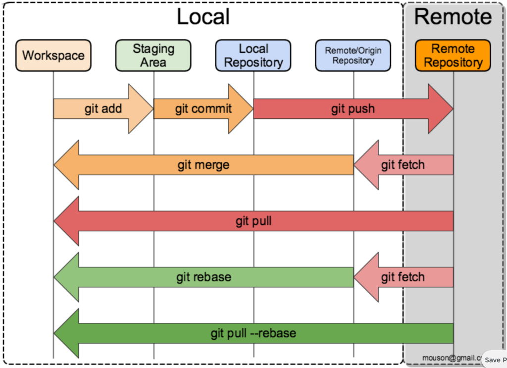

# States

## Contents

 - [Intro to Git States](#intro)
 - [Change state commands](#change-state-commands)

---

## Intro to Git States

There are **four Git states**, namely:

 - **Local working directory:**
   - Local file system.
 - **Staging area:**
   - Tracked files; prepare files to add to local repository.
 - **Local repository:**
   - Local version file control system.
 - **Remote repository.**
   - Public/Shared version file control system that local repos connect to.

See image below to understand:

  

See we also have files states:

 - **Untracked or Modified;**
 - **Staged;**
 - **Commited;**
 - **Pushed.**

---

# Change state commands

> Exists many git commands to change your project state (Changing the state of files, remotes, branches).

See examples below:

  

---

**REFERENCES:**  
[Understand different Git states and the corresponding file states](https://lynn-kwong.medium.com/understand-different-git-states-and-the-corresponding-file-states-fc62348e81d7)  
[Git - States of git files](https://dothanhblog.wordpress.com/2021/05/20/git/)  

---

Ro**drigo** **L**eite da **S**ilva - **drigols**
