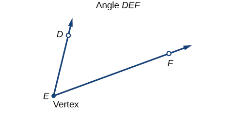
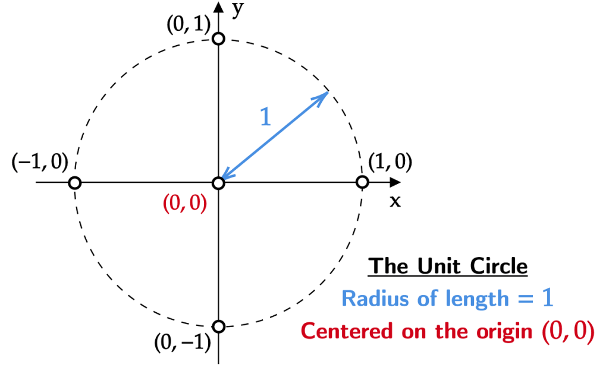
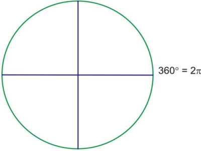
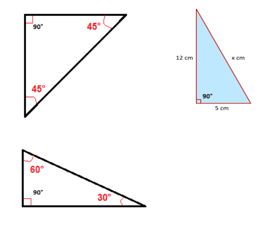
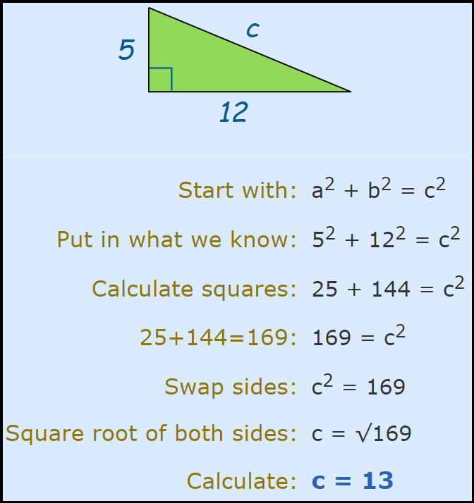
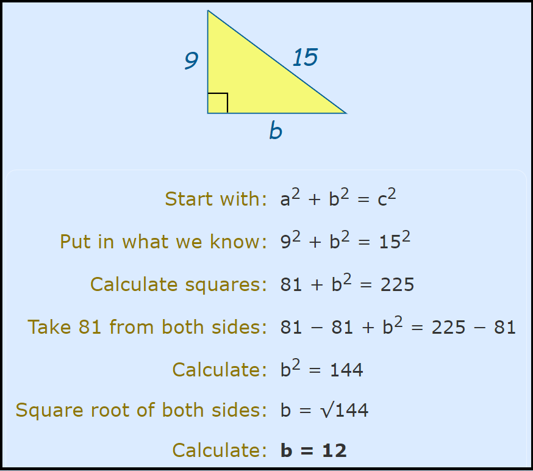
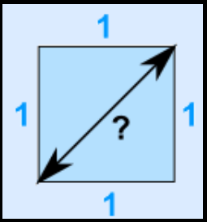
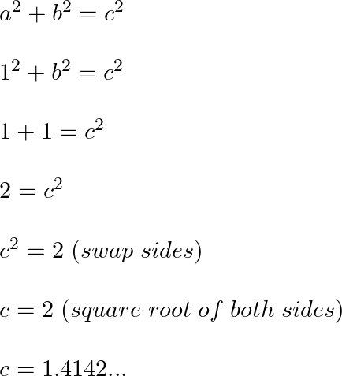
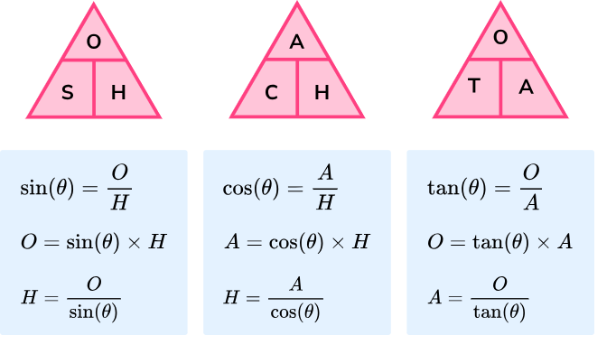
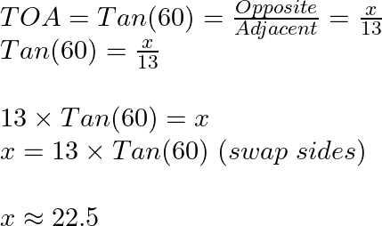

# Trigonometry

## Contents

 - **Prerequisites:**
   - **Angles:**
     - [Rays and Angles](#rays-and-angles)
     - [Angle: Initial and Terminal sides](#angle-initial-terminal-sides)
     - [Measure of Angles](#measure-of-angles)
     - [Angles and Greek Letters](#angles-greek-letters)
   - **Circles:**
     - [Components of a Circle](#circle-components)
     - [Unit Circle](#Unit-Circle)
   - **Radians:**
     - [Radius and Radian as a measure](#radius-and-radians)
     - [Degrees to Radians](#degrees-to-radians)
     - [Radians to Degrees](#radians-to-degrees)
     - [Degrees and Radians Circle/Table](circle-table.md)
   - **Triangles:**
     - [Right-Angled Triangles](#right-angled-triangles)
   - [**Pythagorean Theorem**](#pythagorean-theorem)
     - [When is the Pythagorean Theorem useful?](#when-pt-useful)
     - [Find different sides of a Right-Angled Triangle](#fdsrat)
     - **Pythagorean Theorem (Q&A):**
       - [What is the diagonal distance across a square of size 1?](#pt-qa01)
 - [**Trigonometry:**](#intro-to-trigonometry)
   - [**Sine**](#intro-to-sine)
   - [**Cosine**](#intro-to-cosine)
   - [**Tangent**](#intro-to-tangent)
 - [**Settings**](#settings)
 - [**REFERENCES**](#ref)


<!--- ( Prerequisites/Angles ) -->

---

<div id="rays-and-angles"></div>

## Rays and Angles

Before learning about **Angles**, we need to understand **Rays**.

#### Rays

> A **"Ray"** is a directed line segment.

For example, see the **Ray** below:


See that a ***"Ray"*** has:

 - **An "Endpoint":** The first point is called the *"endpoint"* of the *"Ray"*
   - The starting point of the ray.
 - **A "Direction":** We can also define the direction of the *"Ray"*
   - We define an arrow under the endpoint and the final point: $\overrightarrow{EF}$
   - **NOTE:** See that is similar to a Vector.

<!---
\overrightarrow{EF}
--->

#### Angles

> An **"Angle"** is the **"union of two rays"** having a *common endpoint*.

For example, see the **"Angle"** below:

  

See that:

 - **We have an endpoint "E":**
   - Common to the rays **"D"** and **"F"**.
 - **Two rays "D" and "F" have a common endpoint "E".**
 - **The endpoint "E" is called the "vertex" of the angle:**
   - And the two rays are the sides of the angle.
 - **The angle to our image is formed:**
   - From $\overrightarrow{ED}$ and $\overrightarrow{EF}$

---

<div id="angle-initial-terminal-sides"></div>

## Angle: Initial and Terminal sides

Angle creation is a **dynamic process**... We start with two rays lying on top of one another.

 - **We leave one fixed in place:**
   - The fixed ray is the *"initial side"*
 - **And rotate to the other:**
   - The rotated ray is the *"terminal side"*.

In order to identify the different sides, we indicate the rotation with a small arrow close to the vertex as the image below:

  

---

<div id="measure-of-angles"></div>

## Measure of Angles

> The **measure of an angle** is the **amount of rotation from the initial side to the terminal side**.

Probably the most familiar unit of angle measurement is the **"degree"**.

 - One **degree** is $\frac{1}{360}$ of a circular rotation.
 - So a complete circular rotation contains **360 degrees**.

> **NOTE:**  
> An angle measured in degrees should always include the unit “degrees” after the number, or include the degree symbol `°`.

For example:

```bash
90 degrees = 90°
```

 - If the angle is measured in a **"counterclockwise direction"** from the initial side to the terminal side, the angle is said to be a **"positive angle"**.
 - If the angle is measured in a **"clockwise direction"**, the angle is said to be a **"negative angle"**.

For example, see the images below to understand more easily:

  

To place the terminal side of the angle, we must calculate the fraction of a full rotation the angle represents. We do that by dividing the angle measure in degrees by **"360°"**.

For example:

 - To draw a **"90°"** angle, we calculate that $\frac{90}{360} = \frac{1}{4} = 0.25$.
   - So, the terminal side will be *one-fourth* of the way around the circle, moving counterclockwise from the positive x-axis.
 - To draw a **"360°"** angle, we calculate that $\frac{360}{360} = 1$.

See the image below to understand more easily:

  

It's common to learn that angles can be measured in degrees:

  

> **NOTE:**  
> Looking at the image above, pay attention that the focus is on the **“angles”** and **"not the number of radius"**.

See the image again to understand the focus more easily:

  

See that:

 - **We have many Angles in degree.**
 - **The blue Circle is the ["Unit Circle"](#Unit-Circle):**
   - Has a *"radius of 1"*.
   - Is centered at the *"origin (0, 0)"*.

For example, let's see some of these angles above separated:

  

---

<div id="angles-greek-letters"></div>

## Angles and Greek Letters

> **Greek letters** are often (frequentemente) used as variables for the measure of an angle.

For example, see the common Greek letters used to measure angles:

| θ     | φ or ϕ | α     | β    | γ     |
|-------|--------|-------|------|-------|
| Theta | Phi    | Alpha | Beta | Gamma |


<!--- ( Prerequisites/Circles ) -->

---

<div id="circle-components"></div>

## Components of a Circle

To work with a **Circle** we have some important components:

  

 - **Center of the circle (Central Vertex):**
   - The center is the fixed point inside the circle that is the same distance away from all points on the circle's edge (circumference). 
 - **Circumference:**
   - The circumference is the total length around (bounded) the edge of the circle.
 - **Radius:**
   - The radius is any line segment that connects the center of the circle to a point on the edge (circumference). All **radii (radii = plural of radius, it's the plural form of radius, indicating there are more than one of these lines)** of a circle have the same length.
 - **Diameter:**
   - The diameter is a straight line that passes through the center of the circle (0, 0) and touches opposite ends of the circle's edge. **Its length is equal to twice the radius**.

**NOTE:**  
Now let's look at some components of a circle that may look the same but are different:

 - **Radius (Raio):**
   - A **Radius (Raio)** is a line segment that starts from the *center of the circle (0, 0)* and ends on a point on the circle's edge (circumference).
   - It's typically denoted by the letter **"r"** in mathematical formulas.
 - **Ray (Também é "raio" em inglês):**
   - A **Ray (Também é "raio" em inglês)** is a part of a line that starts at the *center of the circle (0, 0)* and *"extends infinitely"* outward in one direction. 
 - **Arc:**
   - Part of the *circumference* of a *circle*.


---

<div id="Unit-Circle"></div>

## Unit Circle

When we study Angles, it is common to draw a circle between the rays to find the Angle.

> This circle is known as the **"Unit Circle"**.

 - A **"Unit Circle"** is a circle *"on the Cartesian Plane"* that *"has a radius of 1 unit"*.
 - And is *centered* at the *origin (0, 0)*.

  

See that our circle:

 - Has a *"radius of 1"*.
 - Is centered at the *"origin (0, 0)"*.

**NOTE:**  
Pay attention that, the focus here is the *"circle"*, not the other components (such as radius or arcs).


<!--- ( Prerequisites/Radians ) -->

---

<div id="radius-and-radians"></div>

## Radius and Radian as a measure

> A **Radius** is **half a diameter**.

  

> **NOTE:**  
> Knowing that we can say that the *"radius"* is the *"diameter divided by two"*.

A Circle can have an uncountable number of Radius. For example:


Looking at the first Circle, we see that we have many Radii with different spaces between them, but they all have the same length.

### Radian

I like to say (but not formally) that:

> A **"Radian"** is an **"Angle"** in which the *Arc* has the same length as the *Radius*.

  

> **What would happen if we were to rotate around the circle continuing to add radians?**

  

See that:

 - **We have 6 radians.**
   - And a little bit more.
 - **These 6 radians can be used to measure angles:**
   - That is, now we use *"radians"* instead of *"degrees"* to measure angles.

---

<div id="degrees-to-radians"></div>

## Degrees to Radians

To understand how to convert degrees into radians, first let's consider that a complete rotation of the circle (circumference) is:

 - **Degrees:**
   - 360° (or 360 degrees)
 - **Radians:**
   - 2π (or 2π radians)

For example, see the image below:

  

Knowing that we can say also that the half of a circle is:

 - **360° (or 360 degrees) divided by 2:**
   - 180° (or 180 degrees)
 - **2π (or 2π radians) divided by 2:**
   - 1rad (or 1π radian) = π

For example, see the image below:

  

And If I divide 360° into 4 equal parts?

  

> **Ok, but how do you use that to convert degrees into radians?**

We can use **"proportions"** to solve this problem. For example:

> **How do you convert 30° (or 30 degrees) into radians?**

Using proportions we have:

  

That is, **30° (or 30 degrees)** equals **Pi/6 radians**.

$30° = \frac{\pi}{6}$

> **NOTE:**  
> That is, we can use the *"proportions"* approach to solve any problem to convert degrees into radians.

---

<div id="radians-to-degrees"></div>

## Radians to Degrees

Ok, now how to convert radians into degrees? For example:

> **Imagine we need to convert $\frac{3\pi}{4}$ to degrees.**

Well, we know that **Pi (π) = 180°**... Knowing that we can change the question to:

  

Now, we can work like an equation to solve that:

  


<!--- ( Prerequisites/Triangles ) -->

---

<div id="right-angled-triangles"></div>

## Right-Angled Triangles

> A **Right-Angled Triangle (also called a Right Triangle)** has a **right angle (90°)** in it.

For example, see the **Right-Angled Triangle** below:


Let's, see another **Right-Angled Triangle** example:



Now, let's, see an interactive example:


See that:

 - We have 3 Angles.
 - We have a **Right-Angled (90° angle)**.
 - Independent we change the other Angles the **Right-Angled** always has *90° (or 90 degrees)*.


<!--- ( Prerequisites/Pythagorean theorem ) -->

---

<div id="pythagorean-theorem"></div>

## Pythagorean Theorem

Over 2000 years ago there was an amazing discovery about triangles:

 - When a triangle has a **right angle (90°)**...
 - And squares are made on each of the three sides (e quadrados são feitos em cada um dos três lados)...
 - Then the biggest square has the exact same area as the other two squares put together (então o maior quadrado tem exatamente a mesma área que os outros dois quadrados juntos!)!

See the image below to understand more easily:

  

> **NOTE:**  
> It is called the **"Pythagorean theorem"**.

 - **"c"** is the longest side of the triangle:
   - The longest side of the triangle is called the **"hypotenuse"**.
 - **"a"** and **"b"** are the other two sides.

---

<div id="when-pt-useful"></div>

## When is the Pythagorean Theorem useful?

If we know the lengths of two sides of a **Right Angled Triangle**, we can find the length of the *third side* (But remember it only works on *Right Angled Triangles*).

For example, see the question below:



---

<div id="fdsrat"></div>

## Find different sides of a Right-Angled Triangle

> Is the **"Pythagorean Theorem"** just used to find the longest side of the *Right-Angled Triangle* (c, hypotenuse)?

**NOT!**  
We can use the **"Pythagorean Theorem"** to find any side of the *Right-Angled Triangle*. However, we need to know *at least (pelo menos)* two sides first.

For example, see the example below:



---

<div id="pt-qa01"></div>

## What is the diagonal distance across a square of size 1?

Imagine we have the following across a square of size 1:

  

Using Pythagorean Theorem:

  


---

<div id="intro-to-trigonometry"></div>

## Trigonometry

> **Trigonometry**, the branch of mathematics dealing with the `relations` of the **"sides" and "angles" of Triangles**.

To start the Trigonometry studies, let's imagine we have the following Triangle:

  


At first (A princípio), we can think about using the **"Pythagorean Theorem"** to find the value of “X (side)”.

> **But, the *Pythagorean Theorem* requires at least two sides of a triangle**.

Continuing with our problem... Let's label the triangle sides:

  

 - The `hypotenuse` is always the side bigger than both of the other two sides.
 - The `Opposite side` is the one that is opposite from the *angle (θ)*.
 - Finally, the `Adjacent side` is the *side adjacent* or next to the *angle (θ)* of reference.

> **But, how to solve the problem of finding the value of “X (side)”?**

In Trigonometry we have some **"functions"** to help us find sides or angles in a Triangle.

For example, see the image below:


> **But when to use each of these functions?**

**NOTE:**  
**"It depends on what is given"** and **"what is needed to be found"**.

For example:

 - **Sine(θ):**
   - If we have the `opposite side`and the `hypotenuse`, use **sine(θ)**.
 - **Cosine(θ):**
   - If we have the `adjacent side` and the `hypotenuse`, use **cosine(θ)**.
 - **Tangent(θ):**
   - If we have the `opposite sides` and the `adjacent`, use **tangent(θ)**.

> **OK, but how do you remember the formulas?**

To remember the **Sine(θ), Cosine(θ), and Tangent(θ)** the common approach is to relate these formulas to **"SOH"**, **"CAH"**, and **"TOA"**.

For example, see the image below to understand more easily:

  

> **NOTE:**  
> See also we can change the formulas to solve specific problems.

Back to our first Triangle problem... Which formula to use?

  

Well...

 - We have the `opposite side "x"`, because it is opposite of the angle (60).
 - And we have the `adjacent side`, 13, because it is `adjacent` to 60 degrees.

So, we know that we have the `opposite` and `adjacent side`. The only trigonometric ration that involves these two is the **"tangent(60)"**.


<!---
\\TOA = Tan(60°) = \frac{Opposite}{Adjacent} = \frac{x}{13}
\\Tan(60°) = \frac{x}{13}
\\
\\13 \times Tan(60°) = x
\\x = 13 \times Tan(60°) \ (swap \ sides)
\\
\\22.5 ≈ x
--->

> **So, what does our "22.5 ≈ x", mean?**
> It’s just the *missing side (x)* that we solved.

**NOTE:**  
Now, from here we can use the **"Pythagorean Theorem"** to find the `hypotenuse` of the Triangle.


<!--- ( Settings ) --->

---

<div id="settings"></div>

## Settings

**CREATE VIRTUAL ENVIRONMENT:**  
```bash
python -m venv math-environment
```

**ACTIVATE THE VIRTUAL ENVIRONMENT (LINUX):**  
```bash
source math-environment/bin/activate
```

**ACTIVATE THE VIRTUAL ENVIRONMENT (WINDOWS):**  
```bash
source math-environment/Scripts/activate
```

**UPDATE PIP:**
```bash
python -m pip install --upgrade pip
```

**INSTALL PYTHON DEPENDENCIES:**  
```bash
pip install -U -v --require-virtualenv -r requirements.txt
```

**Now, Be Happy!!!** 😬


<!--- ( References ) -->

---

<div id="ref"></div>

## REFERENCES

 - **Prerequisites:**
   - **Angles:**
     - [Angles](https://www.mathsisfun.com/angles.html)
     - [Degrees (Angles)](https://www.mathsisfun.com/geometry/degrees.html)
     - [7.1 Angles](https://openstax.org/books/algebra-and-trigonometry-2e/pages/7-1-angles)
   - **Circles:**
     - [Clockwise and Counterclockwise](https://www.mathsisfun.com/geometry/clockwise-counterclockwise.html)
   - **Radians:**
     - [What are radians?](https://jarnowouda.com/what-are-radians/)
     - [2.1 Radian Measure](https://flexbooks.ck12.org/cbook/ck-12-trigonometry-concepts/section/2.1/primary/lesson/radian-measure-trig/)
 - **Trigonometry:**
   - [Como a Trigonometria deveria ser apresentada!](https://www.youtube.com/watch?v=eBIdYBrRQGk)
   - **Sine**
   - **Cosine**
   - **Tangent**

---

Ro**drigo** **L**eite da **S**ilva - **drigols**
