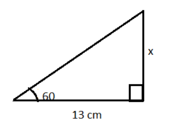

# Trigonometry

## Contents

 - [**Trigonometry:**](#trigono)
   - [**Sine**](#sine)
   - [**Cosine**](#cosine)
   - [**Tangent**](#tangent)
 - [**Settings**](#settings)
 - [**REFERENCES**](#ref)

<!--- ( Trigonometry ) -->

---

<div id="trigono"></div>

## Trigonometry

> ***Trigonometry*** (from Greek **trigonon "triangle"** + **metron "measure"**.

The most interest triangle in the Trigonometry is the *Right-Angled Rriangle*. The **right angle** is shown by the little box in the corner (canto):

For example, see the **Right-Angled Rriangle** below:

  

 - **Another angle is often labeled (frequentemente rotulado) *θ*, and the three sides are then called:**
   - **Opposite:** opposite to the angle **θ**.
   - **Adjacent:** adjacent (next to) the angle **θ**.
   - **Hypotenuse:** The longest side is the *Hypotenuse*.

> **Ok, but why a Right-Angled Triangle?**

Imagine we can measure along and up but **want to know the direct distance** and **angle**:

  

> **NOTE:**  
> **Trigonometry** can find that missing **angle** and **distance**.

Or maybe we have a *distance* and *angle* and **need to "plot the dot (traçar uma reta)" along and up**:

  

> **Questions like these are common in engineering, computer animation and more.**
> And trigonometry gives the answers!

---

<div id="sine"></div>

### Sine

The ***Sine /saɪn/* formula** is:

  

For example, given the triangle below:

  

Find the value of **sin t**:

 - The side **opposite** to the angle **t** is **7**.
 - And the **hypotenuse** of the triangle is **15**.
 - Then, **sin(t) = 7/25**.

> **Ok, but why the Sine formula is (Opposite/Hypotenuse)?**

---

<div id="cosine"></div>

### Cosine

The **Cosine /ˈkoʊ.saɪn/ formula** is:

  

<div id="tangent"></div>

For example, given the triangle below:

  

Find the value of **cos α**:

 - The side **adjacent** to the angle is **15**.
 - And the **hypotenuse** of the triangle is **17**.
 - Then, **cos(α) = 15/17**.

> **Ok, but why the Tangent formula is (Adjacent/Adjacent)?**

---

### Tangent

The **Tangent /ˈtæn.dʒənt/ formula** is:

  

> **Ok, but why the Tangent formula is (Opposite/Adjacent)?**


<!--- ( Settings ) --->

---

<div id="settings"></div>

## Settings

**CREATE VIRTUAL ENVIRONMENT:**  
```bash
python -m venv math-environment
```

**ACTIVATE THE VIRTUAL ENVIRONMENT (LINUX):**  
```bash
source math-environment/bin/activate
```

**ACTIVATE THE VIRTUAL ENVIRONMENT (WINDOWS):**  
```bash
source math-environment/Scripts/activate
```

**UPDATE PIP:**
```bash
python -m pip install --upgrade pip
```

**INSTALL PYTHON DEPENDENCIES:**  
```bash
pip install -U -v --require-virtualenv -r requirements.txt
```

**Now, Be Happy!!!** 😬


<!--- ( References ) -->

---

<div id="references"></div>

## REFERENCES

 - [Clockwise and Counterclockwise](https://www.mathsisfun.com/geometry/clockwise-counterclockwise.html)
 - [Angles](https://www.mathsisfun.com/angles.html)
 - [Degrees (Angles)](https://www.mathsisfun.com/geometry/degrees.html)
 - [7.1 Angles](https://openstax.org/books/algebra-and-trigonometry-2e/pages/7-1-angles)
 - [Triangles](https://www.mathsisfun.com/triangle.html)
 - [Right-Angled Triangles](https://www.mathsisfun.com/right_angle_triangle.html)
 - [Pi (π)](https://www.mathsisfun.com/numbers/pi.html)
 - [Radians](https://www.mathsisfun.com/geometry/radians.html)
 - [What are radians?](https://jarnowouda.com/what-are-radians/)

---

Ro**drigo** **L**eite da **S**ilva - **drigols**
