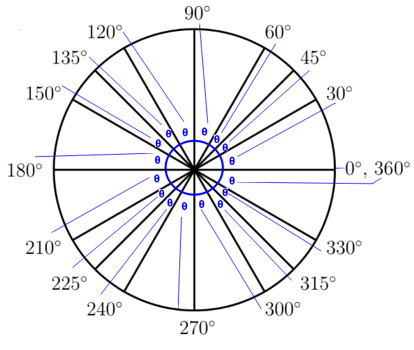
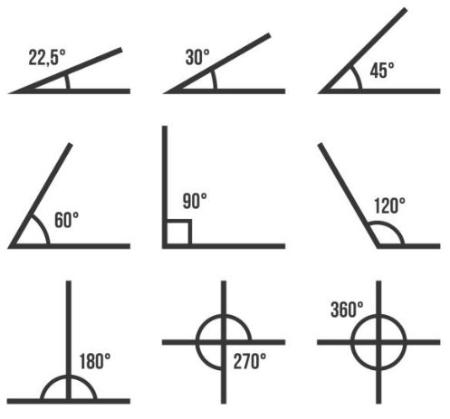
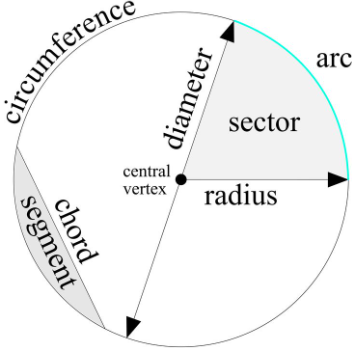
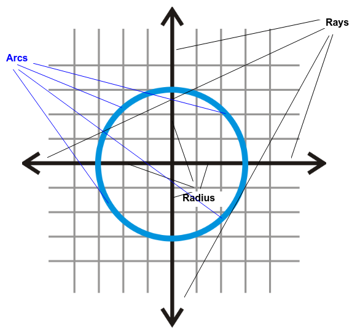
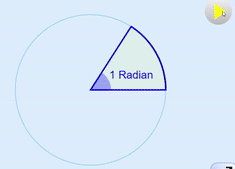
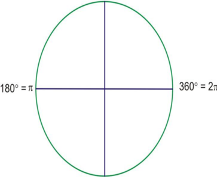
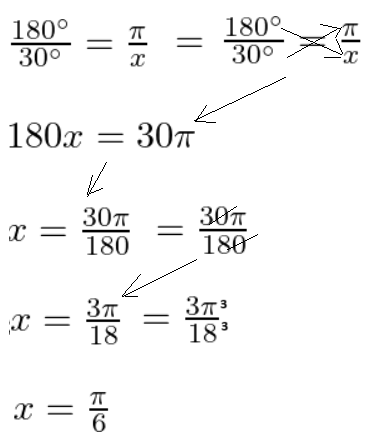
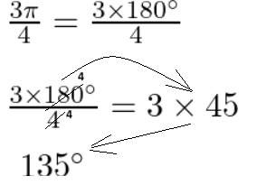
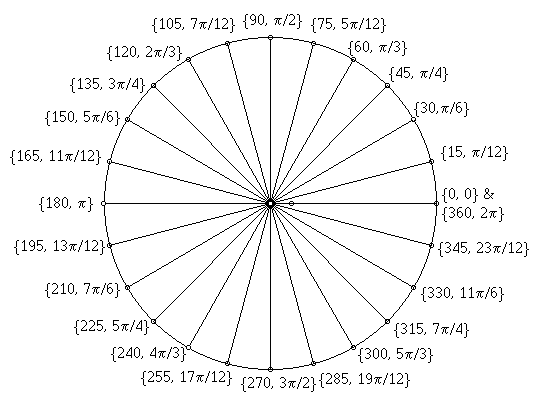

# Trigonometry

## Contents

 - **Prerequisites:**
   - **Angles:**
     - [Rays and Angles](#rays-and-angles)
     - [Angle: Initial and Terminal sides](#angle-initial-terminal-sides)
     - [Measure of Angles](#measure-of-angles)
     - [Angles and Greek Letters](#angles-greek-letters)
   - **Circles:**
     - [Components of a Circle](#circle-components)
     - [Unit Circle](#Unit-Circle)
   - **Radians:**
     - [Radius and Radian as a measure](#radius-and-radians)
     - [Degrees to Radians](#degrees-to-radians)
     - [Radians to Degrees](#radians-to-degrees)
     - [Degrees and Radians Circle/Table](#degrees-and-radians-table)
 - [**Trigonometry:**](#intro-to-trigonometry)
   - [**Sine**](#intro-to-sine)
   - [**Cosine**](#intro-to-cosine)
   - [**Tangent**](#intro-to-tangent)
 - [**Settings**](#settings)
 - [**REFERENCES**](#ref)


<!--- ( Prerequisites/Angles ) -->

---

<div id="rays-and-angles"></div>

## Rays and Angles

Before learning about **Angles**, we need to understand **Rays**.

> A **"Ray"** is a directed line segment.

For example, see the **Ray** below:


See that a ***"Ray"*** has:

 - **An "Endpoint":** The first point is called the *"endpoint"* of the *"Ray"*
   - The starting point of the ray.
 - **A "Direction":** We can also define the direction of the *"Ray"*
   - We define a arrow under the endpoint and the final point: $\overrightarrow{EF}$
   - **NOTE:** See that is similar to a Vector.

<!---
\overrightarrow{EF}
--->

> An **"Angle"** is the **"union of two rays"** having a *common endpoint*.

For example, see the **"Angle"** below:

  

See that:

 - **We have an endpoint "E":**
   - Common to rays **"D"** and **"F"**.
 - **Two rays "D" and "F" have a common endpoint "E".**
 - **The endpoint "E" is called the "vertex" of the angle:**
   - And the two rays are the sides of the angle.
 - **The angle to our image is formed:**
   - From $\overrightarrow{ED}$ and $\overrightarrow{EF}$

---

<div id="angle-initial-terminal-sides"></div>

## Angle: Initial and Terminal sides

Angle creation is a **dynamic process**... We start with two rays lying on top of one another.

 - **We leave one fixed in place:**
   - The fixed ray is the *"initial side"*
 - **And rotate the other:**
   - The rotated ray is the *"terminal side"*.

In order to identify the different sides, we indicate the rotation with a small arrow close to the vertex as the image below:

  

---

<div id="measure-of-angles"></div>

## Measure of Angles

> The **measure of an angle** is the **amount of rotation from the initial side to the terminal side**.

Probably the most familiar unit of angle measurement is the **"degree"**.

 - One **degree** is $\frac{1}{360}$ of a circular rotation.
 - So a complete circular rotation contains **360 degrees**.

> **NOTE:**  
> An angle measured in degrees should always include the unit “degrees” after the number, or include the degree symbol `°`.

For example:

```bash
90 degrees = 90°
```

 - If the angle is measured in a **"counterclockwise direction"** from the initial side to the terminal side, the angle is said to be a **"positive angle"**.
 - If the angle is measured in a **"clockwise direction"**, the angle is said to be a **"negative angle"**.

For example, see the images below to understand more easily:

  

To place the terminal side of the angle, we must calculate the fraction of a full rotation the angle represents. We do that by dividing the angle measure in degrees by **"360°"**.

For example:

 - To draw a **"90°"** angle, we calculate that $\frac{90}{360} = \frac{1}{4} = 0.25$.
   - So, the terminal side will be *one-fourth* of the way around the circle, moving counterclockwise from the positive x-axis.
 - To draw a **"360°"** angle, we calculate that $\frac{360}{360} = 1$.

See the image below to understand more easily:

  

It's common to learn that angles can be measured in degrees:

  

> **NOTE:**  
> Looking at the image above, pay attention that the focus is on the **“angles”** and **"not the number of radius"**.

See the image again to understand the focus more easily:

  

See that:

 - **We have many Angles in degree.**
 - **The blue Circle is the ["Unit Circle"](#Unit-Circle):**
   - Has a *"radius of 1"*.
   - Is centered at the *"origin (0, 0)"*.

For example, let's see some of these angles above separated:

  

---

<div id="angles-greek-letters"></div>

## Angles and Greek Letters

> **Greek letters** are often (frequentemente) used as variables for the measure of an angle.

For example, see the common Greek letters used to measure angles:

| θ     | φ or ϕ | α     | β    | γ     |
|-------|--------|-------|------|-------|
| Theta | Phi    | Alpha | Beta | Gamma |


<!--- ( Prerequisites/Circles ) -->

---

<div id="circle-components"></div>

## Components of a Circle

To work with a **Circle** we have some important components:

  

 - **Center of the circle (Central Vertex):**
   - The center is the fixed point inside the circle that is the same distance away from all points on the circle's edge (circumference). 
 - **Circumference:**
   - The circumference is the total length around (bounded) the edge of the circle.
 - **Radius:**
   - The radius is any line segment that connects the center of the circle to a point on the edge (circumference). All **radii (radii = plural of radius, it's the plural form of radius, indicating there are more than one of these lines)** of a circle have the same length.
 - **Diameter:**
   - The diameter is a straight line that passes through the center of the circle (0, 0) and touches opposite ends of the circle's edge. **Its length is equal to twice the radius**.

**NOTE:**  
Now let's look at some components of a circle that may look the same but are different:

 - **Radius (Raio):**
   - A **Radius (Raio)** is a line segment that starts from the *center of the circle (0, 0)* and ends on a point on the circle's edge (circumference).
   - It's typically denoted by the letter **"r"** in mathematical formulas.
 - **Ray (Também é "raio" em inglês):**
   - A **Ray (Também é "raio" em inglês)** is a part of a line that starts at the *center of the circle (0, 0)* and *"extends infinitely"* outward in one direction. 
 - **Arc:**
   - Part of the *circumference* of a *circle*.



---

<div id="Unit-Circle"></div>

## Unit Circle

When we study Angles, it is common to draw a circle between the rays to find the Angle.

> This circle is known as the **"Unit Circle"**.

 - A **"Unit Circle"** is a circle *"on the Cartesian Plane"* that *"has a radius of 1 unit"*.
 - And is *centered* at the *origin (0, 0)*.

  

See that our circle:

 - Has a *"radius of 1"*.
 - Is centered at the *"origin (0, 0)"*.

**NOTE:**  
Pay attention that, the focus here is the *"circle"*, not the arcs (or rays) length. That's the circle with a radius of 1.


<!--- ( Prerequisites/Radians ) -->

---

<div id="radius-and-radians"></div>

## Radius and Radian as a measure

> A **Radius** is **half a diameter**.

  

> **NOTE:**  
> Knowing that we can say that the *"radius"* is the *"diameter divided by two"*.

A Circle can have an uncountable number of Radius. For example:


Looking at the first Circle, we see that we have many Radii with different spaces between them, but they all have the same length.

### Radian

I like to say (but not formally) that:

> A **"Radian"** is an **"Angle"** in which the *Arc* has the same length as the *Radius*.

  

> **What would happen if we were to rotate around the circle continuing to add radians?**

  

See that:

 - **We have 6 radians.**
   - And a little bit more.
 - **These 6 radians can be used to measure angles:**
   - That is, now we use *"radians"* instead of *"degrees"* to measure angles.

---

<div id="degrees-to-radians"></div>

## Degrees to Radians

To understand how to convert degrees into radians, first let's consider that a complete rotation of the circle (circumference) is:

 - **Degrees:**
   - 360° (or 360 degrees)
 - **Radians:**
   - 2π (or 2π radians)

For example, see the image below:


Knowing that we can say also that the half of a circle is:

 - **360° (or 360 degrees) divided by 2:**
   - 180° (or 180 degrees)
 - **2π (or 2π radians) divided by 2:**
   - 1rad (or 1π radian) = π

For example, see the image below:



And If I divide 360° into 4 equal parts?


> **Ok, but how do you use that to convert degrees into radians?**

We can use **"proportions"** to solve this problem. For example:

> **How do you convert 30° (or 30 degrees) into radians?**

Using proportions we have:



That is, **30° (or 30 degrees)** equals **Pi/6 radians**.

$30° = \frac{\pi}{6}$

> **NOTE:**  
> That is, we can use the *"proportions"* approach to solve any problem to convert degrees into radians.

---

<div id="radians-to-degrees"></div>

## Radians to Degrees

Ok, now how to convert radians into degrees? For example:

> **Imagine we need to convert $\frac{3\pi}{4}$ to degrees.**

Well, we know that **Pi (π) = 180°**... Knowing that we can change the question to:


Now, we can work like an equation to solve that:



---

<div id="degrees-and-radians-table"></div>

## Degrees and Radians Circle/Table

Now, let's see a Circle/Table with Degrees and corresponding Radians:

**Circle:**  


**Table:**  
| Degrees | Radians     |
|---------|-------------|
| 0°      | 0           |
| 1°      | $$\frac{\pi}{180}$$       |
| 2°      | $$\frac{\pi}{90}$$        |
| 3°      | $$\frac{\pi}{60}$$        |
| 4°      | $$\frac{\pi}{45}$$        |
| 5°      | $$\frac{\pi}{36}$$        |
| 6°      | $$\frac{\pi}{30}$$        |
| 7°      | $$\frac{7\pi}{180}$$      |
| 8°      | $$\frac{2\pi}{45}$$       |
| 9°      | $$\frac{\pi}{20}$$        |
| 10°     | $$\frac{\pi}{18}$$        |
| 11°     | $$\frac{11\pi}{180}$$     |
| 12°     | $$\frac{\pi}{15}$$        |
| 13°     | $$\frac{13\pi}{180}$$     |
| 14°     | $$\frac{7\pi}{90}$$       |
| 15°     | $$\frac{\pi}{12}$$        |
| 16°     | $$\frac{4\pi}{45}$$       |
| 17°     | $$\frac{17\pi}{180}$$     |
| 18°     | $$\frac{\pi}{10}$$        |
| 19°     | $$\frac{19\pi}{180}$$     |
| 20°     | $$\frac{\pi}{9}$$         |
| 21°     | $$\frac{7\pi}{60}$$       |
| 22°     | $$\frac{11\pi}{90}$$      |
| 23°     | $$\frac{23\pi}{180}$$     |
| 24°     | $$\frac{\pi}{6}$$         |
| 25°     | $$\frac{5\pi}{36}$$       |
| 26°     | $$\frac{13\pi}{90}$$      |
| 27°     | $$\frac{3\pi}{20}$$       |
| 28°     | $$\frac{7\pi}{45}$$       |
| 29°     | $$\frac{29\pi}{180}$$     |
| 30°     | $$\frac{\pi}{6}$$         |
| 31°     | $$\frac{31\pi}{180}$$     |
| 32°     | $$\frac{8\pi}{45}$$       |
| 33°     | $$\frac{11\pi}{60}$$      |
| 34°     | $$\frac{17\pi}{90}$$      |
| 35°     | $$\frac{7\pi}{36}$$       |
| 36°     | $$\frac{\pi}{5}$$         |
| 37°     | $$\frac{37\pi}{180}$$     |
| 38°     | $$\frac{19\pi}{90}$$      |
| 39°     | $$\frac{13\pi}{60}$$      |
| 40°     | $$\frac{2\pi}{9}$$        |
| 41°     | $$\frac{41\pi}{180}$$     |
| 42°     | $$\frac{7\pi}{30}$$       |
| 43°     | $$\frac{43\pi}{180}$$     |
| 44°     | $$\frac{11\pi}{45}$$      |
| 45°     | $$\frac{\pi}{4}$$         |
| 46°     | $$\frac{23\pi}{90}$$      |
| 47°     | $$\frac{47\pi}{180}$$     |
| 48°     | $$\frac{4\pi}{15}$$       |
| 49°     | $$\frac{49\pi}{180}$$     |
| 50°     | $$\frac{5\pi}{18}$$       |
| 51°     | $$\frac{17\pi}{60}$$            |
| 52°     | $$\frac{13\pi}{45}$$            |
| 53°     | $$\frac{53\pi}{180}$$           |
| 54°     | $$\frac{3\pi}{10}$$             |
| 55°     | $$\frac{11\pi}{36}$$            |
| 56°     | $$\frac{14\pi}{45}$$            |
| 57°     | $$\frac{19\pi}{60}$$            |
| 58°     | $$\frac{29\pi}{90}$$            |
| 59°     | $$\frac{59\pi}{180}$$           |
| 60°     | $$\frac{\pi}{3}$$               |
| 61°     | $$\frac{61\pi}{180}$$           |
| 62°     | $$\frac{31\pi}{90}$$            |
| 63°     | $$\frac{7\pi}{20}$$             |
| 64°     | $$\frac{16\pi}{45}$$            |
| 65°     | $$\frac{13\pi}{36}$$            |
| 66°     | $$\frac{11\pi}{30}$$            |
| 67°     | $$\frac{67\pi}{180}$$           |
| 68°     | $$\frac{17\pi}{45}$$            |
| 69°     | $$\frac{23\pi}{60}$$            |
| 70°     | $$\frac{7\pi}{18}$$             |
| 71°     | $$\frac{71\pi}{180}$$           |
| 72°     | $$\frac{2\pi}{5}$$              |
| 73°     | $$\frac{73\pi}{180}$$           |
| 74°     | $$\frac{37\pi}{90}$$            |
| 75°     | $$\frac{5\pi}{12}$$             |
| 76°     | $$\frac{19\pi}{45}$$            |
| 77°     | $$\frac{77\pi}{180}$$           |
| 78°     | $$\frac{13\pi}{30}$$            |
| 79°     | $$\frac{79\pi}{180}$$           |
| 80°     | $$\frac{4\pi}{9}$$              |
| 81°     | $$\frac{3\pi}{7}$$              |
| 82°     | $$\frac{41\pi}{90}$$            |
| 83°     | $$\frac{83\pi}{180}$$           |
| 84°     | $$\frac{\pi}{2}$$               |
| 85°     | $$\frac{17\pi}{36}$$            |
| 86°     | $$\frac{43\pi}{90}$$            |
| 87°     | $$\frac{29\pi}{60}$$            |
| 88°     | $$\frac{11\pi}{20}$$            |
| 89°     | $$\frac{89\pi}{180}$$           |
| 90°     | $$\frac{\pi}{2}$$               |
| 91°     | $$\frac{91\pi}{180}$$           |
| 92°     | $$\frac{23\pi}{45}$$            |
| 93°     | $$\frac{31\pi}{60}$$            |
| 94°     | $$\frac{47\pi}{90}$$            |
| 95°     | $$\frac{19\pi}{36}$$            |
| 96°     | $$\frac{8\pi}{15}$$             |
| 97°     | $$\frac{97\pi}{180}$$           |
| 98°     | $$\frac{49\pi}{90}$$            |
| 99°     | $$\frac{11\pi}{20}$$            |
| 100°    | $$\frac{5\pi}{9}$$              |
| 101°    | $$\frac{101\pi}{180}$$          |
| 102°    | $$\frac{17\pi}{30}$$            |
| 103°    | $$\frac{103\pi}{180}$$          |
| 104°    | $$\frac{26\pi}{45}$$            |
| 105°    | $$\frac{7\pi}{12}$$             |
| 106°    | $$\frac{53\pi}{90}$$            |
| 107°    | $$\frac{107\pi}{180}$$          |
| 108°    | $$\frac{\pi}{2}$$               |
| 109°    | $$\frac{109\pi}{180}$$          |
| 110°    | $$\frac{11\pi}{18}$$            |
| 111°    | $$\frac{37\pi}{60}$$            |
| 112°    | $$\frac{14\pi}{25}$$            |
| 113°    | $$\frac{113\pi}{180}$$          |
| 114°    | $$\frac{19\pi}{30}$$            |
| 115°    | $$\frac{23\pi}{36}$$            |
| 116°    | $$\frac{29\pi}{45}$$            |
| 117°    | $$\frac{13\pi}{20}$$            |
| 118°    | $$\frac{59\pi}{90}$$            |
| 119°    | $$\frac{119\pi}{180}$$          |
| 120°    | $$\frac{\pi}{3}$$               |
| 121°    | $$\frac{121\pi}{180}$$          |
| 122°    | $$\frac{61\pi}{90}$$            |
| 123°    | $$\frac{41\pi}{60}$$            |
| 124°    | $$\frac{31\pi}{45}$$            |
| 125°    | $$\frac{5\pi}{9}$$              |
| 126°    | $$\frac{7\pi}{12}$$             |
| 127°    | $$\frac{127\pi}{180}$$          |
| 128°    | $$\frac{32\pi}{45}$$            |
| 129°    | $$\frac{43\pi}{60}$$            |
| 130°    | $$\frac{13\pi}{18}$$            |
| 131°    | $$\frac{131\pi}{180}$$          |
| 132°    | $$\frac{11\pi}{15}$$            |
| 133°    | $$\frac{133\pi}{180}$$          |
| 134°    | $$\frac{67\pi}{90}$$            |
| 135°    | $$\frac{\pi}{3}$$               |
| 136°    | $$\frac{17\pi}{24}$$            |
| 137°    | $$\frac{137\pi}{180}$$          |
| 138°    | $$\frac{23\pi}{30}$$            |
| 139°    | $$\frac{139\pi}{180}$$          |
| 140°    | $$\frac{7\pi}{9}$$              |
| 141°    | $$\frac{47\pi}{60}$$            |
| 142°    | $$\frac{71\pi}{90}$$            |
| 143°    | $$\frac{143\pi}{180}$$          |
| 144°    | $$\frac{\pi}{2}$$               |
| 145°    | $$\frac{29\pi}{36}$$            |
| 146°    | $$\frac{73\pi}{90}$$            |
| 147°    | $$\frac{49\pi}{60}$$            |
| 148°    | $$\frac{37\pi}{45}$$            |
| 149°    | $$\frac{149\pi}{180}$$          |
| 150°    | $$\frac{5\pi}{6}$$              |
| 151°    | $$\frac{151\pi}{180}$$          |
| 152°    | $$\frac{19\pi}{22.5}$$          |
| 153°    | $$\frac{17\pi}{20}$$            |
| 154°    | $$\frac{77\pi}{90}$$            |
| 155°    | $$\frac{31\pi}{36}$$            |
| 156°    | $$\frac{13\pi}{15}$$            |
| 157°    | $$\frac{157\pi}{180}$$          |
| 158°    | $$\frac{79\pi}{90}$$            |
| 159°    | $$\frac{53\pi}{60}$$            |
| 160°    | $$\frac{8\pi}{9}$$              |
| 161°    | $$\frac{161\pi}{180}$$          |
| 162°    | $$\frac{9\pi}{10}$$             |
| 163°    | $$\frac{163\pi}{180}$$          |
| 164°    | $$\frac{41\pi}{45}$$            |
| 165°    | $$\frac{\pi}{3}$$               |
| 166°    | $$\frac{83\pi}{90}$$            |
| 167°    | $$\frac{167\pi}{180}$$          |
| 168°    | $$\frac{7\pi}{8}$$              |
| 169°    | $$\frac{169\pi}{180}$$          |
| 170°    | $$\frac{17\pi}{18}$$            |
| 171°    | $$\frac{19\pi}{20}$$            |
| 172°    | $$\frac{43\pi}{45}$$            |
| 173°    | $$\frac{173\pi}{180}$$          |
| 174°    | $$\frac{29\pi}{30}$$            |
| 175°    | $$\frac{7\pi}{6}$$              |
| 176°    | $$\frac{44\pi}{45}$$            |
| 177°    | $$\frac{59\pi}{60}$$            |
| 178°    | $$\frac{89\pi}{90}$$            |
| 179°    | $$\frac{179\pi}{180}$$          |
| 180°    | $$\pi$$                         |
| 181°    | $$\frac{181\pi}{180}$$          |
| 182°    | $$\frac{13\pi}{12}$$            |
| 183°    | $$\frac{61\pi}{60}$$            |
| 184°    | $$\frac{23\pi}{20}$$            |
| 185°    | $$\frac{37\pi}{30}$$            |
| 186°    | $$\frac{31\pi}{24}$$            |
| 187°    | $$\frac{187\pi}{180}$$          |
| 188°    | $$\frac{47\pi}{36}$$            |
| 189°    | $$\frac{21\pi}{16}$$            |
| 190°    | $$\frac{19\pi}{18}$$            |
| 191°    | $$\frac{191\pi}{180}$$          |
| 192°    | $$\frac{4\pi}{3}$$              |
| 193°    | $$\frac{193\pi}{180}$$          |
| 194°    | $$\frac{97\pi}{90}$$            |
| 195°    | $$\frac{13\pi}{12}$$            |
| 196°    | $$\frac{49\pi}{45}$$            |
| 197°    | $$\frac{197\pi}{180}$$          |
| 198°    | $$\frac{11\pi}{10}$$            |
| 199°    | $$\frac{199\pi}{180}$$          |
| 200°    | $$\frac{5\pi}{3}$$              |
| 201°    | $$\frac{67\pi}{36}$$            |
| 202°    | $$\frac{101\pi}{54}$$           |
| 203°    | $$\frac{203\pi}{180}$$          |
| 204°    | $$\frac{17\pi}{15}$$            |
| 205°    | $$\frac{41\pi}{36}$$            |
| 206°    | $$\frac{103\pi}{90}$$           |
| 207°    | $$\frac{23\pi}{20}$$            |
| 208°    | $$\frac{13\pi}{11}$$            |
| 209°    | $$\frac{209\pi}{180}$$          |
| 210°    | $$\frac{7\pi}{6}$$              |
| 211°    | $$\frac{211\pi}{180}$$          |
| 212°    | $$\frac{53\pi}{45}$$            |
| 213°    | $$\frac{71\pi}{60}$$            |
| 214°    | $$\frac{107\pi}{90}$$           |
| 215°    | $$\frac{43\pi}{36}$$            |
| 216°    | $$\frac{\pi}{4}$$               |
| 217°    | $$\frac{217\pi}{180}$$          |
| 218°    | $$\frac{109\pi}{90}$$           |
| 219°    | $$\frac{73\pi}{60}$$            |
| 220°    | $$\frac{11\pi}{9}$$             |
| 221°    | $$\frac{221\pi}{180}$$          |
| 222°    | $$\frac{37\pi}{30}$$            |
| 223°    | $$\frac{223\pi}{180}$$          |
| 224°    | $$\frac{56\pi}{45}$$            |
| 225°    | $$\frac{5\pi}{4}$$              |
| 226°    | $$\frac{113\pi}{90}$$           |
| 227°    | $$\frac{227\pi}{180}$$          |
| 228°    | $$\frac{19\pi}{15}$$            |
| 229°    | $$\frac{229\pi}{180}$$          |
| 230°    | $$\frac{23\pi}{18}$$            |
| 231°    | $$\frac{77\pi}{60}$$            |
| 232°    | $$\frac{233\pi}{180}$$          |
| 233°    | $$\frac{233\pi}{180}$$          |
| 234°    | $$\frac{13\pi}{10}$$            |
| 235°    | $$\frac{47\pi}{36}$$            |
| 236°    | $$\frac{59\pi}{45}$$            |
| 237°    | $$\frac{79\pi}{60}$$            |
| 238°    | $$\frac{119\pi}{90}$$           |
| 239°    | $$\frac{239\pi}{180}$$          |
| 240°    | $$\frac{4\pi}{3}$$              |
| 241°    | $$\frac{241\pi}{180}$$          |
| 242°    | $$\frac{121\pi}{90}$$           |
| 243°    | $$\frac{27\pi}{20}$$            |
| 244°    | $$\frac{61\pi}{45}$$            |
| 245°    | $$\frac{49\pi}{36}$$            |
| 246°    | $$\frac{41\pi}{30}$$            |
| 247°    | $$\frac{247\pi}{180}$$          |
| 248°    | $$\frac{62\pi}{45}$$            |
| 249°    | $$\frac{83\pi}{60}$$            |
| 250°    | $$\frac{5\pi}{3}$$              |
| 251°    | $$\frac{251\pi}{180}$$          |
| 252°    | $$\frac{7\pi}{5}$$              |
| 253°    | $$\frac{253\pi}{180}$$          |
| 254°    | $$\frac{127\pi}{90}$$           |
| 255°    | $$\frac{17\pi}{12}$$            |
| 256°    | $$\frac{64\pi}{45}$$            |
| 257°    | $$\frac{257\pi}{180}$$          |
| 258°    | $$\frac{43\pi}{30}$$            |
| 259°    | $$\frac{259\pi}{180}$$          |
| 260°    | $$\frac{13\pi}{9}$$             |
| 261°    | $$\frac{29\pi}{20}$$            |
| 262°    | $$\frac{131\pi}{90}$$           |
| 263°    | $$\frac{263\pi}{180}$$          |
| 264°    | $$\frac{22\pi}{15}$$            |
| 265°    | $$\frac{53\pi}{36}$$            |
| 266°    | $$\frac{133\pi}{90}$$           |
| 267°    | $$\frac{89\pi}{60}$$            |
| 268°    | $$\frac{67\pi}{45}$$            |
| 269°    | $$\frac{269\pi}{180}$$          |
| 270°    | $$\frac{3\pi}{2}$$              |
| 271°    | $$\frac{271\pi}{180}$$          |
| 272°    | $$\frac{34\pi}{15}$$            |
| 273°    | $$\frac{91\pi}{40}$$            |
| 274°    | $$\frac{137\pi}{60}$$           |
| 275°    | $$\frac{11\pi}{4}$$             |
| 276°    | $$\frac{23\pi}{10}$$            |
| 277°    | $$\frac{277\pi}{180}$$          |
| 278°    | $$\frac{139\pi}{90}$$           |
| 279°    | $$\frac{31\pi}{20}$$            |
| 280°    | $$\frac{7\pi}{4}$$              |
| 281°    | $$\frac{281\pi}{180}$$          |
| 282°    | $$\frac{47\pi}{30}$$            |
| 283°    | $$\frac{283\pi}{180}$$          |
| 284°    | $$\frac{71\pi}{45}$$            |
| 285°    | $$\frac{19\pi}{12}$$            |
| 286°    | $$\frac{143\pi}{90}$$           |
| 287°    | $$\frac{287\pi}{180}$$          |
| 288°    | $$\frac{8\pi}{5}$$              |
| 289°    | $$\frac{289\pi}{180}$$          |
| 290°    | $$\frac{29\pi}{18}$$            |
| 291°    | $$\frac{97\pi}{60}$$            |
| 292°    | $$\frac{73\pi}{45}$$            |
| 293°    | $$\frac{293\pi}{180}$$          |
| 294°    | $$\frac{49\pi}{30}$$            |
| 295°    | $$\frac{59\pi}{36}$$            |
| 296°    | $$\frac{148\pi}{90}$$           |
| 297°    | $$\frac{33\pi}{20}$$            |
| 298°    | $$\frac{149\pi}{90}$$           |
| 299°    | $$\frac{299\pi}{180}$$          |
| 300°    | $$\frac{5\pi}{3}$$              |
| Degrees | Radians           |
|---------|-------------------|
| 301°    | $$\frac{301\pi}{180}$$          |
| 302°    | $$\frac{151\pi}{90}$$           |
| 303°    | $$\frac{101\pi}{60}$$           |
| 304°    | $$\frac{76\pi}{45}$$            |
| 305°    | $$\frac{61\pi}{36}$$            |
| 306°    | $$\frac{17\pi}{10}$$            |
| 307°    | $$\frac{307\pi}{180}$$          |
| 308°    | $$\frac{77\pi}{45}$$            |
| 309°    | $$\frac{103\pi}{60}$$           |
| 310°    | $$\frac{31\pi}{18}$$            |
| 311°    | $$\frac{311\pi}{180}$$          |
| 312°    | $$\frac{13\pi}{8}$$             |
| 313°    | $$\frac{313\pi}{180}$$          |
| 314°    | $$\frac{157\pi}{90}$$           |
| 315°    | $$\frac{7\pi}{4}$$              |
| 316°    | $$\frac{79\pi}{45}$$            |
| 317°    | $$\frac{317\pi}{180}$$          |
| 318°    | $$\frac{53\pi}{30}$$            |
| 319°    | $$\frac{319\pi}{180}$$          |
| 320°    | $$\frac{16\pi}{9}$$             |
| 321°    | $$\frac{107\pi}{60}$$           |
| 322°    | $$\frac{161\pi}{90}$$           |
| 323°    | $$\frac{323\pi}{180}$$          |
| 324°    | $$\frac{9\pi}{5}$$              |
| 325°    | $$\frac{65\pi}{36}$$            |
| 326°    | $$\frac{163\pi}{90}$$           |
| 327°    | $$\frac{109\pi}{60}$$           |
| 328°    | $$\frac{41\pi}{22}$$            |
| 329°    | $$\frac{329\pi}{180}$$          |
| 330°    | $$\frac{\pi}{3}$$               |
| 331°    | $$\frac{331\pi}{180}$$          |
| 332°    | $$\frac{83\pi}{45}$$            |
| 333°    | $$\frac{37\pi}{20}$$            |
| 334°    | $$\frac{167\pi}{90}$$           |
| 335°    | $$\frac{67\pi}{36}$$            |
| 336°    | $$\frac{7\pi}{4}$$              |
| 337°    | $$\frac{337\pi}{180}$$          |
| 338°    | $$\frac{169\pi}{90}$$           |
| 339°    | $$\frac{113\pi}{60}$$           |
| 340°    | $$\frac{17\pi}{9}$$             |
| 341°    | $$\frac{341\pi}{180}$$          |
| 342°    | $$\frac{19\pi}{10}$$            |
| 343°    | $$\frac{343\pi}{180}$$          |
| 344°    | $$\frac{86\pi}{45}$$            |
| 345°    | $$\frac{23\pi}{12}$$            |
| 346°    | $$\frac{173\pi}{90}$$           |
| 347°    | $$\frac{347\pi}{180}$$          |
| 348°    | $$\frac{29\pi}{15}$$            |
| 349°    | $$\frac{349\pi}{180}$$          |
| 350°    | $$\frac{7\pi}{3}$$              |
| 351°    | $$\frac{39\pi}{20}$$            |
| 352°    | $$\frac{88\pi}{45}$$            |
| 353°    | $$\frac{353\pi}{180}$$          |
| 354°    | $$\frac{59\pi}{30}$$            |
| 355°    | $$\frac{71\pi}{36}$$            |
| 356°    | $$\frac{89\pi}{45}$$            |
| 357°    | $$\frac{119\pi}{60}$$           |
| 358°    | $$\frac{179\pi}{90}$$           |
| 359°    | $$\frac{359\pi}{180}$$          |
| 360°    | $$2\pi$$                        |


---

<div id="intro-to-trigonometry"></div>

## Trigonometry

> ***Trigonometry*** (from Greek **trigonon "triangle"** + **metron "measure"**.

 - The most interest triangle in the Trigonometry is the *Right-Angled Triangle*.
 - The **right angle** is shown by the little box in the corner (canto):

For example, see the **Right-Angled Triangle** below:

  

 - **The angle is often labeled (frequentemente rotulado) *"θ"*, and the three sides are then called:**
   - **Opposite:** opposite to the angle **θ**.
   - **Adjacent:** adjacent (next to) the angle **θ**.
   - **Hypotenuse:** The longest side is the *Hypotenuse*.


<!--- ( Single ) -->

---

<div id="intro-to-sine"></div>

## Sine

The ***Sine /saɪn/* formula** is:

  

For example, given the triangle below:

  

Find the value of **sin t**:

 - The side **opposite** to the angle **t** is **7**.
 - And the **hypotenuse** of the triangle is **15**.
 - Then, **sin(t) = 7/25**.

> **Ok, but why the Sine formula is (Opposite/Hypotenuse)?**


<!--- ( Cosine ) -->

---

<div id="intro-to-cosine"></div>

## Cosine

The **Cosine /ˈkoʊ.saɪn/ formula** is:

  

<div id="tangent"></div>

For example, given the triangle below:

  

Find the value of **cos α**:

 - The side **adjacent** to the angle is **15**.
 - And the **hypotenuse** of the triangle is **17**.
 - Then, **cos(α) = 15/17**.

> **Ok, but why the Tangent formula is (Adjacent/Adjacent)?**


<!--- ( Tangent ) -->

---

<div id="intro-to-tangent"></div>

## Tangent

The **Tangent /ˈtæn.dʒənt/ formula** is:

  

> **Ok, but why the Tangent formula is (Opposite/Adjacent)?**


<!--- ( Settings ) --->

---

<div id="settings"></div>

## Settings

**CREATE VIRTUAL ENVIRONMENT:**  
```bash
python -m venv math-environment
```

**ACTIVATE THE VIRTUAL ENVIRONMENT (LINUX):**  
```bash
source math-environment/bin/activate
```

**ACTIVATE THE VIRTUAL ENVIRONMENT (WINDOWS):**  
```bash
source math-environment/Scripts/activate
```

**UPDATE PIP:**
```bash
python -m pip install --upgrade pip
```

**INSTALL PYTHON DEPENDENCIES:**  
```bash
pip install -U -v --require-virtualenv -r requirements.txt
```

**Now, Be Happy!!!** 😬


<!--- ( References ) -->

---

<div id="ref"></div>

## REFERENCES

 - **Prerequisites:**
   - **Angles:**
     - [Angles](https://www.mathsisfun.com/angles.html)
     - [Degrees (Angles)](https://www.mathsisfun.com/geometry/degrees.html)
     - [7.1 Angles](https://openstax.org/books/algebra-and-trigonometry-2e/pages/7-1-angles)
   - **Circles:**
     - [Clockwise and Counterclockwise](https://www.mathsisfun.com/geometry/clockwise-counterclockwise.html)
   - **Radians:**
     - [What are radians?](https://jarnowouda.com/what-are-radians/)
     - [2.1 Radian Measure](https://flexbooks.ck12.org/cbook/ck-12-trigonometry-concepts/section/2.1/primary/lesson/radian-measure-trig/)
 - **Trigonometry:**
   - **Sine**
   - **Cosine**
   - **Tangent**

---

Ro**drigo** **L**eite da **S**ilva - **drigols**
