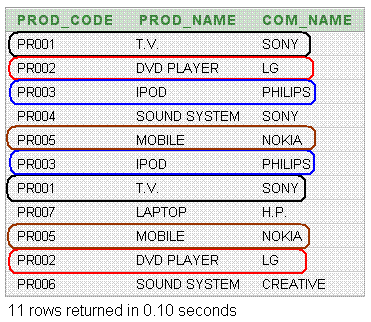
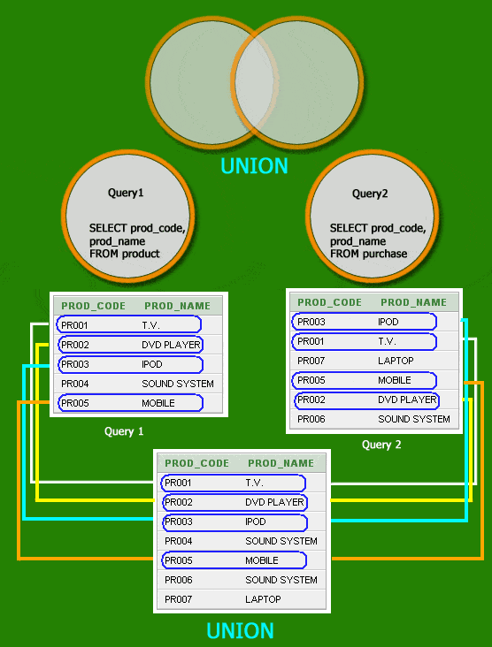

# UNION

## Contents

 - [Intro to UNION](#intro)
 - [UNION ALL](#union-all)
 - [UNION ALL using where](#union-where)
 - [UNION a table to itself](#itself)
 - **Tips & Tricks:**
   - [Difference between SQL JOIN and UNION](#join-vs-union)

---

<div id="intro"></div>

## Intro to UNION

> The SQL **UNION** operator combines the results of two or more queries and makes a result set which includes fetched rows from the participating queries in the UNION.

**Basic rules for combining two or more queries using UNION:**
 - **1.)** Number of columns and order of columns of all queries must be same.
 - **2.)** The data types of the columns on involving table in each query must be same or compatible.
 - **3.)** Usually returned column names are taken from the first query.

**NOTE:**  
By default the UNION behaves like UNION [DISTINCT] , i.e. eliminated the duplicate rows; <u>However, using ALL keyword with UNION returns all rows, including duplicates</u>.

---

<div id="union-all"></div>

## UNION ALL

In the following example, the optional clause **ALL** have been added with **UNION** for which, all the rows from each query have been available in the result set. Here in the above output, the marking rows are non-unique but it has been displayed. If ignored ALL clause, the marking rows would have come once.

**INPUT:**  
```sql
SELECT
    prod_code, prod_name,com_name
FROM product UNION ALL
    SELECT
        prod_code, prod_name, com_name
    FROM purchase;
```

**OUTPUT:**  
```sql
+-----------+--------------+----------+
| prod_code | prod_name    | com_name |
+-----------+--------------+----------+
| PR001     | T.V.         | SONY     |
| PR002     | DVD PLAYER   | LG       |
| PR003     | IPOD         | PHILIPS  |
| PR004     | SOUND SYSTEM | SONY     |
| PR005     | MOBILE       | NOKIA    |
| PR003     | IPOD         | PHILIPS  |
| PR001     | T.V.         | SONY     |
| PR007     | LAPTOP       | H.P.     |
| PR005     | MOBILE       | NOKIA    |
| PR002     | DVD PLAYER   | LG       |
| PR006     | SOUND SYSTEM | CREATIVE |
+-----------+--------------+----------+
```

  

---

<div id="union-where"></div>

## UNION ALL using where

In the following example, the two queries have been set using two different criteria including **WHERE clause**. So all the retrieve rows (including duplicates) have displayed in the result set. Here in this example, the marking rows are identical, but it has been displayed for the ALL clause along with UNION. If ignored ALL clause the marking rows would have come once:

**INPUT:**  
```sql
SELECT
    prod_code, prod_name, com_name
FROM product 
WHERE
    life>6
UNION ALL
    SELECT
        prod_code, prod_name, com_name
    FROM purchase
    WHERE
        pur_qty>10;
```

**OUTPUT:**  
```sql
+-----------+--------------+----------+
| prod_code | prod_name    | com_name |
+-----------+--------------+----------+
| PR001     | T.V.         | SONY     |
| PR002     | DVD PLAYER   | LG       |
| PR003     | IPOD         | PHILIPS  |
| PR004     | SOUND SYSTEM | SONY     |
| PR003     | IPOD         | PHILIPS  |
| PR001     | T.V.         | SONY     |
| PR005     | MOBILE       | NOKIA    |
+-----------+--------------+----------+
```

  

---

<div id="itself"></div>

## UNION a table to itself

In the following example, the two queries have been set using two different criteria for the same table. So all the retrieved rows ( including duplicates ) have displayed. Here in this example, the marking rows are identical, but it has been displayed for the ALL clause along with UNION:

**INPUT:**  
```sql
SELECT
    prod_code, prod_name, com_name
FROM purchase
WHERE
    pur_qty>6
UNION ALL
    SELECT
        prod_code, prod_name, com_name
    FROM purchase
    WHERE
        pur_amount>100000;
```

**OUTPUT:**  
```sql
+-----------+--------------+----------+
| prod_code | prod_name    | com_name |
+-----------+--------------+----------+
| PR003     | IPOD         | PHILIPS  |
| PR001     | T.V.         | SONY     |
| PR005     | MOBILE       | NOKIA    |
| PR002     | DVD PLAYER   | LG       |
| PR006     | SOUND SYSTEM | CREATIVE |
| PR001     | T.V.         | SONY     |
| PR007     | LAPTOP       | H.P.     |
| PR005     | MOBILE       | NOKIA    |
+-----------+--------------+----------+
```

  

---

<div id="join-vs-union"></div>

## Difference between SQL JOIN and UNION

 - **1.)** The columns of joining tables may be different in **JOIN** but in **UNION** the number of columns and order of columns of all queries must be same.
 - **2.)** The **UNION** puts rows from queries after each other( puts vertically ) but **JOIN** puts the column from queries after each other (puts horizontally), i.e. it makes a cartesian product.

For example, in the following example, no clause have been added with **UNION**, so, by default **UNION** is acting as **UNION [DISTINCT]** and only the unique rows are available in the result set:

**INPUT:**  
```sql
SELECT
    prod_code, prod_name
FROM product UNION
    SELECT
        prod_code, prod_name
    FROM purchase;
```

**OUTPUT:**  
```sql
+-----------+--------------+
| prod_code | prod_name    |
+-----------+--------------+
| PR001     | T.V.         |
| PR002     | DVD PLAYER   |
| PR003     | IPOD         |
| PR004     | SOUND SYSTEM |
| PR005     | MOBILE       |
| PR007     | LAPTOP       |
| PR006     | SOUND SYSTEM |
+-----------+--------------+
```

**Pictorial Representation:**  
  

---

**REFERENCES:**  
[SQL UNION](https://www.w3resource.com/sql/sql-union.php)  

---

Ro**drigo** **L**eite da **S**ilva - **drigols**
