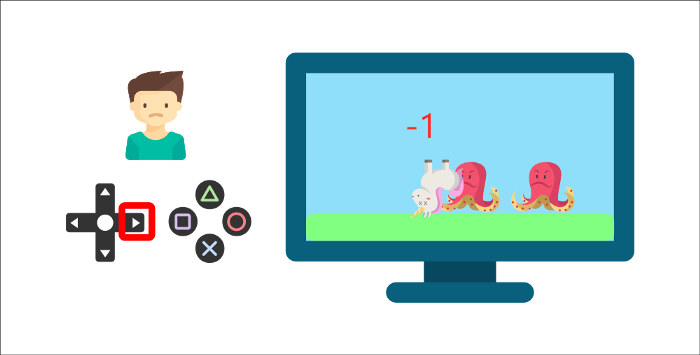

# Introdução ao Reinforcement Learning (Aprendizado por Reforço)

## Conteúdo

 - [01 - Introdução e Características](#01)
 - [02 - Observações vs Estados](#02)
 - [03 - Espaço de Ação (Discreto vs Contínuo)](#03)
 - [04 - Tipos de Tarefas (Episódicas vs Contínuas)](#04)

## 01 - Introdução e Característica

Bem, para começar nossos estudos sobre *Reinforcement Learning* a primeira coisa que você tem que colocar em mente é que o *Reinforcement Learning* é uma técnica de **aprendizado não supervisionado**.

> Ou seja, não existe uma referência ou gabarito dizendo essa é a melhor ação a ser tomada.

Diferente dos outros tipos de aprendizados aqui a única coisa que o modelo vai ter em termos de *supervisão (ou feedback)* vai ser um sinal que vai ser a **recompensa** que ele obteve no sistema e o objetivo vai ser maximizar a recompensa o máximo possível.

> Ou seja, eu quero ganhar o máximo de recompensas possíveis.

A ideia por trás do *Reinforcement Learning* é que um agente **(uma IA)** aprenderá com o ambiente **interagindo com ele** (por tentativa e erro) e **recebendo recompensa**s (negativas ou positivas) como feedback para realizar ações.

Por exemplo, imagine que você coloque seu irmão mais novo diante de um videogame que ele nunca jogou, um controle em suas mãos, e o deixe jogar:

  

Seu irmão irá interagir com o ambiente (o videogame) pressionando o botão direito **(ação)**. Ele tem uma moeda, é uma recompensa de **+1**. É positivo, ele só entendeu que neste jogo **ele deve pegar as moedas**...

  

Mas então, **ele pressiona para a direita novamente** e toca um inimigo, ele acaba de morrer **-1** recompensa...

  

**NOTE:**  
Ao interagir com seu ambiente por tentativa e erro, seu irmãozinho acabou de entender que nesse ambiente **ele precisa pegar moedas**, **mas evitar os inimigos**. Sem qualquer supervisão, a criança ficará cada vez melhor no jogo. É assim que humanos e animais aprendem, por meio das interações.

> *Reinforcement Learning* é apenas uma abordagem computacional de aprender com as ações.

---

## 02 - Observações vs Estados

**Observações** e **Estados** são as informações que nosso agente obtém do ambiente:

 - No caso de um videogame, pode ser um frame (uma captura de tela);
 - No caso do agente comercial, pode ser o valor de uma determinada ação.

Há uma diferenciação a ser feita entre **observação** e **estado**:

### 02.1 - Estado s

É uma descrição completa do estado do mundo **(não há informações ocultas)**. Ou seja, em um ambiente totalmente observado.

Veja o cenário abaixo:

  

**NOTE:**  
No jogo de xadrez, recebemos um **estado** do ambiente, pois **temos acesso a todas as informações do tabuleiro**.

### 02.2 - Observação o

É uma **descrição parcial do estado**. Em um ambiente parcialmente observado.

Veja o cenário abaixo:

  

**NOTE:**  
Em um jogo como Super Mario, vemos apenas uma parte do nível perto do jogador, por isso recebemos uma **observação**.

---

## 03 - Espaço de Ação (Discreto vs Contínuo)

> O **Espaço de Ação** é o conjunto de **todas as ações possíveis em um ambiente**.

As ações podem vir de um espaço:

 - Discreto;
 - Ou Contínuo.

### 03.1 - Discreto (finito)

Em um **espaço de ações discreto** o número de ações possíveis é **finito**. Por exemplo, veja o cenário abaixo:

  

**NOTE:**  
Em Super Mario Bros, temos um conjunto finito de ações, pois temos apenas 4 direções e salto.

### 03.2 - Contínuo (infinito)

Agora vamos ver um **espaço de ações contínuo** onde o número de ações possíveis é infinito:

  

**NOTE:**  
Um agente de **Self-Driving Car** tem um número infinito de ações possíveis, pois ele pode virar à esquerda **20°**, **21°**, **22°**, **buzinar**, virar à direita **20°**, **20,1°**...

**NOTE:**  
Levar essas informação em consideração é fundamental, pois terá importância quando escolher seu **algoritmo RL**.

---

## 04 - Tipos de Tarefas (Episódicas vs Contínuas)

Uma tarefa é uma **instância** de um problema de Reinforcement Learning. Podemos ter dois tipos de tarefas:

 - Episódicas;
 - E Contínuas.

### 04.1 - Tarefas Episódicas

Nesse caso, temos **um ponto inicial** e **um ponto final (um estado terminal)**. Isso cria um episódio:

 - Uma lista de estados;
 - Ações;
 - Recompensas;
 - E novos estados.

Por exemplo, pense em Super Mario, um episódio que começa no lançamento de um novo nível do Mario e termina quando você é morto ou chega ao fim do nível.

  

### 04.2 - Tarefas Contínuas

Essas são tarefas que **continuam para sempre (sem estado terminal)**. Nesse caso, o agente **deve aprender a escolher as melhores ações e simultaneamente interagir com o ambiente**.

Por exemplo, um agente que faz negociação automatizada de ações. Para esta tarefa, não há ponto de partida e estado terminal. **O agente continua correndo até decidirmos impedi-lo**.

  

---

**REFERENCES:**  
[Didática Tech - Inteligência Artificial & Data Science](https://didatica.tech/)  
[An Introduction to Deep Reinforcement Learning](https://thomassimonini.medium.com/an-introduction-to-deep-reinforcement-learning-17a565999c0c)  

---

**Rodrigo Leite -** *Software Engineer*
