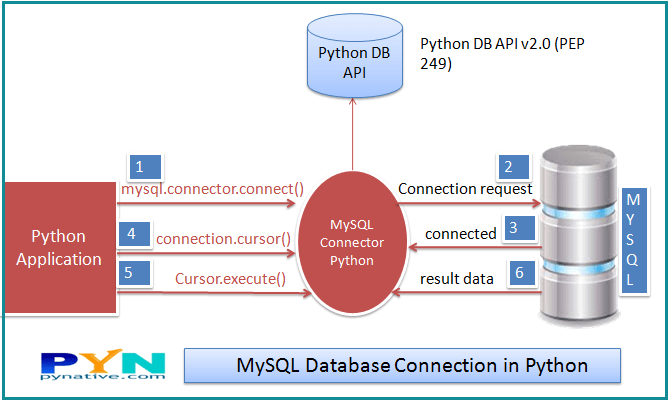

# Conectando no MySQL

## Contents

 - [01 - Tipos de conectores (modules) para MySQL em Python](#types)
 - [02 - Conectando no MySQL com o módulo "MySQL Connector Python"](#mysql-connector-python)
 - [03 - Usando um dicionário para manter os argumentos do MySQL Connection](#dict)

---

<div id="types"></div>

## 01 - Tipos de conectores (modules) para MySQL em Python

Em Python, podemos usar os seguintes módulos para se comunicar com o **MySQL**:

 - MySQL Connector Python
 - PyMySQL
 - MySQLDB
 - MySqlClient
 - OurSQL

**NOTE:**  
Acima de todas as interfaces ou módulos estão em conformidade com a [Especificação da API de Banco de Dados Python v2.0 (PEP 249)](https://peps.python.org/pep-0249/), o que significa que a sintaxe, o método e a forma de acesso ao banco de dados são os mesmos em todos os arquivos.

A **PEP 249** foi projetado para incentivar e manter a semelhança entre os módulos Python usados para acessar bancos de dados. Ao fazer isso, acima de todos os módulos estão seguindo as regras definidas na ***Python Database API Specification v2.0 (PEP 249)***.

Você poderá escolher qualquer um dos módulos acima conforme suas necessidades. A forma de acessar o banco de dados MySQL permanece a mesma.

---

<div id="mysql-connector-python"></div>

## 02 - Conectando no MySQL com o módulo "MySQL Connector Python"

Para se conectar no módulo [mysql-connector-python](https://pypi.org/project/mysql-connector-python/) primeiro nós devemos baixá-lo. Mas, isso é simples com o gerenciador de pacotes **PIP**:

```python
pip install mysql-connector-python
```

Agora para se conectar no **Banco de Dados MySQL** você precisá conhecer os seguintes detalhes do servidor **MySQL** para realizar a conexão com **Python**:

| Argument      | Description                                                                                               |
|---------------|-----------------------------------------------------------------------------------------------------------|
| Username      | O nome de usuário que você usa para trabalhar com o MySQL Server. O nome de usuário padrão para o banco de dados MySQL é um **root**. |
| Password      | A senha é fornecida pelo usuário no momento da instalação do servidor MySQL. Se você estiver usando root, não precisará da senha. |
| Host name     | O nome do servidor ou endereço IP no qual o MySQL está sendo executado. se você estiver executando em localhost, poderá usar localhost ou seu IP **127.0.0.0** |
| Database name | O nome do banco de dados ao qual você deseja se conectar e executar as operações. |

Um passo a passo para você se conectar ao **Banco de Dados MySQL** em **Python** e executar algumas operações pode ser o seguinte:

 1. **Instale o módulo do conector MySQL (o que foi demonstrado acima):**
    - pip install mysql-connector-python
 2. **Importar o módulo de conector MySQL:**
    - import mysql.connector
 3. **Use o método connect():**
    - Use o método *connect()* da classe *MySQL Connector* com os argumentos necessários para conectar ao *MySQL*. Ele retornaria um objeto **MySQL Connection*** se a conexão for estabelecida com sucesso
 4. **Use o método cursor():**
    - Use o método *cursor()* do objeto *MySQL Connection* para criar um *objeto cursor* para executar *operações SQL*.
 5. **Use o método execute():**
    - Os métodos execute() executam consultas *SQL* e retornam o resultado.
 6. **Extraia o resultado usando fetchall():**
    - Use o objeto *cursor.fetchall()* ou *fetchone()* ou *fetchmany()* para ler o resultado da consulta.
 7. **Fechar cursor e objetos de conexão:**
    - Use os métodos *cursor.close()* e *connection.close()* para fechar conexões abertas após a conclusão do seu trabalho.

  

Veja um exemplo de como se conectar em um **Banco de Dados** MySQL abaixo:

[connection.py](src/connection.py)
```python
import mysql.connector

from mysql.connector import Error

try:
  connection = mysql.connector.connect(
    host='localhost',
    database='Electronics',
    user='root',
    password='toor'
  )
  if connection.is_connected():
    db_Info = connection.get_server_info()
    print("Connected to MySQL Server version ", db_Info)
    cursor = connection.cursor()
    cursor.execute("select database();")
    record = cursor.fetchone()
    print("You're connected to database: ", record)
except Error as e:
  print("Error while connecting to MySQL", e)
finally:
  if connection.is_connected():
    cursor.close()
    connection.close()
    print("MySQL connection is closed")
```

**OUTPUT:**  
```python
Connected to MySQL Server version  5.7.38-log
You're connected to database:  ('electronics',)
MySQL connection is closed
```

**NOTE:**  
Uma observação aqui é isso só foi possível porque antes de tentar se conectar nós já tinhamos:

 - O servidor MySQL instalado e rodando.
 - E o Banco de Dados "electronics" criado:
   - *CREATE DATABASE electronics*.

---

<div id="dict"></div>

## 03 - Usando um dicionário para manter os argumentos do MySQL Connection

> Se você tiver muitos argumentos de conexão, é melhor mantê-los em um dicionário e usar o operador `**`. Em casos excepcionais, precisamos de mais de quatro argumentos no método **connect()** para conectar o banco de dados **MySQL**.

Vamos entender isso. Por exemplo, abaixo estão mais três argumentos de conexão que podemos usar no método **connect()**:

 - **connection_timeout**
   - Tempo limite para as conexões de soquete TCP e Unix.
 - **auto_commit**
   - Se as transações devem ser confirmadas automaticamente.
   - O padrão é *False*.
 - **pool_size**
   - Tamanho do conjunto de conexões se desejar usar o conjunto de conexões.

Você pode usar muitos outros argumentos de conexão conforme sua necessidade, adicioná-los todos em um dicionário e passar um dicionário para o método **connect()**.

Veja como isso funciona na prática no exemplo abaixo:

[dictionary_connection.py](src/dictionary_connection.py)
```python
import mysql.connector

from mysql.connector import Error

try:
  connection_config_dict = {
    'user': 'root',
      'password': 'toor',
      'host': '127.0.0.1',
      'database': 'Electronics',
      'raise_on_warnings': True,
      'autocommit': True,
      'pool_size': 5
  }
  connection = mysql.connector.connect(**connection_config_dict)
  if connection.is_connected():
    db_Info = connection.get_server_info()
    print("Connected to MySQL Server version ", db_Info)
    cursor = connection.cursor()
    cursor.execute("select database();")
    record = cursor.fetchone()
    print("Your connected to database: ", record)
except Error as e:
  print("Error while connecting to MySQL", e)
finally:
  if connection.is_connected():
    cursor.close()
    connection.close()
    print("MySQL connection is closed")
```

**OUTPUT:**
```python
Connected to MySQL Server version  5.7.38-log
Your connected to database:  ('electronics',)
MySQL connection is closed
```

---

**REFERENCES:**  
[Python MySQL Database Connection using MySQL Connector](https://pynative.com/python-mysql-database-connection/#h-how-to-connect-mysql-database-in-python)  

---

**Rodrigo Leite -** *drigols*
