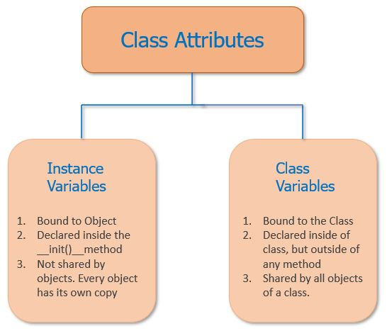

# Classes and Objects in Python

## Contents

 - [Class Attributes in Python (Instance variables vs. Class variables)](#class-attributes)
   - [Instance variables](#instance-variables)
   - [Class variables](#class-variables)

---

<div id="class-attributes"></div>

## Class Attributes in Python (Instance variables vs. Class variables)

> When we design a class, we use **instance variables** and **class variables**.

In Class, attributes can be defined into two parts:

 - **Instance variables:**
   - The **instance variables** are attributes attached to an instance of a class. We define instance variables in the constructor `(the __init__() method of a class)`.
 - **Class Variables:**
   - A **class variable** is a variable that is declared inside of class, but outside of any instance method or `__init__()` method.

  

---

<div id="instance-variables"></div>

## Instance variables

> If the value of a variable varies from object to object, then such variables are called **instance variables**. For every object, a separate copy of the instance variable will be created.

**Instance variables are not shared by objects:**
Every object has its own copy of the instance attribute. This means that for each object of a class, the **instance variable** value is different.

> **We can access (and modify) the *instance variable* values using the object and dot (.) operator.**

 - In Python, to work with an **instance variable** and *method*, we use the **self keyword**.
 - We use the **self keyword** as the first parameter to a method.
 - The **self** refers to the current object.

  

 - **Instance variables** are declared inside a method **using the self keyword**.
 - We **use a constructor** to **define** and **initialize the instance variables**.
 
in the following example, we are creating two instance variable **name** and **age** in the *Student class*.


```python
class Student:
    # constructor
    def __init__(self, name, age):
        # Instance variable
        self.name = name
        self.age = age

# create first object
s1 = Student("Jessa", 20)

# access instance variable
print('Object 1')
print('Name:', s1.name)
print('Age:', s1.age)

# create second object
s2= Student("Kelly", 10)

# access instance variable
print('Object 2')
print('Name:', s2.name)
print('Age:', s2.age)
```

**OUTPUT:**  
```python
Object 1
Name: Jessa
Age: 20

Object 2
Name: Kelly
Age: 10
```

**NOTE:**  
See that we use **dot (.) operator** to access the values in **instance variable**.

---

**REFERENCES:**  
[Classes and Objects in Python](https://pynative.com/python-classes-and-objects/#h-what-is-a-class-and-objects-in-python)  

---

Ro**drigo** **L**eite da **S**ilva - **drigols**
