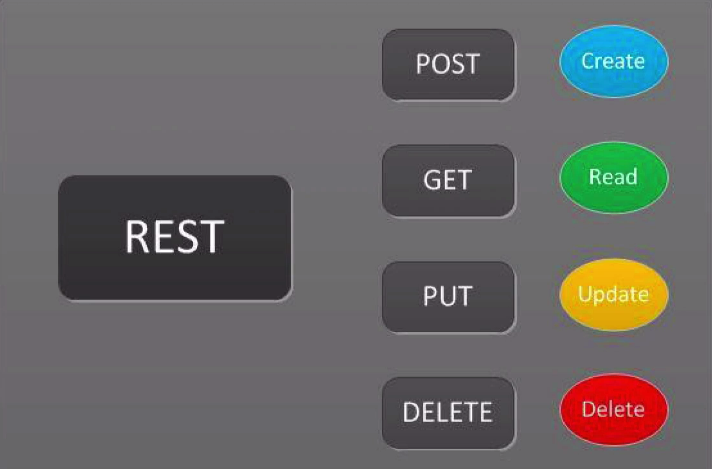

# Métodos HTTP

## Contents

 - [Introdução ao Métodos HTTP](#intro-to-http-methods)
 - [Método GET](#get)
 - [Método POST](#post)
 - [Método PUT](#put)
 - [Método DELETE](#delete)
 - [Método HEAD](#head)
 - [Método PATCH](#patch)
 - [Método OPTIONS](#options)
 - [Método TRACE](#trace)
 - [Método CONNECT](#connect)

---

<div id="intro-to-http-methods"></div>

## Introdução ao Métodos HTTP

Existem **9 verbos/métodos HTTP** os quais podemos utilizar para a criação de uma **API RESTFul**. Esse conjunto de métodos possui a semântica de operações possíveis de serem efetuadas sob um determinado **recurso**.  

 - Na especificação original do **HTTP** existiam apenas **3 verbos/métodos (GET, POST, HEAD)**.
 - Na revisão **1.1** do **HTTP** foram adicionados mais **5 verbos/métodos (OPTIONS, PUT, DELETE, TRACE e CONNECT)**.
 - A **RFC 5789 (especificação)** estendeu o **HTTP** com um novo **verbo/método PATCH**.  

**NOTE:**  
Uma observação aqui é que alguns desses métodos são similares a operações em Banco de Dados, veja o exemplo abaixo:  
  
 

---

<div id="get"></div>

## Método GET

> O método **GET** é utilizado quando existe a necessidade de se obter um recurso. Ele é considerado __idempotente__, ou seja, independente da quantidade de vezes que é executado sob um recurso, o resultado sempre será o mesmo.

**NOTE:**  
<u>O verbo/método GET já é o padrão (default) de requisições</u>:  
  
__Input:__  
```  
curl https://jsonplaceholder.typicode.com/users/2  
```  
  
__Ouput:__  
```json  
{
  "id": 2,
  "name": "Ervin Howell",
  "username": "Antonette",
  "email": "Shanna@melissa.tv",
  "address": {
    "street": "Victor Plains",
    "suite": "Suite 879",
    "city": "Wisokyburgh",
    "zipcode": "90566-7771",
    "geo": {
      "lat": "-43.9509",
      "lng": "-34.4618"
    }
  },
  "phone": "010-692-6593 x09125",
  "website": "anastasia.net",
  "company": {
    "name": "Deckow-Crist",
    "catchPhrase": "Proactive didactic contingency",
    "bs": "synergize scalable supply-chains"
  }
}
```

**NOTE:**  
Como o **GET** já é o verbo/método padrão (default) nós não precisamos passar o argumento **-X** para espeficiar qual método vamos utilizar.

---

<div id="post"></div>

## Método POST

> O **verbo/método POST** é utilizado para a crição de um item do recurso a partir do uso de uma representação.

Por exemplo, suponha que nós temos um recurso usuários, nós vamos criar um novo item usuário.

__Input:__  
```
curl -X POST www.exemplo.com/client \
-H "Content-Type: application/json" \
-d '{"name": "Rodrigo"}'
```  

__NOTE:__  
Uma observação no exemplo acima é a seguinte, quando nós precisamos passar muitos argumentos para o verbo/método __POST__, nós podemos utilizar barra invertida __" \ " (barra invertida)__ para que seja possível quebra de linha na mesma chamada do __POST__.  

---

<div id="put"></div>

## Método PUT

> O método __PUT__ é utilizado como forma de atualizar um determinado recurso.  
  
```  
curl -X PUT www.exemplo.com/client \  
-H "Content-Type: application/json" \  
-d '{"name": "Novo nome"}'  
```

---

<div id="delete"></div>
  
## Método DELETE

> O __DELETE__ tem como finalidade a remoção de um determinado recurso.  
  
```  
curl -X DELETE www.exemplo.com/client/1  
```  

---

<div id="head"></div>

## Método HEAD

O verbo/método __HEAD__ é muito parecido com o método __GET__, a única diferença é que o servidor não retornará o __"body"__ depois de receber a requisição.  
  
__Exemplo:__  
  
```  
curl -I -v http://www.example.com/users  
```  

---

<div id="patch"></div>

## Método PATCH

O método __PATCH__ faz "modificiações parciais nos recursos", ou seja, fazer a alteração de valores específicos de um recurso, ao invés de enviar todos os dados novamente.  
  
Enquanto o verbo/método __PUT__ só permite a "substituição" inteira do recurso, o __PATCH__ permite modificações parciais.  
  
__Exemplo:__  
  
```  
curl -X PATCH -v http://www.example.com/users/1 \  
-H "Content-Type": application/json" \  
-d '{"age": 26}'  
```  

**NOTE:**  
Veja que nesse exemplo nós estamos alterando apenas o item idad e(age) do recurso usuário (users/1).  
  
> Com o verbo/método __PUT__ é necessário atualizar todos os itens (campos) do recurso mesmo que você só deseje atualizar um deles.  

---

<div id="options"></div>

## Método OPTIONS

> O verbo/método __OPTIONS__ é a forma que o cliente possui de perguntar ao servidor quais os requisitos para um determinado recurso.

**NOTE:**  
Por exemplo, o __OPTIONS__ pode ser usado para saber quais métodos podem ser aplicados a um determinado recurso, ou qual a URL permitida para se comunicar com um determinado recurso.

> A ideia do __OPTIONS__ é você pergunta a um determinado recurso o que você pode fazer com ele. Quais verbos/métodos eu posso utilizar nesse recurso?  

__Exemplo:__  
  
```  
curl -i -X OPTIONS http://www.example.com/users/1  
```  

---

<div id="trace"></div>

## Método TRACE

> O método **TRACE** ecoa de volta a requisição recebida para que o cliente veja se houveram mudanças a adições feitas por servidores intermediários.

**NOTE:**  
O verbo/método __TRACE__ por questões de segurança sempre fica desabilitado nos servidores.

---

<div id="connect"></div>

## Método CONNECT

Converte a requisição de conexão para um túnel __TCP/IP__ transparente, usualmente para facilitar comunicação criptografada com SSL (HTTPS) através de um proxy HTTP não criptografado.  

---

**Rodrigo Leite -** *drigols*
